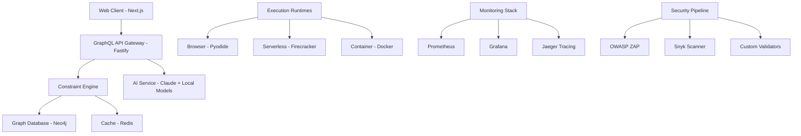

# SafePy Cloud – Developer Technical Specification

**Version:** 1.0.0 | **Status:** Development | **Date:** December 2025

## Overview

SafePy Cloud is a **100% type-safe, constraint-first development platform** that generates **Flask-based web applications only**. Visual graphs are compiled to **Python + Flask applications with PostgreSQL**:

- **Frontend Nodes** → **Flask Templates + WTForms** (server-side rendered, 100% type-safe)
- **Backend Nodes** → **Python** (natively type-safe with mypy/pydantic)
- **Database** → **PostgreSQL** (type-safe with SQLAlchemy)

**Type-Safe Guarantee:** Every constraint in the visual graph becomes a **compile-time type guarantee**. No runtime errors possible - all type violations caught at graph compilation time.

**Core Architectural Innovation:** SafePy implements a "constraint-to-type compiler": `Visual Graph Constraints → Python + Flask Types → Statically-Typed Web Application → Type-Safe Execution`

**Key Technical Principles:**
- Graph database as single source of truth
- **100% Type-Safe Code Generation:** Constraints become Python + Flask type guarantees
- **Zero Runtime Errors:** All type violations caught at compile time
- Multi-runtime execution (Flask development server, production WSGI, containerized)
- Security-by-design with audited Python library ecosystem
- **Constraint-to-Type Compiler:** Visual constraints → Static type guarantees
- **Type-Safe Web Applications:** Flask with SQLAlchemy and WTForms
- **Unified Application Architecture**: Single Flask application with database integration

### Frontend UI/UX Design (N8N-Inspired)

**Core Layout Structure (N8N Pattern):**
```
┌─────────────────────────────────────────────────────────────┐
│ Header Bar (Toolbar + User Menu)                           │
├─────────────┬───────────────────────────────────────────────┤
│ Node        │ Canvas Area                                   │
│ Palette     │                                               │
│ (Left)      │ • Zoom & Pan                                  │
│             │ • Drag & Drop Nodes                           │
│ • Data      │ • Connection Lines                            │
│ • Transform │ • Mini-Map (Bottom-Right)                    │
│ • API       │                                               │
├─────────────┼───────────────────────────────────────────────┤
│ Property    │ Execution Panel (Collapsible Bottom)         │
│ Panel       │                                               │
│ (Right)     │ • Real-time Logs                              │
│             │ • Execution Status                            │
│ • Node      │ • Performance Metrics                         │
│   Config    │                                               │
│ • AI        └───────────────────────────────────────────────┘
│   Suggestions
│ • Code
│   Preview
│ • Validation
│   Errors
```

**N8N-Inspired Features:**
- **Node Palette (Left Sidebar):** Categorizable node library with search and favorites
- **Canvas (Center):** Infinite zoomable/pannable surface with grid snapping
- **Property Panel (Right Sidebar):** Context-aware configuration panels that slide in/out
- **Mini-Map:** Thumbnail navigation for large graphs
- **Execution Visualization:** Color-coded connection lines (green=success, red=error, blue=running)
- **Real-time Collaboration:** Multi-user cursors and live editing (Google Docs style)
- **Keyboard Shortcuts:** Vim-style navigation and node manipulation
- **Context Menus:** Right-click menus for quick actions

### Unified Flask Application Architecture

**Node Types in Visual Graphs:**

#### 🎨 UI Nodes (Flask Templates)
**Visual Indicators:** Blue header with Flask icon
**Execution Runtime:** Flask application server
**Purpose:** Web interface components, forms, data display, user interactions

**Examples:**
- **UI Components:** Buttons, forms, tables, charts using Jinja2 templates
- **Form Handling:** WTForms validation and processing
- **Data Display:** HTML tables, charts with server-side rendering
- **User Interactions:** Links, buttons, navigation

**Code Generation:**
```python
# Generated Flask route with template
from flask import render_template, request
from wtforms import Form, StringField, validators

class UserForm(Form):
    name = StringField('Name', [validators.Length(min=1, max=50)])
    email = StringField('Email', [validators.Email()])

@app.route('/users', methods=['GET', 'POST'])
def user_management():
    """UI component - renders HTML form and handles submission"""
    form = UserForm(request.form)
    if request.method == 'POST' and form.validate():
        # Process form data
        save_user(form.name.data, form.email.data)
        return redirect(url_for('user_list'))

    return render_template('user_form.html', form=form)
```

#### ⚙️ Logic Nodes (Flask Business Logic)
**Visual Indicators:** Green header with Python icon
**Execution Runtime:** Flask application server
**Purpose:** Data processing, database operations, API calls, business logic

**Examples:**
- **Database Operations:** PostgreSQL queries with SQLAlchemy
- **API Integration:** External service calls, data processing
- **Business Logic:** Calculations, validations, workflow steps
- **Data Transformation:** ETL operations, data cleaning

**Code Generation:**
```python
# Generated Flask business logic
from flask import current_app
from sqlalchemy.orm import Session
from models import User

def get_user_data(user_id: str, db: Session) -> dict:
    """Database operation - runs in Flask application"""
    user = db.query(User).filter(User.id == user_id).first()
    return {
        'id': user.id,
        'name': user.name,
        'email': user.email,
        'created_at': user.created_at.isoformat()
    } if user else None
```

#### 🔄 Hybrid Nodes (Frontend + Backend)
**Visual Indicators:** Purple header with bidirectional arrow
**Execution Runtime:** Split between browser and server
**Purpose:** Components that need both client and server coordination

**Examples:**
- **Real-time Forms:** Client validation + server submission
- **File Uploads:** Client selection + server processing
- **Live Updates:** Client UI + server data streaming
- **Authentication:** Client session + server verification

**Code Generation:**
```python
# Frontend component (Browser)
def file_upload_component():
    """Client-side file selection UI"""
    uploaded_file = st.file_uploader("Choose a file")
    if uploaded_file:
        # Send to backend for processing
        process_file_server(uploaded_file)

# Backend handler (Server)
def process_file_server(file_data) -> dict:
    """Server-side file processing"""
    # Validate, store, and process file
    result = save_and_analyze_file(file_data)
    return result
```

### Graph Execution Flow & Context Boundaries

**Flask Application Execution Flow:**

```python
from enum import Enum
from typing import Dict, List

class FlaskExecutionContext(Enum):
    ROUTE = 'route'        # Flask route handlers (@app.route)
    MODEL = 'model'        # SQLAlchemy database models
    TEMPLATE = 'template'  # Jinja2 HTML templates
    BUSINESS_LOGIC = 'logic'  # Pure Python business logic

class NodeExecutionPlan:
    node_id: str
    context: FlaskExecutionContext
    dependencies: List[str]        # Must execute before this node
    route_path: str               # For route nodes
    model_name: str              # For model nodes
    generated_code: str
    input_mappings: Dict[str, str]  # Where inputs come from
    output_mappings: Dict[str, str] # Where outputs go
}
```

**Cross-Context Communication:**

1. **Frontend → Backend:** HTTP requests, WebSocket messages, form submissions
2. **Backend → Frontend:** API responses, real-time updates, server-sent events
3. **Hybrid Synchronization:** Shared state management, optimistic updates

**Visual Graph Indicators:**
```
Frontend Node:  🔵 [Browser Icon] Component Name
Backend Node:   🟢 [Server Icon] Operation Name
Hybrid Node:    🟣 [Bidirectional] Integrated Feature

Connection Lines:
→ Solid line: Same context data flow
⇄ Dashed line: Cross-context communication
⚠️ Red highlight: Context boundary violation
```

### Flask Application Code Generation

**Unified Flask Code Generation:**

```python
class FlaskCodeGenerator:
  def generate_flask_application(self, graph: Graph) -> str:
    """Generate complete Flask application from visual graph"""

    routes = []
    models = []
    templates = []

    for node in graph.nodes:
      if node.type == 'ui':
        routes.append(self.generate_flask_route(node))
        templates.append(self.generate_jinja_template(node))
      elif node.type == 'logic':
        routes.append(self.generate_flask_route(node))
        models.append(self.generate_sqlalchemy_model(node))

    return self.assemble_flask_app(routes, models, templates)

  def generate_flask_route(self, node: Node) -> str:
    """Generate Flask route from node"""
    return f'''
@app.route('{node.route_path}', methods={node.http_methods})
def {node.function_name}():
    """Generated Flask route for {node.name}"""
    {self.generate_route_logic(node)}
    return {self.generate_route_response(node)}
'''

  def generate_sqlalchemy_model(self, node: Node) -> str:
    """Generate SQLAlchemy model for data nodes"""
    return f'''
class {node.model_name}(db.Model):
    """Generated SQLAlchemy model for {node.name}"""
    id = db.Column(db.Integer, primary_key=True)
    {self.generate_model_fields(node)}
'''
```

### Flask Application Deployment & Runtime

**Unified Flask Deployment Strategy:**

```
Single Graph Deployment:
├── Flask Application
│   ├── Routes (Generated from UI/Logic nodes)
│   ├── Templates (Jinja2 HTML templates)
│   ├── Models (SQLAlchemy database models)
│   └── Static Assets (CSS, JS, Images)
├── PostgreSQL Database
│   ├── Tables (Generated from data nodes)
│   ├── Constraints (Type-safe relationships)
│   └── Indexes (Performance optimization)
└── Infrastructure
    ├── WSGI Server (Gunicorn/Waitress)
    ├── Reverse Proxy (nginx)
    └── Database Connection Pool
```

**Runtime Request Flow:**
1. **HTTP Request** → Flask Route Handler
2. **Form Validation** → WTForms Processing
3. **Business Logic** → Python Function Execution
4. **Database Operations** → SQLAlchemy Queries
5. **Template Rendering** → Jinja2 HTML Response
6. **HTTP Response** → Client Browser

### Constraint System & Context Boundaries

**Security-First Constraint Validation:**

```yaml
# Security is enforced before any other constraints
constraint: security_gate
  type: PRECONDITION
  target: "ALL"
  rule: |
    # Security validation runs first
    validateSecurity(node, graph) == true
  message: "Security requirements must be satisfied"
  severity: ERROR
  priority: 100  # Highest priority

# Router security constraints
constraint: secure_router_required
  type: PRECONDITION
  target: "APIRouterNode"
  rule: |
    node.properties.securityConfig?.authentication?.required == true &&
    node.properties.securityConfig?.rateLimit > 0 &&
    node.properties.securityConfig?.auditLogging == true &&
    node.properties.securityConfig?.inputValidation == true
  message: "Routers must have authentication, rate limiting, audit logging, and input validation"
  severity: ERROR

# Database security constraints
constraint: rls_mandatory
  type: PRECONDITION
  target: "DatabaseTableNode"
  rule: |
    node.properties.rlsEnabled == true &&
    node.properties.policies?.length > 0 &&
    node.properties.auditTriggers == true
  message: "Database tables must have RLS enabled with policies and audit triggers"
  severity: ERROR

constraint: no_sql_injection_risk
  type: VALIDATION
  target: "DatabaseQueryNode"
  rule: |
    # Only parameterized queries allowed
    node.properties.queryType == 'PARAMETERIZED' &&
    # No raw string concatenation
    !node.properties.query.includes('+') &&
    # Must use prepared statements
    node.properties.usePreparedStatements == true
  message: "SQL injection prevention: only parameterized queries allowed"
  severity: ERROR

# Flask Application Security Constraints
constraint: route_security
  context: route
  rules:
    - must validate all form inputs with WTForms
    - must authenticate user sessions
    - must authorize based on user roles
    - must use CSRF protection on POST requests
    - must sanitize template variables

constraint: model_security
  context: model
  rules:
    - must validate all data with Pydantic models
    - must use SQLAlchemy ORM (no raw SQL)
    - must implement proper access controls
    - must log all database operations

constraint: template_security
  context: template
  rules:
    - must escape all user data (auto-escaped by Jinja2)
    - no JavaScript execution in templates
    - must validate template context data
```

**Flask Application Data Flow Validation:**
- ✅ Route → Model: Form data to database operations
- ✅ Model → Route: Query results to template rendering
- ✅ Route → Template: Context data to HTML generation
- ❌ Direct SQL in routes (must use models)
- ❌ Business logic in templates (must use routes)
- ⚠️ Large datasets require pagination/optimization

### Development & Testing Implications

**Flask Application Testing:**

```python
import pytest
from flask import Flask
from myapp import create_app, db
from myapp.models import User

# Route testing
def test_user_creation_route(client):
    """Test Flask route for user creation"""
    response = client.post('/users', data={
        'name': 'John Doe',
        'email': 'john@example.com'
    })
    assert response.status_code == 302  # Redirect after success
    assert User.query.filter_by(email='john@example.com').first()

# Model testing
def test_user_model():
    """Test SQLAlchemy model"""
    user = User(name='Jane Doe', email='jane@example.com')
    db.session.add(user)
    db.session.commit()

    retrieved = User.query.filter_by(email='jane@example.com').first()
    assert retrieved.name == 'Jane Doe'

# Integration testing
def test_complete_user_workflow(client):
    """Test complete user creation and display workflow"""
    # Create user via form
    client.post('/users', data={'name': 'Test', 'email': 'test@test.com'})

    # Check user appears in list
    response = client.get('/users')
    assert b'Test' in response.data
    assert b'test@test.com' in response.data
```

This separation ensures **clear architectural boundaries** while maintaining **seamless integration** between frontend and backend logic in the visual graph paradigm.

### AI-Assisted Node Building & Code Completion

**Context-Aware Node Creation:**

When users drag nodes from the palette or create them via AI, SafePy provides intelligent assistance throughout the process:

```typescript
interface AINodeAssistant {
  // Suggests appropriate node configurations
  suggestNodeConfig(nodeType: NodeType, context: GraphContext): NodeSuggestion[];

  // Auto-completes node properties as user types
  completeNodeProperty(
    node: Node,
    propertyPath: string,
    currentValue: any,
    context: GraphContext
  ): PropertyCompletion[];

  // Suggests optimal connections between nodes
  suggestConnections(sourceNode: Node, availableTargets: Node[]): ConnectionSuggestion[];

  // Provides intelligent defaults based on graph patterns
  generateSmartDefaults(node: Node, graph: Graph): NodeDefaults;

  // Helps recover from configuration errors
  suggestErrorFixes(node: Node, error: ValidationError): FixSuggestion[];
}
```

#### Intelligent Node Configuration Assistant

**Real-Time Property Auto-Completion:**

```typescript
// Example: Database Query Node Configuration
const databaseNodeAssistant = {
  // When user types in "table" field
  async completeTableName(node: DatabaseNode, partialName: string): Promise<string[]> {
    // AI analyzes connected nodes and suggests relevant tables
    const connectedAPIs = getConnectedAPINodes(node);
    const suggestedTables = await ai.suggestTablesBasedOnAPI(connectedAPIs);

    // Also considers existing graph patterns
    const existingTables = getTablesUsedInGraph();
    const patternBasedSuggestions = ai.suggestBasedOnPatterns(existingTables);

    return [...suggestedTables, ...patternBasedSuggestions]
      .filter(table => table.toLowerCase().includes(partialName.toLowerCase()))
      .slice(0, 5); // Top 5 suggestions
  },

  // Auto-generates SQL based on connected nodes
  async generateSQL(node: DatabaseNode): Promise<string> {
    const inputConnections = getInputConnections(node);
    const outputConnections = getOutputConnections(node);

    // AI generates SQL that matches the data flow
    const sql = await ai.generateSQL({
      inputs: inputConnections.map(c => c.dataType),
      outputs: outputConnections.map(c => c.dataType),
      table: node.properties.table,
      filters: node.properties.filters
    });

    return sql;
  }
};
```

#### AI-Powered Node Connection Suggestions

**Smart Connection Recommendations:**

```typescript
// Suggests optimal connections as user builds the graph
const connectionAssistant = {
  async suggestNextConnections(currentNode: Node, graph: Graph): Promise<ConnectionSuggestion[]> {
    // Analyzes current graph structure
    const graphAnalysis = await ai.analyzeGraphFlow(graph);

    // Suggests logical next steps
    const suggestions = [];

    if (currentNode.type === 'API_CALL') {
      // After API call, suggest data processing
      suggestions.push({
        type: 'DATA_TRANSFORM',
        confidence: 0.9,
        reason: 'API responses often need data transformation',
        autoConfig: {
          inputType: 'json',
          transformations: ['flatten', 'type_conversion']
        }
      });

      // Or database storage
      suggestions.push({
        type: 'DATABASE_INSERT',
        confidence: 0.7,
        reason: 'API data is commonly stored in databases',
        autoConfig: {
          table: await ai.inferTableName(currentNode.properties.endpoint),
          mapping: await ai.generateFieldMapping(currentNode.properties.responseSchema)
        }
      });
    }

    return suggestions.sort((a, b) => b.confidence - a.confidence);
  },

  // Provides visual hints during connection dragging
  async getConnectionHints(sourceNode: Node, targetNode: Node): Promise<ConnectionHint[]> {
    const hints = [];

    // Data type compatibility
    if (this.checkDataTypeCompatibility(sourceNode, targetNode)) {
      hints.push({
        type: 'COMPATIBLE',
        message: 'Data types are compatible',
        color: 'green'
      });
    } else {
      hints.push({
        type: 'CONVERSION_NEEDED',
        message: 'AI can add automatic type conversion',
        suggestion: await ai.suggestTypeConverter(sourceNode, targetNode),
        color: 'yellow'
      });
    }

    // Security considerations
    const securityCheck = await this.checkSecurityCompatibility(sourceNode, targetNode);
    if (!securityCheck.compatible) {
      hints.push({
        type: 'SECURITY_WARNING',
        message: securityCheck.message,
        color: 'red'
      });
    }

    // Performance suggestions
    const performanceHint = await ai.analyzeConnectionPerformance(sourceNode, targetNode);
    if (performanceHint) {
      hints.push({
        type: 'PERFORMANCE_SUGGESTION',
        message: performanceHint.message,
        color: 'blue'
      });
    }

    return hints;
  }
};
```

#### Interactive Node Building Experience

**Step-by-Step AI Guidance:**

```typescript
// When user creates a new node, AI provides contextual help
const nodeCreationWizard = {
  async guideNodeCreation(nodeType: NodeType, graph: Graph): Promise<NodeCreationGuidance> {
    const steps = [];
    const context = await ai.analyzeCreationContext(graph);

    switch (nodeType) {
      case 'API_CALL':
        steps.push({
          step: 1,
          field: 'endpoint',
          suggestion: await ai.suggestAPIEndpoint(context),
          help: 'Based on your graph, you might want to call this API...'
        });

        steps.push({
          step: 2,
          field: 'method',
          suggestion: 'GET', // Most common
          help: 'GET is usually what you want for data retrieval'
        });

        steps.push({
          step: 3,
          field: 'authentication',
          suggestion: await ai.suggestAuthMethod(context),
          help: 'Your graph uses JWT auth, so this API should too'
        });

        break;

      case 'DATABASE_QUERY':
        steps.push({
          step: 1,
          field: 'table',
          suggestion: await ai.suggestRelevantTable(context),
          help: 'This table contains the data you\'re working with'
        });

        steps.push({
          step: 2,
          field: 'columns',
          suggestion: await ai.suggestColumns(context),
          help: 'These columns match your data processing needs'
        });

        break;
    }

    return { steps, estimatedCompletion: steps.length * 30 }; // 30 seconds per step
  }
};
```

#### AI Learning from User Patterns

**Personalized Assistance:**

```typescript
interface UserPatternLearner {
  // Learns from successful node configurations
  recordSuccessfulConfig(node: Node, result: ExecutionResult): Promise<void>;

  // Learns from user corrections and fixes
  recordUserCorrection(original: any, corrected: any, context: GraphContext): Promise<void>;

  // Provides personalized suggestions
  getPersonalizedSuggestions(userId: string, nodeType: NodeType): Promise<Suggestion[]>;
}

class PatternBasedAssistant implements UserPatternLearner {
  async recordSuccessfulConfig(node: Node, result: ExecutionResult) {
    // Store successful patterns for future suggestions
    await this.patternStore.save({
      userId: node.createdBy,
      nodeType: node.type,
      config: node.properties,
      context: this.extractContext(node),
      success: true,
      timestamp: Date.now()
    });
  }

  async getPersonalizedSuggestions(userId: string, nodeType: NodeType): Promise<Suggestion[]> {
    // Find patterns from user's successful configurations
    const userPatterns = await this.patternStore.findByUser(userId, nodeType);

    // Generate suggestions based on user's preferences
    return userPatterns.map(pattern => ({
      type: 'PERSONAL_PATTERN',
      config: pattern.config,
      confidence: this.calculatePatternConfidence(pattern),
      reason: `You successfully used this configuration ${pattern.usageCount} times`
    }));
  }
}
```

#### Real-Time Error Prevention & Suggestions

**Proactive Error Detection:**

```typescript
// AI monitors node configuration in real-time and prevents errors
const errorPreventionAssistant = {
  async validateAndSuggest(node: Node, graph: Graph): Promise<ValidationWithSuggestions> {
    const validation = await constraintEngine.validateNode(node, graph);
    const suggestions = [];

    if (validation.errors.length > 0) {
      // AI analyzes errors and suggests fixes
      for (const error of validation.errors) {
        const fix = await ai.suggestErrorFix(error, node, graph);
        if (fix) {
          suggestions.push({
            type: 'ERROR_FIX',
            error: error,
            fix: fix,
            confidence: await ai.calculateFixConfidence(fix, error),
            autoApply: fix.confidence > 0.8 // Auto-apply high-confidence fixes
          });
        }
      }
    }

    // Also suggest improvements even without errors
    const improvements = await ai.suggestImprovements(node, graph);
    suggestions.push(...improvements);

    return {
      validation,
      suggestions: suggestions.sort((a, b) => b.confidence - a.confidence)
    };
  }
};
```

#### React Flow Integration (N8N-Style Canvas)

**Core Components:**
```tsx
// Canvas Component (N8N-inspired)
const GraphCanvas = () => {
  const [nodes, setNodes, onNodesChange] = useNodesState(initialNodes);
  const [edges, setEdges, onEdgesChange] = useEdgesState(initialEdges);

  return (
    <ReactFlow
      nodes={nodes}
      edges={edges}
      onNodesChange={onNodesChange}
      onEdgesChange={onEdgesChange}
      onConnect={onConnect}
      onNodeClick={onNodeClick}
      nodeTypes={nodeTypes}
      edgeTypes={edgeTypes}
      fitView
      snapToGrid
      snapGrid={[15, 15]}
      defaultViewport={{ x: 0, y: 0, zoom: 1 }}
    >
      <MiniMap
        nodeColor={(node) => getNodeColor(node)}
        nodeStrokeWidth={3}
        zoomable
        pannable
      />
      <Controls />
      <Background variant="dots" gap={15} size={1} />
    </ReactFlow>
  );
};

// Node Types (SafePy-specific) - Context-aware
const nodeTypes = {
  // Frontend Nodes (Blue theme)
  uiComponent: UIComponentNode,      // 🎨 UI rendering, user interactions
  clientLogic: ClientLogicNode,      // 🔵 Client-side computations
  visualization: VisualizationNode,  // 📊 Charts, graphs, displays

  // Backend Nodes (Green theme)
  dataSource: DataSourceNode,        // 🗄️ Database connections, queries
  apiCall: ApiCallNode,             // 🌐 External API integrations
  transform: TransformNode,         // 🔄 Data processing, ETL

  // Hybrid Nodes (Purple theme)
  fileUpload: FileUploadNode,       // 📁 Client selection + server processing
  realTime: RealTimeNode,           // 🔄 Live updates, WebSocket handling
  authFlow: AuthFlowNode,           // 🔐 Client session + server verification

  // Control Flow (Gray theme)
  condition: ConditionNode,         // ❓ Logic branching
  output: OutputNode               // 📤 Result handling
};
```

#### Node Design System (N8N-Inspired)

**Node Structure:**
```tsx
interface BaseNodeProps {
  id: string;
  data: NodeData;
  selected: boolean;
  dragging: boolean;
}

const BaseNode = ({ id, data, selected, children }: BaseNodeProps) => {
  // Context-aware styling
  const contextStyles = {
    frontend: "border-blue-300 bg-blue-50",
    backend: "border-green-300 bg-green-50",
    hybrid: "border-purple-300 bg-purple-50"
  };

  const contextIcons = {
    frontend: "🔵", // Browser icon
    backend: "🟢",  // Server icon
    hybrid: "🟣"    // Bidirectional icon
  };

  return (
    <div className={cn(
      "bg-white border-2 rounded-lg shadow-sm min-w-[200px]",
      contextStyles[data.executionContext],
      selected && "ring-2 ring-blue-200 shadow-lg",
      "hover:shadow-md transition-all duration-200"
    )}>
      {/* Node Header (N8N-style with context indicator) */}
      <div className="flex items-center justify-between p-3 border-b">
        <div className="flex items-center gap-2">
          <span className="text-lg">{contextIcons[data.executionContext]}</span>
          <NodeIcon type={data.type} />
          <span className="font-medium text-sm">{data.label}</span>
        </div>
        <div className="flex items-center gap-1">
          <ExecutionContextBadge context={data.executionContext} />
          <NodeStatusIndicator status={data.executionStatus} />
        </div>
      </div>

      {/* Node Content */}
      <div className="p-3">
        {children}
      </div>

      {/* Connection Handles - Context-aware colors */}
      <Handle
        type="target"
        position="left"
        className={cn(
          "w-3 h-3",
          data.executionContext === 'frontend' && "!bg-blue-500",
          data.executionContext === 'backend' && "!bg-green-500",
          data.executionContext === 'hybrid' && "!bg-purple-500"
        )}
      />
      <Handle
        type="source"
        position="right"
        className={cn(
          "w-3 h-3",
          data.executionContext === 'frontend' && "!bg-blue-500",
          data.executionContext === 'backend' && "!bg-green-500",
          data.executionContext === 'hybrid' && "!bg-purple-500"
        )}
      />
    </div>
  );
};
```

#### Property Panel System (Right Sidebar)

**Dynamic Property Panels:**
```tsx
const PropertyPanel = ({ selectedNode }: { selectedNode: Node | null }) => {
  if (!selectedNode) {
    return (
      <div className="w-80 border-l bg-gray-50 p-4">
        <p className="text-gray-500 text-sm">
          Select a node to edit its properties
        </p>
      </div>
    );
  }

  return (
    <div className="w-80 border-l bg-white">
      <div className="p-4 border-b">
        <h3 className="font-medium">{selectedNode.data.label}</h3>
        <p className="text-sm text-gray-600">{selectedNode.data.description}</p>
      </div>

      <div className="p-4 space-y-4">
        {getPropertyFields(selectedNode.type).map(field => (
          <PropertyField
            key={field.key}
            field={field}
            value={selectedNode.data[field.key]}
            onChange={(value) => updateNodeProperty(selectedNode.id, field.key, value)}
            // AI-powered auto-completion
            onInputChange={(partialValue) => aiAssistant.completeProperty(
              selectedNode,
              field.key,
              partialValue
            )}
            suggestions={aiAssistant.getPropertySuggestions(
              selectedNode,
              field.key
            )}
          />
        ))}

        {/* AI-Powered Configuration Assistant */}
        <AIConfigurationAssistant node={selectedNode} />

        {/* Smart Defaults Suggestions */}
        <SmartDefaultsPanel
          node={selectedNode}
          onApplyDefaults={(defaults) => applyAISuggestedDefaults(selectedNode.id, defaults)}
        />

        {/* Error Prevention & Fixes */}
        <ErrorPreventionPanel
          node={selectedNode}
          errors={validationErrors}
          suggestions={aiAssistant.suggestFixes(selectedNode, validationErrors)}
        />

        {/* Code Preview with AI Improvements */}
        <CodePreview
          node={selectedNode}
          aiSuggestions={aiAssistant.suggestCodeImprovements(selectedNode)}
        />
      </div>
    </div>
  );
};
```

#### Node Palette (Left Sidebar)

**Categorizable Node Library:**
```tsx
const NodePalette = () => {
  const [searchTerm, setSearchTerm] = useState('');
  const [selectedCategory, setSelectedCategory] = useState('all');

  const categories = [
    { id: 'all', label: 'All Nodes', icon: '🔍' },
    { id: 'data', label: 'Data Sources', icon: '📊' },
    { id: 'transform', label: 'Transform', icon: '🔄' },
    { id: 'api', label: 'API Calls', icon: '🌐' },
    { id: 'ui', label: 'UI Components', icon: '🖥️' },
    { id: 'logic', label: 'Logic', icon: '🧠' }
  ];

  return (
    <div className="w-64 border-r bg-white">
      {/* Search Bar */}
      <div className="p-4 border-b">
        <input
          type="text"
          placeholder="Search nodes..."
          className="w-full px-3 py-2 border rounded-md"
          value={searchTerm}
          onChange={(e) => setSearchTerm(e.target.value)}
        />
      </div>

      {/* Categories */}
      <div className="flex border-b overflow-x-auto">
        {categories.map(category => (
          <button
            key={category.id}
            onClick={() => setSelectedCategory(category.id)}
            className={cn(
              "flex items-center gap-2 px-3 py-2 text-sm whitespace-nowrap",
              selectedCategory === category.id
                ? "border-b-2 border-blue-500 text-blue-600"
                : "text-gray-600 hover:text-gray-900"
            )}
          >
            <span>{category.icon}</span>
            {category.label}
          </button>
        ))}
      </div>

      {/* Node Grid */}
      <div className="p-4">
        <div className="grid grid-cols-1 gap-2">
          {filteredNodes.map(nodeType => (
            <DraggableNode
              key={nodeType.id}
              nodeType={nodeType}
              onDragStart={() => onNodeDragStart(nodeType)}
            />
          ))}
        </div>
      </div>
    </div>
  );
};
```

## 1. System Architecture

### Core Components



### Technology Stack

| Component | Primary Technology | Version | Alternatives | Purpose |
|-----------|-------------------|---------|-------------|---------|
| **Frontend** | Next.js + React + React Flow + **Strict TypeScript** + shadcn/ui | 14.x | **No JavaScript runtime** - 100% TypeScript compilation | Type-safe visual graph editor with SSR/SSG + fully-typed UI components |
| **Backend** | Node.js + Fastify + GraphQL Yoga | 20.x | Bun + Hono, Deno + Oak | High-performance API layer with schema validation |
| **Database** | Neo4j (Graph) + PostgreSQL (Relational) + Redis (Cache) | Neo4j 5.x, PG 15.x, Redis 7.x | ArangoDB, Dgraph, KeyDB | Graph storage + relational data + high-performance caching |
| **AI** | Claude Opus 4.5 (Primary) + GPT-4 + Ollama | API + Self-hosted | Hugging Face, Together AI | Graph generation with provider flexibility and offline capability |
| **Execution** | Pyodide (Browser) + Firecracker (Serverless) + Docker (Container) | Pyodide 0.25.x, Firecracker latest | WebAssembly, gVisor, containerd | Multi-runtime environments with isolation |
| **Security** | OWASP ZAP + Snyk + Custom Scanners | ZAP 2.14.x, Snyk latest | Semgrep, SonarQube, Checkmarx | Comprehensive security scanning and vulnerability detection |
| **Monitoring** | Prometheus + Grafana + Jaeger | Prom 2.48.x, Grafana 10.x, Jaeger latest | DataDog, New Relic, OpenTelemetry | Full observability stack with metrics, dashboards, and tracing |
| **Deployment** | Kubernetes + ArgoCD + Helm | K8s 1.28.x, ArgoCD 2.8.x | Docker Swarm, Nomad | GitOps deployment with declarative configuration |
| **Development** | Turborepo + ESLint + Prettier + Husky | Turbo 1.11.x, ESLint 8.x | Nx, Lerna, Rush | Monorepo tooling with code quality and pre-commit hooks |

### 100% Type-Safe Architecture

**Why 100% Type-Safe?**

SafePy eliminates runtime errors entirely through Python type safety:

1. **Pure Python Runtime:** Applications run entirely in Python with Flask
2. **Static Type Checking:** Python with strict mypy + Pydantic validation
3. **Constraint-to-Type Translation:** Visual constraints become static type guarantees
4. **Compile-Time Verification:** All type violations caught before deployment

**The Type-Safe Promise:**
```python
# Traditional dynamic Python (Runtime Errors Possible)
def process_user(user):
    return user['name'].upper()  # ❌ Runtime error if 'name' key missing

# SafePy Generated (Type-Safe)
from pydantic import BaseModel
from typing import Optional

class User(BaseModel):
    id: str
    name: str  # Guaranteed to exist and be string
    email: str  # Guaranteed to exist and be string

def process_user(user: User) -> str:
    return user.name.upper()  # ✅ Type-checker guaranteed safe
```

#### Constraint-to-Type Translation Engine

**How Visual Constraints Become Type Guarantees:**

```python
from typing import Union, List, Optional
from pydantic import BaseModel

class ConstraintToTypeTranslator:
    def translate_constraint(self, constraint: Constraint) -> str:
        """Translate visual constraints to Python type annotations"""

        # Example translations:
        # Constraint: "field must be string"
        # Becomes:   str

        # Constraint: "field must be non-null"
        # Becomes:   T (required) vs Optional[T] (optional)

        # Constraint: "array must contain User objects"
        # Becomes:   List[User]

# Generated Pydantic models from graph constraints
class GeneratedUserAPI:
    # Constraint: "endpoint returns User object or null"
    def get_user(self, user_id: str) -> Optional[User]:
        pass

  // Constraint: "endpoint accepts valid User data"
  createUser(data: CreateUserInput): Promise<User>;

  // Constraint: "list returns non-empty array"
  listUsers(limit: number): Promise<User[]>;
}

// Generated Python types from same constraints
from typing import Optional, List
from pydantic import BaseModel

class UserResponse(BaseModel):
    id: str      # Constraint: "id is required string"
    name: str    # Constraint: "name is required string"
    email: str   # Constraint: "email is valid email format"

class UserAPI:
    async def get_user(self, user_id: str) -> Optional[UserResponse]:
        # Type-safe: return type guaranteed by constraints
        pass

    async def create_user(self, data: CreateUserInput) -> UserResponse:
        # Type-safe: input/output types guaranteed by constraints
        pass
```

#### Type-Safe Code Generation Pipeline

**Frontend TypeScript Generation:**
```typescript
// Generated with strict TypeScript settings
interface GeneratedComponentProps {
  readonly userId: string;        // Constraint: "userId is required"
  readonly onUpdate?: (user: User) => void; // Constraint: "callback is optional"
  readonly className?: string;    // Constraint: "styling is optional"
}

// Generated component with type guarantees from graph constraints
export function UserProfile({ userId, onUpdate, className }: GeneratedComponentProps) {
  // TypeScript compiler guarantees:
  // - userId is always a string (never undefined)
  // - onUpdate, if provided, accepts User type
  // - className, if provided, is a string

  const [user, setUser] = useState<User | null>(null);
  // Type: user is either User object or null (constraint-enforced)

  useEffect(() => {
    fetchUser(userId).then(setUser);
    // Type: fetchUser returns Promise<User | null> (constraint-enforced)
  }, [userId]);

  if (!user) return <div>Loading...</div>;

  return (
    <div className={className}>
      {/* TypeScript guarantees user.name exists and is string */}
      <h1>{user.name}</h1>
      <p>{user.email}</p>
      <button onClick={() => onUpdate?.(user)}>
        Update
      </button>
    </div>
  );
}
```

**Backend Python Generation:**
```python
# Generated with strict type checking
from typing import Optional, List, Dict, Any
from pydantic import BaseModel, Field, EmailStr
from mypy import strict_optional  # Enforce strict type checking

class UserModel(BaseModel):
    """Generated from graph constraints"""
    id: str = Field(..., min_length=1, max_length=50)  # Constraint: "id is valid string"
    name: str = Field(..., min_length=1, max_length=100) # Constraint: "name is required"
    email: EmailStr  # Constraint: "email is valid email"
    status: str = Field(..., pattern="^(active|inactive)$") # Constraint: "status is enum"

class UserService:
    """Generated service with type guarantees"""

    def __init__(self, db: DatabaseConnection) -> None:
        self.db = db

    async def get_user(self, user_id: str) -> Optional[UserModel]:
        """Type-safe: returns UserModel or None"""
        # Constraint guarantees: user_id is non-empty string
        # Return type guarantee: either UserModel or None
        query = "SELECT id, name, email, status FROM users WHERE id = $1"
        result = await self.db.fetch_one(query, [user_id])

        if result:
            # Type validation: result matches UserModel constraints
            return UserModel(**result)
        return None

    async def create_user(self, user_data: Dict[str, Any]) -> UserModel:
        """Type-safe: input validated, output guaranteed"""
        # Constraint guarantees: user_data matches CreateUserInput
        validated_data = CreateUserInput(**user_data)

        # Type guarantee: insert returns valid UserModel
        user = await self.db.insert('users', validated_data.dict())
        return UserModel(**user)

    async def list_users(self, limit: int = 10) -> List[UserModel]:
        """Type-safe: returns list of valid UserModels"""
        # Constraint guarantees: limit is positive integer
        # Return type guarantee: List[UserModel] (non-empty if users exist)
        query = "SELECT id, name, email, status FROM users LIMIT $1"
        results = await self.db.fetch_all(query, [limit])

        # Type validation: each result matches UserModel
        return [UserModel(**row) for row in results]
```

#### Type-Safe UI Component Generation

**shadcn/ui with Full TypeScript Integration:**
```typescript
// Generated component using type-safe shadcn/ui
import { Button } from "@/components/ui/button"; // Fully typed
import { Card, CardContent, CardHeader } from "@/components/ui/card"; // Fully typed
import { Badge } from "@/components/ui/badge"; // Fully typed

interface UserDataTableProps {
  readonly users: readonly User[];  // Constraint: "users is non-empty array"
  readonly onUserSelect?: (user: User) => void; // Constraint: "callback receives User"
  readonly loading?: boolean; // Constraint: "loading is boolean"
}

// Generated with type guarantees from graph constraints
export function UserDataTable({
  users,
  onUserSelect,
  loading = false
}: UserDataTableProps) {
  // TypeScript guarantees:
  // - users is always User[] (constraint-enforced)
  // - each user has required fields (constraint-enforced)
  // - onUserSelect, if provided, receives valid User (constraint-enforced)

  if (loading) {
    return (
      <Card>
        <CardContent className="flex justify-center p-8">
          <div>Loading users...</div>
        </CardContent>
      </Card>
    );
  }

  return (
    <Card>
      <CardHeader>
        <h3>Users ({users.length})</h3>
      </CardHeader>
      <CardContent>
        <div className="space-y-2">
          {users.map((user) => (
            <div
              key={user.id}
              className="flex items-center justify-between p-2 border rounded"
            >
              <div>
                <div className="font-medium">{user.name}</div>
                <div className="text-sm text-gray-600">{user.email}</div>
              </div>
              <div className="flex items-center gap-2">
                <Badge variant={user.status === 'active' ? 'default' : 'secondary'}>
                  {user.status}
                </Badge>
                {onUserSelect && (
                  <Button
                    size="sm"
                    onClick={() => onUserSelect(user)}
                  >
                    Select
                  </Button>
                )}
              </div>
            </div>
          ))}
        </div>
      </CardContent>
    </Card>
  );
}
```

#### Compile-Time Type Verification

**TypeScript Strict Configuration:**
```json
// tsconfig.json - Maximum type safety
{
  "compilerOptions": {
    "strict": true,
    "noImplicitAny": true,
    "strictNullChecks": true,
    "strictFunctionTypes": true,
    "noImplicitReturns": true,
    "noFallthroughCasesInSwitch": true,
    "noUncheckedIndexedAccess": true,
    "exactOptionalPropertyTypes": true,
    "noImplicitOverride": true,
    "noPropertyAccessFromIndexSignature": true,
    "noImplicitThis": true
  }
}
```

**Python Type Checking:**
```toml
# pyproject.toml - Strict Python typing
[tool.mypy]
strict = true
warn_return_any = true
warn_unused_configs = true
disallow_untyped_defs = true
disallow_incomplete_defs = true
check_untyped_defs = true
disallow_untyped_decorators = true
no_implicit_optional = true
warn_redundant_casts = true
warn_unused_ignores = true
warn_no_return = true
warn_unreachable = true
strict_equality = true

[tool.pydantic-mypy]
init_forbid_extra = true
init_typed = true
warn_required_dynamic_aliases = true
warn_untyped_fields = true
```

#### Runtime Type Safety Guarantees

**Zero Runtime Type Errors:**
- **TypeScript:** All type violations caught at compilation
- **Python:** Runtime type checking with Pydantic
- **Graph Constraints:** Visual constraints become type constraints
- **Build-time Verification:** No deployment of type-unsafe code

**Type Safety Levels:**
1. **Compile-time:** TypeScript prevents invalid operations
2. **Graph-time:** Visual constraints prevent invalid connections
3. **Runtime:** Pydantic validates data structures
4. **Deployment-time:** Type checks prevent unsafe deployments

This creates a **four-layer type safety net** where **no type-related bugs can exist** in the final application.

### Database Architecture & Schemas

#### Neo4j Graph Schema (Core Data Model)

**Node Labels & Properties:**
```cypher
// User Management
(:User {
  id: string,           // UUID
  email: string,        // Unique, indexed
  username: string,     // Unique, indexed
  created_at: datetime, // Auto-generated
  last_login: datetime,
  preferences: map,     // JSON object for UI settings
  role: string         // 'admin', 'developer', 'viewer'
})

// Project Structure
(:Project {
  id: string,
  name: string,
  description: string,
  owner_id: string,     // References User.id
  created_at: datetime,
  updated_at: datetime,
  settings: map,       // Project-specific settings
  visibility: string   // 'private', 'team', 'public'
})

// Graph Nodes (Visual Elements)
(:GraphNode {
  id: string,
  graph_id: string,    // References Graph.id
  node_type: string,   // 'data_source', 'transform', 'api_call', etc.
  position_x: float,
  position_y: float,
  properties: map,     // Node-specific configuration
  execution_context: string, // 'frontend', 'backend', 'hybrid'
  created_at: datetime,
  updated_at: datetime
})

// Execution Results
(:ExecutionResult {
  id: string,
  graph_id: string,
  execution_id: string,
  node_id: string,
  status: string,      // 'success', 'error', 'running'
  output_data: map,    // Execution results
  error_message: string,
  execution_time_ms: integer,
  executed_at: datetime
})
```

**Relationship Types:**
```cypher
// Project Relationships
(:User)-[:OWNS_PROJECT]->(:Project)
(:User)-[:CAN_EDIT]->(:Project)
(:User)-[:CAN_VIEW]->(:Project)

// Graph Structure
(:Project)-[:CONTAINS_GRAPH]->(:Graph)
(:Graph)-[:HAS_NODE]->(:GraphNode)
(:GraphNode)-[:CONNECTS_TO {dataType: string, port: string}]->(:GraphNode)

// Execution Flow
(:Graph)-[:HAS_EXECUTION]->(:ExecutionResult)
(:ExecutionResult)-[:EXECUTED_NODE]->(:GraphNode)
```

#### PostgreSQL Schema (Relational Data)

**Core Tables:**
```sql
-- Users (complements Neo4j user nodes)
CREATE TABLE users (
  id UUID PRIMARY KEY DEFAULT gen_random_uuid(),
  neo4j_id VARCHAR(255) UNIQUE NOT NULL,
  email VARCHAR(255) UNIQUE NOT NULL,
  username VARCHAR(100) UNIQUE NOT NULL,
  password_hash VARCHAR(255),
  oauth_provider VARCHAR(50),
  oauth_id VARCHAR(255),
  created_at TIMESTAMP WITH TIME ZONE DEFAULT NOW(),
  updated_at TIMESTAMP WITH TIME ZONE DEFAULT NOW(),
  last_login TIMESTAMP WITH TIME ZONE,
  is_active BOOLEAN DEFAULT true,
  preferences JSONB DEFAULT '{}'
);

-- Projects
CREATE TABLE projects (
  id UUID PRIMARY KEY DEFAULT gen_random_uuid(),
  neo4j_id VARCHAR(255) UNIQUE NOT NULL,
  name VARCHAR(255) NOT NULL,
  description TEXT,
  owner_id UUID REFERENCES users(id) ON DELETE CASCADE,
  created_at TIMESTAMP WITH TIME ZONE DEFAULT NOW(),
  updated_at TIMESTAMP WITH TIME ZONE DEFAULT NOW(),
  visibility VARCHAR(20) DEFAULT 'private' CHECK (visibility IN ('private', 'team', 'public')),
  settings JSONB DEFAULT '{}'
);

-- Audit Logging
CREATE TABLE audit_logs (
  id UUID PRIMARY KEY DEFAULT gen_random_uuid(),
  user_id UUID REFERENCES users(id),
  action VARCHAR(100) NOT NULL,
  resource_type VARCHAR(50) NOT NULL,
  resource_id VARCHAR(255) NOT NULL,
  old_values JSONB,
  new_values JSONB,
  ip_address INET,
  user_agent TEXT,
  created_at TIMESTAMP WITH TIME ZONE DEFAULT NOW()
);

-- API Keys
CREATE TABLE api_keys (
  id UUID PRIMARY KEY DEFAULT gen_random_uuid(),
  user_id UUID REFERENCES users(id) ON DELETE CASCADE,
  name VARCHAR(100) NOT NULL,
  key_hash VARCHAR(255) UNIQUE NOT NULL,
  permissions JSONB DEFAULT '[]',
  expires_at TIMESTAMP WITH TIME ZONE,
  last_used_at TIMESTAMP WITH TIME ZONE,
  created_at TIMESTAMP WITH TIME ZONE DEFAULT NOW(),
  is_active BOOLEAN DEFAULT true
);
```

#### Redis Cache Schema

**Key Patterns & TTL:**
```javascript
// User Sessions
Key: `session:{userId}`
// Value: JSON with session data
// TTL: 24 hours

// Graph Validation Cache
Key: `graph:validation:{graphId}:{hash}`
// Value: ValidationResult JSON
// TTL: 1 hour

// AI Response Cache
Key: `ai:response:{promptHash}:{model}`
// Value: AI response JSON
// TTL: 30 minutes

// Rate Limiting
Key: `ratelimit:{userId}:{endpoint}`
// Value: Request count
// TTL: 1 hour

// Execution Results Cache
Key: `execution:result:{executionId}`
// Value: ExecutionResult JSON
// TTL: 24 hours
```

#### Migration Strategy

**Database Migrations:**
```javascript
// Migration file structure
const migration_v001 = {
  version: '001',
  description: 'Initial schema setup',

  up: async (neo4jDriver, pgClient, redisClient) => {
    // Neo4j migrations
    await neo4jDriver.executeQuery(`
      CREATE CONSTRAINT user_id_unique IF NOT EXISTS
      FOR (u:User) REQUIRE u.id IS UNIQUE
    `);

    // PostgreSQL migrations
    await pgClient.query(`
      CREATE TABLE IF NOT EXISTS users (
        id UUID PRIMARY KEY DEFAULT gen_random_uuid(),
        neo4j_id VARCHAR(255) UNIQUE NOT NULL,
        email VARCHAR(255) UNIQUE NOT NULL,
        created_at TIMESTAMP WITH TIME ZONE DEFAULT NOW()
      )
    `);

    // Redis initialization (usually handled by application)
    await redisClient.set('migration:001:completed', 'true');
  },

  down: async (neo4jDriver, pgClient, redisClient) => {
    // Rollback logic
    await neo4jDriver.executeQuery('DROP CONSTRAINT user_id_unique IF EXISTS');
    await pgClient.query('DROP TABLE IF EXISTS users');
    await redisClient.del('migration:001:completed');
  }
};
```

### Key Technical Decisions

- **Graph-First Architecture:** Neo4j as primary data store, code as derivative
- **Constraint Language:** Custom DSL for node validation rules
- **Multi-Runtime Strategy:** Automatic runtime selection based on graph analysis
- **Security-by-Design:** Pre-deployment library scanning and constraint enforcement
- **Compiler-in-Front-of-Compiler:** Two-stage compilation process (Graph → Code → Executable)

### 100% Type-Safe Code Generation Architecture

**Why 100% Type-Safe Generation?**

SafePy generates **only statically-typed code** with **zero runtime JavaScript errors**:

- **TypeScript for Frontend:** Compiled to JavaScript, but 100% type-safe at development time
- **Python for Backend:** Native type safety with mypy + Pydantic runtime validation
- **Constraint-to-Type Translation:** Visual constraints become compile-time type guarantees
- **No JavaScript Runtime Errors:** All type violations caught at graph compilation time

#### Backend Code Generation (Python)

**Data Processing & Business Logic:**
```python
# Generated backend code for data processing node
import pandas as pd
import sqlalchemy as sa
from typing import Dict, List, Any, Optional
from pydantic import BaseModel, Field

class UserDataProcessor:
    """Generated from DataTransformNode in backend context"""

    def __init__(self, db_connection: sa.engine.Engine):
        self.db = db_connection

    def process_user_batch(self, user_ids: List[str]) -> pd.DataFrame:
        """
        Generated method for processing user data.
        Includes automatic type hints and error handling.
        """
        try:
            # Generated SQL query with safety constraints
            query = sa.text("""
                SELECT id, name, email, status, created_at
                FROM users
                WHERE id = ANY(:user_ids)
                AND deleted_at IS NULL
            """)

            # Generated parameter binding (SQL injection prevention)
            result = self.db.execute(query, {"user_ids": user_ids})
            df = pd.DataFrame(result.fetchall(), columns=result.keys())

            # Generated data transformations
            df['processed_at'] = pd.Timestamp.now()
            df['is_active'] = df['status'] == 'active'
            df['days_since_creation'] = (pd.Timestamp.now() - df['created_at']).dt.days

            return df

        except Exception as e:
            logger.error(f"User data processing failed: {e}")
            raise DataProcessingError(f"Failed to process user data: {e}")
```

**API Integration Code:**
```python
# Generated backend code for API integration
import httpx
from tenacity import retry, stop_after_attempt, wait_exponential
import logging

logger = logging.getLogger(__name__)

class ExternalAPIService:
    """Generated from APIIntegrationNode in backend context"""

    def __init__(self, api_key: str, base_url: str = "https://api.example.com"):
        self.api_key = api_key
        self.base_url = base_url
        self.client = httpx.AsyncClient(
            timeout=30.0,
            headers={"Authorization": f"Bearer {api_key}"}
        )

    @retry(
        stop=stop_after_attempt(3),
        wait=wait_exponential(multiplier=1, min=4, max=10),
        reraise=True
    )
    async def fetch_user_profile(self, user_id: str) -> Dict[str, Any]:
        """
        Generated API call with automatic retry logic and error handling.
        """
        try:
            url = f"{self.base_url}/users/{user_id}"
            response = await self.client.get(url)

            response.raise_for_status()
            data = response.json()

            # Generated response validation
            if not isinstance(data, dict) or 'id' not in data:
                raise APIResponseError("Invalid API response format")

            logger.info(f"Successfully fetched profile for user {user_id}")
            return data

        except httpx.HTTPError as e:
            logger.error(f"API call failed for user {user_id}: {e}")
            raise APIIntegrationError(f"Failed to fetch user profile: {e}")
        finally:
            # Generated cleanup
            pass
```

#### Frontend Code Generation (Strict TypeScript)

**React Component Generation:**
```tsx
// Generated frontend code for UI component
'use client';

import React, { useState, useEffect, memo } from 'react';
import { Card, CardContent, CardHeader, CardTitle } from '@/components/ui/card';
import { Button } from '@/components/ui/button';
import { Input } from '@/components/ui/input';
import { Loader2, RefreshCw } from 'lucide-react';

interface UserDataDisplayProps {
  userId?: string;
  onRefresh?: () => void;
  className?: string;
}

// Generated from UIDisplayNode in frontend context
const UserDataDisplay = memo<UserDataDisplayProps>(({
  userId,
  onRefresh,
  className
}) => {
  const [userData, setUserData] = useState(null);
  const [loading, setLoading] = useState(false);
  const [error, setError] = useState<string | null>(null);

  // Generated data fetching logic
  const fetchUserData = async () => {
    if (!userId) return;

    setLoading(true);
    setError(null);

    try {
      // Generated API call (connects to backend)
      const response = await fetch(`/api/users/${userId}`);
      if (!response.ok) throw new Error('Failed to fetch user data');

      const data = await response.json();
      setUserData(data);
    } catch (err) {
      setError(err instanceof Error ? err.message : 'Unknown error');
    } finally {
      setLoading(false);
    }
  };

  useEffect(() => {
    fetchUserData();
  }, [userId]);

  // Generated UI rendering logic
  if (loading) {
    return (
      <Card className={className}>
        <CardContent className="flex items-center justify-center p-6">
          <Loader2 className="h-6 w-6 animate-spin" />
          <span className="ml-2">Loading user data...</span>
        </CardContent>
      </Card>
    );
  }

  if (error) {
    return (
      <Card className={className}>
        <CardContent className="p-6">
          <div className="text-red-600 mb-4">Error: {error}</div>
          <Button onClick={fetchUserData} variant="outline">
            <RefreshCw className="h-4 w-4 mr-2" />
            Retry
          </Button>
        </CardContent>
      </Card>
    );
  }

  if (!userData) {
    return (
      <Card className={className}>
        <CardContent className="p-6">
          <div className="text-gray-500">No user data available</div>
        </CardContent>
      </Card>
    );
  }

  // Generated UI layout
  return (
    <Card className={className}>
      <CardHeader>
        <CardTitle className="flex items-center justify-between">
          User Profile
          {onRefresh && (
            <Button onClick={onRefresh} size="sm" variant="outline">
              <RefreshCw className="h-4 w-4" />
            </Button>
          )}
        </CardTitle>
      </CardHeader>
      <CardContent className="space-y-4">
        <div className="grid grid-cols-2 gap-4">
          <div>
            <label className="text-sm font-medium text-gray-700">Name</label>
            <div className="text-sm text-gray-900">{userData.name}</div>
          </div>
          <div>
            <label className="text-sm font-medium text-gray-700">Email</label>
            <div className="text-sm text-gray-900">{userData.email}</div>
          </div>
          <div>
            <label className="text-sm font-medium text-gray-700">Status</label>
            <div className={`inline-flex items-center px-2.5 py-0.5 rounded-full text-xs font-medium ${
              userData.status === 'active'
                ? 'bg-green-100 text-green-800'
                : 'bg-gray-100 text-gray-800'
            }`}>
              {userData.status}
            </div>
          </div>
          <div>
            <label className="text-sm font-medium text-gray-700">Join Date</label>
            <div className="text-sm text-gray-900">
              {new Date(userData.createdAt).toLocaleDateString()}
            </div>
          </div>
        </div>
      </CardContent>
    </Card>
  );
});

UserDataDisplay.displayName = 'UserDataDisplay';

export default UserDataDisplay;
```

#### UI Library Integration (shadcn/ui Example)

**How shadcn/ui Components Work with SafePy:**

SafePy **does NOT generate** the shadcn/ui components themselves. Instead, it generates code that **uses** these pre-built components:

```tsx
// Generated import statements (NOT component definitions)
import { Button } from "@/components/ui/button";
import { Card, CardContent, CardHeader, CardTitle } from "@/components/ui/card";
import { Input } from "@/components/ui/input";
import { Label } from "@/components/ui/label";
import { Select, SelectContent, SelectItem, SelectTrigger, SelectValue } from "@/components/ui/select";

// Generated component usage
export default function UserForm() {
  // SafePy generates the logic and layout
  // shadcn/ui provides the visual components

  return (
    <Card>
      <CardHeader>
        <CardTitle>Create User</CardTitle>
      </CardHeader>
      <CardContent className="space-y-4">
        <div className="space-y-2">
          <Label htmlFor="name">Name</Label>
          <Input id="name" placeholder="Enter user name" />
        </div>

        <div className="space-y-2">
          <Label htmlFor="role">Role</Label>
          <Select>
            <SelectTrigger>
              <SelectValue placeholder="Select a role" />
            </SelectTrigger>
            <SelectContent>
              <SelectItem value="admin">Admin</SelectItem>
              <SelectItem value="user">User</SelectItem>
              <SelectItem value="viewer">Viewer</SelectItem>
            </SelectContent>
          </Select>
        </div>

        <Button type="submit" className="w-full">
          Create User
        </Button>
      </CardContent>
    </Card>
  );
}
```

**Why This Approach Works:**

1. **UI Libraries Stay Pre-built:** shadcn/ui components are installed via npm and remain as-is
2. **SafePy Generates Usage Code:** Focus on layout, logic, data flow, and component composition
3. **Styling Integration:** Generated code includes Tailwind classes and component props
4. **Component Ecosystem:** Full access to the entire React ecosystem without regeneration

**Project Structure with UI Libraries:**
```
user_data_app/
├── frontend/
│   ├── components/
│   │   ├── ui/           # shadcn/ui components (pre-built, not generated)
│   │   │   ├── button.tsx
│   │   │   ├── card.tsx
│   │   │   ├── input.tsx
│   │   │   └── ...
│   │   └── generated/    # SafePy-generated component usage
│   │       ├── UserForm.tsx
│   │       ├── DataTable.tsx
│   │       └── Dashboard.tsx
│   ├── lib/
│   │   └── utils.ts      # Utility functions
│   └── styles/
│       └── globals.css   # Tailwind + shadcn styles
└── backend/
    └── services/         # Python business logic
```

#### Code Generation Strategy by Context

**Context-Specific Code Generation:**

```typescript
class ContextAwareCodeGenerator {
  async generateCode(graph: Graph): Promise<GeneratedProject> {
    const files: GeneratedFile[] = [];

    // Group nodes by execution context
    const contextGroups = this.groupNodesByContext(graph.nodes);

    // Generate appropriate code for each context
    for (const [context, nodes] of contextGroups.entries()) {
      switch (context) {
        case 'frontend':
          files.push(...await this.generateFrontendCode(nodes, graph));
          break;
        case 'backend':
          files.push(...await this.generateBackendCode(nodes, graph));
          break;
        case 'hybrid':
          files.push(...await this.generateHybridCode(nodes, graph));
          break;
      }
    }

    // Add shared configuration and dependencies
    files.push(...this.generateSharedConfig(graph));

    return { files, dependencies: this.calculateDependencies(contextGroups) };
  }

  private async generateFrontendCode(nodes: Node[], graph: Graph): Promise<GeneratedFile[]> {
    // Generate React/TypeScript components
    // Include UI library imports but don't generate the libraries themselves
    return nodes.map(node => ({
      path: `frontend/components/generated/${node.id}.tsx`,
      content: this.generateReactComponent(node, graph),
      dependencies: ['react', '@shadcn/ui', 'tailwindcss']
    }));
  }

  private async generateBackendCode(nodes: Node[], graph: Graph): Promise<GeneratedFile[]> {
    // Generate Python services and business logic
    return nodes.map(node => ({
      path: `backend/services/${node.id}.py`,
      content: this.generatePythonService(node, graph),
      dependencies: ['fastapi', 'sqlalchemy', 'pandas']
    }));
  }
}
```

#### The Compiler Architecture

SafePy implements a **two-stage compilation pipeline**, acting as a "compiler in front of the compiler":

```
Traditional Development:
Source Code → Language Compiler → Executable

SafePy Development:
Visual Graph → Graph Compiler → Source Code → Language Compiler → Executable
    ↑              ↑                     ↑
  Designer       SafePy              Python/Node.js/etc.
```

**Stage 1 - Graph Compilation:**
- **Input:** Constraint-validated visual graph (Neo4j)
- **Process:** AST generation, type inference, optimization
- **Output:** Production-ready source code (Python, JavaScript, etc.)

**Stage 2 - Traditional Compilation:**
- **Input:** Generated source code from Stage 1
- **Process:** Standard language compilation/interpreter
- **Output:** Executable application

**Benefits of This Architecture:**
- **Visual Programming:** Users manipulate graphs, not text
- **Constraint Safety:** Bugs caught at graph level, before code generation
- **Multi-Language Output:** Same graph can generate Python, JavaScript, etc.
- **Optimization Opportunities:** Graph-level optimizations before code generation

***

## 2. API Specifications

### GraphQL Schema Overview

```graphql
type Query {
  project(id: ID!): Project
  projects(userId: ID!): [Project!]!
  node(id: ID!): Node
  constraintViolations(graphId: ID!): [ConstraintViolation!]!
}

type Mutation {
  createProject(input: CreateProjectInput!): Project!
  addNode(input: AddNodeInput!): Node!
  connectNodes(input: ConnectNodesInput!): Connection!
  executeGraph(graphId: ID!): ExecutionResult!
  validateConstraints(graphId: ID!): ValidationResult!
}

type Subscription {
  graphUpdated(projectId: ID!): GraphUpdate!
  executionStatus(executionId: ID!): ExecutionStatus!
}
```

### Detailed GraphQL Endpoints

#### Project Management

**Query: Get Project**
```graphql
query GetProject($id: ID!) {
  project(id: $id) {
    id
    name
    description
    owner {
      id
      username
      email
    }
    graphs {
      id
      name
      nodes {
        id
        type
        position {
          x
          y
        }
      }
      connections {
        id
        sourceNodeId
        targetNodeId
        dataType
      }
    }
    createdAt
    updatedAt
  }
}
```

**Mutation: Create Project**
```graphql
mutation CreateProject($input: CreateProjectInput!) {
  createProject(input: $input) {
    id
    name
    description
    owner {
      id
      username
    }
    createdAt
  }
}
```

#### Graph Operations

**Mutation: Add Node to Graph**
```graphql
mutation AddNode($input: AddNodeInput!) {
  addNode(input: $input) {
    id
    type
    position {
      x
      y
    }
    properties
    constraints {
      id
      type
      rule
      severity
      message
    }
  }
}
```

**Mutation: Connect Nodes**
```graphql
mutation ConnectNodes($input: ConnectNodesInput!) {
  connectNodes(input: $input) {
    id
    sourceNodeId
    targetNodeId
    sourcePort
    targetPort
    dataType
    validationStatus
  }
}
```

**Mutation: Execute Graph**
```graphql
mutation ExecuteGraph($graphId: ID!) {
  executeGraph(graphId: $graphId) {
    id
    graphId
    status
    results {
      nodeId
      status
      output
      executionTimeMs
      errorMessage
    }
    startedAt
    completedAt
    totalExecutionTimeMs
  }
}
```

#### Real-time Subscriptions

**Subscription: Graph Updates**
```graphql
subscription GraphUpdates($projectId: ID!) {
  graphUpdated(projectId: $projectId) {
    graphId
    updateType
    updatedBy {
      id
      username
    }
    changes {
      nodeChanges {
        nodeId
        changeType
        oldValue
        newValue
      }
      connectionChanges {
        connectionId
        changeType
        oldValue
        newValue
      }
    }
    timestamp
  }
}
```

**Subscription: Execution Status**
```graphql
subscription ExecutionStatus($executionId: ID!) {
  executionStatus(executionId: $executionId) {
    executionId
    status
    currentNodeId
    progressPercentage
    nodeResults {
      nodeId
      status
      executionTimeMs
      errorMessage
    }
    estimatedTimeRemainingMs
    timestamp
  }
}
```

### REST API Endpoints

#### Authentication Endpoints

**POST /api/auth/login**
```typescript
// Request
{
  "email": "user@example.com",
  "password": "hashed_password"
}

// Response
{
  "access_token": "jwt_token",
  "refresh_token": "refresh_jwt_token",
  "token_type": "Bearer",
  "expires_in": 3600,
  "user": {
    "id": "uuid",
    "email": "user@example.com",
    "username": "username"
  }
}
```

**POST /api/auth/refresh**
```typescript
// Request
{
  "refresh_token": "refresh_jwt_token"
}

// Response - Same as login
```

#### Project Endpoints

**GET /api/projects**
```typescript
// Query Parameters
{
  limit?: number = 20,
  offset?: number = 0,
  search?: string,
  sortBy?: 'created_at' | 'updated_at' | 'name',
  sortOrder?: 'asc' | 'desc'
}

// Response
{
  "projects": [
    {
      "id": "uuid",
      "name": "My Project",
      "description": "Project description",
      "owner": {
        "id": "uuid",
        "username": "owner"
      },
      "visibility": "private",
      "createdAt": "2024-01-01T00:00:00Z",
      "updatedAt": "2024-01-01T00:00:00Z"
    }
  ],
  "total": 1,
  "limit": 20,
  "offset": 0
}
```

**POST /api/projects**
```typescript
// Request
{
  "name": "New Project",
  "description": "Project description",
  "visibility": "private",
  "settings": {
    "theme": "dark",
    "autoSave": true
  }
}

// Response
{
  "id": "uuid",
  "name": "New Project",
  "description": "Project description",
  "owner": {
    "id": "uuid",
    "username": "owner"
  },
  "visibility": "private",
  "createdAt": "2024-01-01T00:00:00Z"
}
```

#### Execution Endpoints

**POST /api/executions**
```typescript
// Request
{
  "graphId": "uuid",
  "runtime": "serverless", // 'browser', 'serverless', 'container'
  "parameters": {
    "input_data": "value",
    "config": {}
  }
}

// Response
{
  "executionId": "uuid",
  "graphId": "uuid",
  "status": "queued",
  "estimatedDurationMs": 5000,
  "createdAt": "2024-01-01T00:00:00Z"
}
```

**GET /api/executions/{executionId}**
```typescript
// Response
{
  "executionId": "uuid",
  "graphId": "uuid",
  "status": "completed",
  "runtime": "serverless",
  "results": {
    "output_node_1": {
      "status": "success",
      "data": { "result": "value" },
      "executionTimeMs": 1250
    }
  },
  "totalExecutionTimeMs": 1320,
  "startedAt": "2024-01-01T00:00:00Z",
  "completedAt": "2024-01-01T00:00:02Z"
}
```

### WebSocket API

**Connection URL:** `ws://api.safe-py.cloud/ws`

**Authentication:**
```javascript
// Send after connection
{
  "type": "authenticate",
  "payload": {
    "token": "jwt_access_token"
  }
}
```

**Subscribe to Graph Updates:**
```javascript
{
  "type": "subscribe",
  "payload": {
    "channel": "graph",
    "graphId": "uuid"
  }
}
```

**Graph Update Message:**
```javascript
{
  "type": "graph_update",
  "payload": {
    "graphId": "uuid",
    "updateType": "node_added",
    "data": {
      "nodeId": "uuid",
      "nodeType": "transform",
      "position": { "x": 100, "y": 200 }
    },
    "timestamp": "2024-01-01T00:00:00Z"
  }
}
```

**Execution Status Updates:**
```javascript
{
  "type": "execution_status",
  "payload": {
    "executionId": "uuid",
    "status": "running",
    "currentNodeId": "node_123",
    "progressPercentage": 65,
    "nodeResults": [
      {
        "nodeId": "node_123",
        "status": "completed",
        "executionTimeMs": 850
      }
    ]
  }
}
```

### Core Data Models

#### Node Type Definition
```typescript
interface Node {
  id: string;
  type: NodeType;
  position: { x: number; y: number };
  properties: Record<string, any>;
  constraints: Constraint[];
  executionMetadata: ExecutionMetadata;
}

enum NodeType {
  DATA_SOURCE = 'DATA_SOURCE',
  TRANSFORM = 'TRANSFORM',
  API_CALL = 'API_CALL',
  UI_COMPONENT = 'UI_COMPONENT',
  CONDITION = 'CONDITION',
  OUTPUT = 'OUTPUT'
}
```

#### Constraint Definition
```typescript
interface Constraint {
  id: string;
  type: ConstraintType;
  rule: string; // Declarative constraint rule
  severity: 'ERROR' | 'WARNING' | 'INFO';
  message: string;
  validator: ConstraintValidator;
}

interface ConstraintValidator {
  validate(node: Node, graph: Graph): ValidationResult;
}
```

#### Graph Structure
```typescript
interface Graph {
  id: string;
  nodes: Map<string, Node>;
  connections: Connection[];
  metadata: GraphMetadata;
}

interface Connection {
  id: string;
  sourceNodeId: string;
  targetNodeId: string;
  sourcePort: string;
  targetPort: string;
  dataType: DataType;
}
```

***

## 2.5 Error Handling Patterns

### Comprehensive Error Classification

**Error Types & Hierarchy:**
```typescript
enum ErrorType {
  // Validation Errors (4xx)
  VALIDATION_ERROR = 'VALIDATION_ERROR',           // Input validation failures
  CONSTRAINT_VIOLATION = 'CONSTRAINT_VIOLATION',   // Graph constraint violations
  AUTHENTICATION_ERROR = 'AUTHENTICATION_ERROR',   // Invalid credentials
  AUTHORIZATION_ERROR = 'AUTHORIZATION_ERROR',     // Insufficient permissions
  RATE_LIMIT_ERROR = 'RATE_LIMIT_ERROR',          // Rate limit exceeded

  // Runtime Errors (5xx)
  EXECUTION_ERROR = 'EXECUTION_ERROR',            // Node execution failures
  COMPILATION_ERROR = 'COMPILATION_ERROR',        // Code generation failures
  RESOURCE_ERROR = 'RESOURCE_ERROR',              // Resource exhaustion
  EXTERNAL_SERVICE_ERROR = 'EXTERNAL_SERVICE_ERROR', // API/third-party failures
  INFRASTRUCTURE_ERROR = 'INFRASTRUCTURE_ERROR'   // System-level failures
}

interface SafePyError extends Error {
  type: ErrorType;
  code: string;              // Machine-readable error code
  message: string;           // Human-readable message
  details?: any;             // Additional context
  traceId: string;           // Request tracing ID
  timestamp: Date;
  userId?: string;           // Associated user
  graphId?: string;          // Associated graph
  nodeId?: string;           // Associated node
  stackTrace?: string;       // Error stack trace
  remediation?: string;      // Suggested fix
}
```

### Error Handling Middleware

**Fastify Error Handler:**
```typescript
const errorHandler: FastifyErrorHandler = async (error, request, reply) => {
  // Log error with full context
  await logger.error('Request error', {
    error: error.message,
    stack: error.stack,
    url: request.url,
    method: request.method,
    userId: request.user?.id,
    traceId: request.traceId,
    headers: sanitizeHeaders(request.headers),
    body: sanitizeBody(request.body)
  });

  // Determine error type and response
  const safePyError = classifyError(error);

  const response = {
    error: {
      type: safePyError.type,
      code: safePyError.code,
      message: safePyError.message,
      traceId: safePyError.traceId,
      timestamp: safePyError.timestamp,
      ...(safePyError.remediation && { remediation: safePyError.remediation })
    }
  };

  reply.code(getHttpStatusCode(safePyError.type)).send(response);
};
```

### User-Facing Error Messages

**Error Message Translation:**
```typescript
const ERROR_MESSAGES = {
  [ErrorType.CONSTRAINT_VIOLATION]: {
    title: 'Graph Constraint Violated',
    message: 'Your graph violates a safety rule. This prevents bugs from occurring.',
    suggestion: 'Check the highlighted connection and adjust your node configuration.'
  },

  [ErrorType.EXECUTION_ERROR]: {
    title: 'Node Execution Failed',
    message: 'A node in your graph failed to execute properly.',
    suggestion: 'Check the node configuration and try again.'
  }
};

function getUserFriendlyError(error: SafePyError): UserError {
  const template = ERROR_MESSAGES[error.type] || {
    title: 'Something went wrong',
    message: 'An unexpected error occurred.',
    suggestion: 'Please try again or contact support.'
  };

  return {
    title: template.title,
    message: template.message,
    suggestion: template.suggestion,
    traceId: error.traceId
  };
}
```

## 2.6 Performance Optimization Strategies

### Graph Execution Optimization

**Parallel Execution Engine:**
```typescript
class ParallelExecutionEngine {
  async executeGraph(graph: Graph): Promise<ExecutionResult> {
    // Analyze dependency graph
    const dependencyGraph = this.buildDependencyGraph(graph);

    // Identify parallel execution paths
    const executionLayers = this.identifyParallelLayers(dependencyGraph);

    // Execute layers in parallel
    const results = new Map<string, any>();

    for (const layer of executionLayers) {
      const layerPromises = layer.map(nodeId =>
        this.executeNodeParallel(nodeId, results)
      );

      // Wait for all nodes in this layer to complete
      const layerResults = await Promise.allSettled(layerPromises);

      // Store results for next layer dependencies
      layer.forEach((nodeId, index) => {
        const result = layerResults[index];
        results.set(nodeId, result.status === 'fulfilled' ? result.value : null);
      });
    }

    return this.aggregateResults(results);
  }

  private buildDependencyGraph(graph: Graph): Map<string, string[]> {
    const dependencies = new Map<string, string[]>();

    for (const connection of graph.connections) {
      const targetDeps = dependencies.get(connection.targetNodeId) || [];
      targetDeps.push(connection.sourceNodeId);
      dependencies.set(connection.targetNodeId, targetDeps);
    }

    return dependencies;
  }

  private identifyParallelLayers(dependencies: Map<string, string[]>): string[][] {
    const layers: string[][] = [];
    const processed = new Set<string>();
    const allNodes = Array.from(dependencies.keys());

    while (processed.size < allNodes.length) {
      const currentLayer = allNodes.filter(nodeId => {
        if (processed.has(nodeId)) return false;

        const nodeDeps = dependencies.get(nodeId) || [];
        return nodeDeps.every(dep => processed.has(dep));
      });

      if (currentLayer.length === 0) break;

      layers.push(currentLayer);
      currentLayer.forEach(nodeId => processed.add(nodeId));
    }

    return layers;
  }
}
```

### Caching Strategies

**Multi-Level Caching Architecture:**
```typescript
class MultiLevelCache {
  constructor(
    private l1Cache: Redis,    // Hot data (1s TTL)
    private l2Cache: Redis,    // Warm data (5min TTL)
    private l3Cache: Redis     // Cold data (1h TTL)
  ) {}

  async get<T>(key: string): Promise<T | null> {
    // Check L1 cache first (fastest)
    let value = await this.l1Cache.get(key);
    if (value) {
      await this.promoteToL1(key, value); // Keep hot data hot
      return JSON.parse(value);
    }

    // Check L2 cache
    value = await this.l2Cache.get(key);
    if (value) {
      await this.promoteToL1(key, value); // Move to L1
      return JSON.parse(value);
    }

    // Check L3 cache
    value = await this.l3Cache.get(key);
    if (value) {
      await this.promoteToL1(key, value); // Move to L1
      return JSON.parse(value);
    }

    return null;
  }

  private async promoteToL1(key: string, value: string): Promise<void> {
    // Set in L1 with short TTL
    await this.l1Cache.setex(key, 60, value); // 1 minute
  }
}

// Usage examples
const graphCache = new MultiLevelCache(redisL1, redisL2, redisL3);

// Cache graph validation results
const validationKey = `validation:${graphId}:${hash}`;
await graphCache.set(validationKey, validationResult, 300); // 5 min TTL

// Cache compiled code
const codeKey = `compiled:${graphId}:${version}`;
await graphCache.set(codeKey, compiledCode, 3600); // 1 hour TTL

// Cache execution results
const resultKey = `result:${executionId}`;
await graphCache.set(resultKey, executionResult, 86400); // 24 hours TTL
```

### Database Query Optimization

**Connection Pooling & Query Optimization:**
```typescript
class OptimizedDatabaseService {
  private pool: Pool;

  constructor() {
    this.pool = new Pool({
      host: process.env.DB_HOST,
      port: parseInt(process.env.DB_PORT || '5432'),
      database: process.env.DB_NAME,
      user: process.env.DB_USER,
      password: process.env.DB_PASSWORD,
      max: 20,              // Maximum connections
      min: 5,               // Minimum connections
      idleTimeoutMillis: 30000,
      connectionTimeoutMillis: 2000,
      statement_timeout: 10000,     // Query timeout
      query_timeout: 10000,         // Query timeout
      allowExitOnIdle: true
    });
  }

  async executeOptimizedQuery<T>(
    query: string,
    params: any[],
    options: QueryOptions = {}
  ): Promise<T[]> {
    const client = await this.pool.connect();

    try {
      // Set session parameters for optimization
      await client.query('SET work_mem = \'64MB\'');
      await client.query('SET temp_buffers = \'32MB\'');

      // Execute with timeout and prepared statement
      const result = await client.query({
        text: query,
        values: params,
        rowMode: options.rowMode || 'array'
      });

      // Log slow queries
      if (result.command === 'SELECT' && result.rowCount > 1000) {
        await this.logSlowQuery(query, params, result.rowCount);
      }

      return result.rows;
    } finally {
      client.release();
    }
  }

  async executeBatch(queries: BatchQuery[]): Promise<BatchResult[]> {
    const client = await this.pool.connect();

    try {
      await client.query('BEGIN');

      const results = [];
      for (const query of queries) {
        const result = await client.query(query.text, query.values);
        results.push(result);
      }

      await client.query('COMMIT');
      return results;
    } catch (error) {
      await client.query('ROLLBACK');
      throw error;
    } finally {
      client.release();
    }
  }
}
```

### Frontend Performance Optimization

**Code Splitting & Lazy Loading:**
```typescript
// Next.js dynamic imports for node types
const NodeTypeRegistry = {
  // Lazy load node components
  async getNodeComponent(nodeType: string) {
    switch (nodeType) {
      case 'DATA_SOURCE':
        return (await import('./nodes/DataSourceNode')).default;
      case 'TRANSFORM':
        return (await import('./nodes/TransformNode')).default;
      case 'API_CALL':
        return (await import('./nodes/ApiCallNode')).default;
      case 'UI_COMPONENT':
        return (await import('./nodes/UIComponentNode')).default;
      default:
        return (await import('./nodes/DefaultNode')).default;
    }
  }
};

// Virtual scrolling for large graphs
const VirtualizedGraphCanvas = () => {
  const [visibleNodes, setVisibleNodes] = useState<Node[]>([]);

  useEffect(() => {
    const handleViewportChange = (bounds: Bounds) => {
      const visible = nodes.filter(node =>
        isNodeInViewport(node, bounds)
      );
      setVisibleNodes(visible);
    };

    viewportObserver.subscribe(handleViewportChange);
    return () => viewportObserver.unsubscribe(handleViewportChange);
  }, [nodes]);

  return (
    <ReactFlow nodes={visibleNodes} edges={visibleEdges}>
      <MiniMap />
      <Controls />
    </ReactFlow>
  );
};
```

### Memory Optimization

**Graph Memory Management:**
```typescript
class GraphMemoryManager {
  private nodePool = new Map<string, WeakRef<Node>>();
  private executionCache = new LRUCache<string, ExecutionResult>({
    max: 1000,
    ttl: 1000 * 60 * 30 // 30 minutes
  });

  // Memory-efficient graph storage
  storeGraph(graph: Graph): string {
    const serialized = this.serializeEfficiently(graph);

    // Compress large graphs
    if (serialized.length > 1000000) { // 1MB
      return this.compressGraph(serialized);
    }

    return serialized;
  }

  private serializeEfficiently(graph: Graph): string {
    // Only serialize essential data
    const essential = {
      id: graph.id,
      nodes: graph.nodes.map(node => ({
        id: node.id,
        type: node.type,
        position: node.position,
        // Exclude computed properties
        properties: this.stripComputedProperties(node.properties)
      })),
      connections: graph.connections.map(conn => ({
        id: conn.id,
        source: conn.sourceNodeId,
        target: conn.targetNodeId,
        type: conn.dataType
      }))
    };

    return JSON.stringify(essential);
  }

  // Automatic cleanup of unused graphs
  async cleanupUnusedGraphs(): Promise<void> {
    const unusedGraphs = await this.findUnusedGraphs();

    for (const graphId of unusedGraphs) {
      await this.archiveGraph(graphId);
      await this.logMemoryReclamation(graphId);
    }
  }
}
```

### CDN & Static Asset Optimization

**Asset Optimization Pipeline:**
```typescript
// Next.js configuration for performance
const nextConfig = {
  // Enable SWC minifier
  swcMinify: true,

  // Optimize images
  images: {
    formats: ['image/webp', 'image/avif'],
    deviceSizes: [640, 750, 828, 1080, 1200, 1920, 2048, 3840],
    imageSizes: [16, 32, 48, 64, 96, 128, 256, 384]
  },

  // Bundle analyzer
  webpack: (config, { isServer }) => {
    if (!isServer) {
      config.plugins.push(
        new BundleAnalyzerPlugin({
          analyzerMode: 'static',
          openAnalyzer: false
        })
      );
    }
    return config;
  },

  // Compression
  compress: true,

  // Experimental features for performance
  experimental: {
    optimizeCss: true,
    scrollRestoration: true,
    typedRoutes: true
  }
};
```

## 3. Constraint Engine

### 3.1 Constraint Definition Language (CDL)

Constraints are defined using a declarative DSL that validates graph structure and data flow:

```yaml
# Example constraint definition
constraint:
  id: "database_connection_required"
  type: "PRECONDITION"
  target: "DatabaseQueryNode"
  rule: |
    node.properties.connection &&
    node.properties.connection.type === 'DatabaseConnection' &&
    node.properties.connection.status === 'active'
  message: "Database query nodes must have an active database connection"
  severity: "ERROR"

constraint:
  id: "sql_injection_prevention"
  type: "VALIDATION"
  target: "DatabaseQueryNode"
  rule: |
    !/(\b(union|select|insert|update|delete|drop|create|alter)\b.*\b(or|and)\b.*[=><])/i.test(node.properties.query)
  message: "Potential SQL injection pattern detected"
  severity: "ERROR"
```

### 3.2 Constraint Validation Pipeline

```typescript
class ConstraintEngine {
  async validateGraph(graph: Graph): Promise<ValidationResult> {
    const violations: ConstraintViolation[] = [];

    for (const node of graph.nodes.values()) {
      violations.push(...await this.validateNode(node, graph));
    }

    for (const connection of graph.connections) {
      violations.push(...await this.validateConnection(connection, graph));
    }

    violations.push(...await this.validateGraphStructure(graph));

    return {
      isValid: violations.filter(v => v.severity === 'ERROR').length === 0,
      violations
    };
  }
}
```

**Why Constraints Enable Safe Code Generation:**

Constraints aren't just validation rules – they **guarantee safe code generation**. Since the graph is constraint-validated before compilation:

1. **Type Safety:** Connections ensure type compatibility → Generated code has correct types
2. **Resource Safety:** Constraints prevent resource leaks → Generated code includes proper cleanup
3. **Security:** SQL injection, XSS constraints → Generated code is secure by construction
4. **Logic Safety:** No infinite loops, race conditions → Generated code is deadlock-free

**Example:** A "Database Query" node with SQL injection constraints generates only parameterized queries, never string concatenation.
```

### 3.3 Built-in Constraint Types

| Constraint Type | Purpose | Example |
|----------------|---------|---------|
| **Precondition** | Node requirements | "Must have input connection" |
| **Postcondition** | Node guarantees | "Always returns typed data" |
| **Type Safety** | Data flow validation | "String input → String output" |
| **Security** | Attack prevention | "No SQL injection patterns" |
| **Performance** | Resource limits | "Query timeout < 30s" |
| **Structural** | Graph topology | "No cycles in data flow" |

***

## 4. Execution Runtimes

### 4.1 Intelligent Graph-to-Code Compiler

The **Graph-to-Code Compiler** is the heart of SafePy's two-stage compilation architecture. It transforms constraint-validated graphs into production-ready, state-of-the-art codebases following software engineering best practices.

**Intelligent Code Organization Strategy:**

The compiler analyzes the entire graph structure to determine optimal project organization:

1. **Functional Grouping:** Nodes with related responsibilities are grouped into modules
2. **Layer Separation:** Clear separation between data, business logic, and presentation layers
3. **Dependency Analysis:** Import optimization and circular dependency prevention
4. **Context-Aware Structure:** Different structures for web apps, APIs, data pipelines, etc.
5. **Best Practices:** Follows language-specific conventions (Python: PEP 8, TypeScript: Airbnb style)

```typescript
interface CodeGenerator {
  generateCode(graph: Graph): Promise<GeneratedCode>;
  generateTypes(graph: Graph): Promise<TypeDefinitions>;
  optimizeGraph(graph: Graph): Promise<OptimizedGraph>;
}

class PythonCodeGenerator implements CodeGenerator {
  async   async generateCode(graph: Graph): Promise<GeneratedProject> {
    // Step 1: Analyze graph structure
    const projectType = this.inferProjectType(graph);
    const nodeGroups = this.groupNodesByFunctionality(graph.nodes);
    const fileStructure = this.generateFileStructure(nodeGroups, projectType);

    // Step 2: Generate files by context and domain
    const generatedFiles: GeneratedFile[] = [];

    for (const [filePath, nodes] of fileStructure.entries()) {
      const fileContent = await this.generateFileContent(nodes, graph, projectType);
      generatedFiles.push({
        path: filePath,
        content: fileContent,
        permissions: this.determineFilePermissions(filePath)
      });
    }

    // Step 3: Generate configuration files
    generatedFiles.push(...this.generateConfigFiles(projectType, graph));

    // Step 4: Generate documentation
    generatedFiles.push(this.generateReadme(graph, projectType));

    return {
      files: generatedFiles,
      projectType,
      dependencies: this.extractOptimizedDependencies(graph),
      structure: fileStructure
    };
  }

  private inferProjectType(graph: Graph): ProjectType {
    const hasUI = graph.nodes.some(n => n.executionContext === 'frontend');
    const hasAPI = graph.nodes.some(n => n.type.includes('API'));
    const hasData = graph.nodes.some(n => n.type.includes('DATA'));

    if (hasUI && hasAPI) return ProjectType.FULL_STACK;
    if (hasUI && !hasAPI) return ProjectType.WEB_APP;
    if (hasAPI && hasData) return ProjectType.API_SERVICE;
    return ProjectType.DATA_PIPELINE;
  }

  private groupNodesByFunctionality(nodes: Node[]): NodeGroup[] {
    const groups: Map<string, Node[]> = new Map();

    for (const node of nodes) {
      const domain = this.inferNodeDomain(node);
      if (!groups.has(domain)) {
        groups.set(domain, []);
      }
      groups.get(domain)!.push(node);
    }

    return Array.from(groups.entries()).map(([domain, nodes]) => ({
      domain,
      nodes,
      dependencies: this.calculateGroupDependencies(nodes)
    }));
  }

  private generateNodeCode(node: Node, graph: Graph): FileLocation & { code: string } {
    // Context-aware code generation with intelligent file placement
    const fileLocation = this.nodeFileMapper.mapNodeToFile(
      node,
      this.projectStructureAnalyzer.inferProjectType(graph)
    );

    let code: string;
    switch (node.executionContext) {
      case 'frontend':
        code = this.generateFrontendNodeCode(node);
        break;
      case 'backend':
        code = this.generateBackendNodeCode(node);
        break;
      case 'hybrid':
        code = this.generateHybridNodeCode(node);
        break;
      default:
        throw new Error(`Unsupported execution context: ${node.executionContext}`);
    }

    // Add file header with metadata
    const header = this.generateFileHeader(node, fileLocation);
    code = header + '\n\n' + code;

    return { ...fileLocation, code };
  }

  private generateFileHeader(node: Node, location: FileLocation): string {
    const timestamp = new Date().toISOString();
    const dependencies = location.imports.map(imp =>
      `from ${imp.module} import ${imp.symbols.join(', ')}`
    ).join('\n');

    return `"""
${location.path} - Generated from SafePy Graph

Node: ${node.id} (${node.type})
Context: ${node.executionContext}
Domain: ${location.folder.split('/').pop()}
Generated: ${timestamp}

Dependencies:
${dependencies || 'None'}

This file is auto-generated. Do not edit directly.
Modify the graph in SafePy and regenerate.
"""`;

### Security-Embedded Code Generation Examples

**Generated Secure Database Query:**
```python
# Generated with automatic security controls
from security.auth import require_auth, check_permissions
from security.audit import log_database_access
from security.validation import validate_sql_parameters, sanitize_inputs
from security.rls import apply_row_level_security
import logging

logger = logging.getLogger(__name__)

@require_auth
@check_permissions(['database.read'])
@log_database_access
@validate_sql_parameters
@sanitize_inputs
def query_user_data(user_id: str, filters: dict = None) -> List[dict]:
    """
    Secure database query with automatic security controls.

    Generated from DatabaseQueryNode with security constraints.
    """
    try:
        # Security: Apply row-level security automatically
        rls_filter = apply_row_level_security('users', user_id)

        # Security: Only parameterized queries allowed
        query = """
        SELECT id, name, email, status, age, created_at
        FROM users
        WHERE id = :user_id AND {rls_filter}
        """.format(rls_filter=rls_filter)

        # Security: Parameters are validated and sanitized
        params = {'user_id': user_id}

        if filters:
            if 'status' in filters and filters['status'] in ['active', 'inactive']:
                query += " AND status = :status"
                params['status'] = filters['status']
            if 'min_age' in filters and isinstance(filters['min_age'], int):
                query += " AND age >= :min_age"
                params['min_age'] = filters['min_age']

        # Execute with security monitoring
        with database_connection_pool() as conn:
            result = conn.execute(query, params).fetchall()

            # Security: Audit the data access
            audit_log_data_access(
                operation="query_users",
                record_count=len(result),
                filters_applied=filters,
                user_id=get_current_user_id()
            )

            return [dict(row) for row in result]

    except SecurityException as e:
        logger.error(f"Security violation in user data query: {e}")
        raise
    except Exception as e:
        logger.error(f"Database query failed: {e}")
        # Security: Don't leak internal details
        raise DatabaseError("Failed to retrieve user data")
```

**Generated Secure API Endpoint:**
```python
# Generated with automatic security controls
from fastapi import APIRouter, Depends, HTTPException, Security
from security.auth import get_current_user, require_scopes
from security.rate_limiting import rate_limit
from security.input_validation import validate_user_data
from security.output_sanitization import sanitize_user_output
from security.audit import log_api_access
from security.cors import secure_cors
from models.user_models import UserData, UserFilters
from services.data_service import DataService

router = APIRouter()

@router.get("/users", response_model=List[UserData])
@rate_limit(max_requests=100, window_seconds=60)  # Automatic rate limiting
@secure_cors  # Automatic CORS security
@log_api_access  # Automatic audit logging
async def get_users(
    filters: UserFilters = Depends(),
    current_user = Security(get_current_user, scopes=["users.read"])  # Automatic auth
):
    """
    Secure API endpoint with automatic security controls.

    Generated from APIEndpointNode with security constraints.
    """
    try:
        # Security: Validate input parameters
        validated_filters = validate_user_data(filters.dict(), current_user)

        # Security: Check permissions based on data sensitivity
        if validated_filters.includes_sensitive_data():
            require_scopes(["users.sensitive.read"])(current_user)

        # Business logic
        data_service = DataService()
        users = await data_service.get_users(validated_filters, current_user)

        # Security: Sanitize output data
        sanitized_users = sanitize_user_output(users, current_user)

        return sanitized_users

    except SecurityException as e:
        logger.error(f"Security violation in API call: {e}")
        raise HTTPException(status_code=403, detail="Access denied")
    except ValidationException as e:
        logger.error(f"Input validation failed: {e}")
        raise HTTPException(status_code=400, detail="Invalid input parameters")
    except Exception as e:
        logger.error(f"API call failed: {e}")
        # Security: Don't leak internal errors
        raise HTTPException(status_code=500, detail="Internal server error")
```

**Generated Secure Router Configuration:**
```python
# Generated with mandatory security configuration
from fastapi import FastAPI
from fastapi.middleware.cors import CORSMiddleware
from fastapi.middleware.trustedhost import TrustedHostMiddleware
from security.middleware import SecurityHeadersMiddleware, RateLimitMiddleware
from security.auth import AuthenticationMiddleware
from security.monitoring import SecurityMonitoringMiddleware

app = FastAPI(
    title="SafePy Generated API",
    version="1.0.0",
    # Security: API metadata is public but controlled
)

# Security: Mandatory security middleware (cannot be disabled)
app.add_middleware(SecurityHeadersMiddleware, {
    'X-Frame-Options': 'DENY',
    'X-Content-Type-Options': 'nosniff',
    'X-XSS-Protection': '1; mode=block',
    'Strict-Transport-Security': 'max-age=31536000; includeSubDomains',
    'Content-Security-Policy': "default-src 'self'"
})

app.add_middleware(RateLimitMiddleware, {
    'max_requests': 100,
    'window_seconds': 60,
    'burst_limit': 20
})

app.add_middleware(AuthenticationMiddleware, {
    'auth_required': True,  # Cannot be disabled
    'token_expiry': 3600,
    'refresh_token_expiry': 86400
})

app.add_middleware(SecurityMonitoringMiddleware, {
    'log_security_events': True,  # Cannot be disabled
    'alert_on_suspicious': True,
    'audit_all_requests': True
})

# Security: CORS is restricted by default
app.add_middleware(CORSMiddleware, {
    'allow_origins': [],  # No wildcard - must be explicitly configured
    'allow_credentials': False,  # Security best practice
    'allow_methods': ['GET', 'POST'],  # Minimal by default
    'allow_headers': ['Authorization', 'Content-Type'],  # Minimal required
})

# Security: Trusted hosts only
app.add_middleware(TrustedHostMiddleware, {
    'allowed_hosts': ['yourdomain.com'],  # Must be explicitly configured
})

# Include secured routers
from routers.users import router as users_router
from routers.data import router as data_router

# Security: All routers are automatically secured
app.include_router(users_router, prefix="/api/v1", tags=["users"])
app.include_router(data_router, prefix="/api/v1", tags=["data"])

@app.on_event("startup")
async def startup_event():
    """Security: Initialize security components on startup."""
    # Security: Validate configuration on startup
    await validate_security_config()

    # Security: Initialize audit logging
    await initialize_audit_logging()

    # Security: Validate database RLS policies
    await validate_database_security()

    logger.info("Security components initialized successfully")

@app.on_event("shutdown")
async def shutdown_event():
    """Security: Clean shutdown of security components."""
    await shutdown_security_monitoring()
    logger.info("Security components shut down successfully")
```

This demonstrates how SafePy **prevents security misconfigurations by design** - the generated code simply cannot be insecure because security controls are automatically included and cannot be removed or misconfigured.

### Security Validation Pipeline

**Multi-Layer Security Validation:**

```typescript
class SecurityValidator {
  async validateGraphSecurity(graph: Graph): Promise<SecurityValidationResult> {
    const issues: SecurityIssue[] = [];

    // Layer 1: Node-level security validation
    for (const node of graph.nodes.values()) {
      issues.push(...await this.validateNodeSecurity(node));
    }

    // Layer 2: Connection-level security validation
    for (const connection of graph.connections) {
      issues.push(...await this.validateConnectionSecurity(connection, graph));
    }

    // Layer 3: Graph-level security validation
    issues.push(...await this.validateGraphSecurity(graph));

    // Layer 4: Cross-context security validation
    issues.push(...await this.validateCrossContextSecurity(graph));

    return {
      isSecure: issues.filter(i => i.severity === 'CRITICAL').length === 0,
      issues: issues.sort((a, b) => this.getSeverityWeight(b.severity) - this.getSeverityWeight(a.severity))
    };
  }

  private async validateNodeSecurity(node: Node): Promise<SecurityIssue[]> {
    const issues: SecurityIssue[] = [];

    // Authentication checks
    if (this.requiresAuthentication(node) && !node.properties.hasAuth) {
      issues.push({
        type: 'MISSING_AUTHENTICATION',
        severity: 'CRITICAL',
        nodeId: node.id,
        message: 'Node requires authentication but none is configured'
      });
    }

    // Authorization checks
    if (this.handlesSensitiveData(node) && !node.properties.hasAuthorization) {
      issues.push({
        type: 'MISSING_AUTHORIZATION',
        severity: 'CRITICAL',
        nodeId: node.id,
        message: 'Node handles sensitive data but lacks authorization controls'
      });
    }

    // Input validation checks
    if (this.acceptsUserInput(node) && !node.properties.hasInputValidation) {
      issues.push({
        type: 'MISSING_INPUT_VALIDATION',
        severity: 'HIGH',
        nodeId: node.id,
        message: 'Node accepts user input but lacks input validation'
      });
    }

    // Database security checks
    if (node.type.includes('DATABASE') && !node.properties.hasRLS) {
      issues.push({
        type: 'MISSING_ROW_LEVEL_SECURITY',
        severity: 'CRITICAL',
        nodeId: node.id,
        message: 'Database operations must use Row Level Security'
      });
    }

    return issues;
  }
}
```

**Security Issue Prioritization:**
```typescript
enum SecuritySeverity {
  CRITICAL = 100,  // Blocks deployment (auth, RLS, encryption)
  HIGH = 75,       // Requires immediate attention (input validation, rate limiting)
  MEDIUM = 50,     // Should be addressed (logging, monitoring)
  LOW = 25,        // Nice to have (additional hardening)
  INFO = 0         // Informational (best practices)
}
```

**Automatic Security Fix Suggestions:**
```typescript
class SecurityFixSuggester {
  suggestFixes(issue: SecurityIssue): SecurityFix[] {
    switch (issue.type) {
      case 'MISSING_AUTHENTICATION':
        return [{
          type: 'ADD_AUTH_MIDDLEWARE',
          description: 'Add JWT authentication middleware to router',
          code: `app.add_middleware(AuthenticationMiddleware)`,
          priority: 'IMMEDIATE'
        }];

      case 'MISSING_ROW_LEVEL_SECURITY':
        return [{
          type: 'ENABLE_RLS',
          description: 'Enable Row Level Security on database table',
          code: `ALTER TABLE ${tableName} ENABLE ROW LEVEL SECURITY;`,
          priority: 'IMMEDIATE'
        }];

      case 'MISSING_INPUT_VALIDATION':
        return [{
          type: 'ADD_VALIDATION_SCHEMA',
          description: 'Add Pydantic validation schema for input',
          code: `class InputSchema(BaseModel): field: str = Field(..., min_length=1, max_length=100)`,
          priority: 'HIGH'
        }];
    }
  }
}
```

### Security as Non-Negotiable Constraint

**Zero Security Compromises:**
- **Cannot Deploy Insecure Code:** Security validation runs before code generation
- **No Security Opt-Outs:** Critical security features cannot be disabled
- **Automatic Security Updates:** Security patches are applied automatically
- **Continuous Security Monitoring:** Security violations are logged and alerted

**Security-First Development Workflow:**
1. **Graph Creation** → Security constraints validated in real-time
2. **Node Connection** → Cross-context security rules enforced
3. **Graph Validation** → Comprehensive security audit
4. **Code Generation** → Security controls baked into generated code
5. **Deployment** → Security validation gates prevent insecure deployments

This ensures that **security misconfigurations are structurally impossible** - they're prevented at the design level, not added as an afterthought.
  }

  private generateFrontendNodeCode(node: Node): string {
    switch (node.type) {
      case 'UI_COMPONENT':
        return this.generateUIComponentCode(node);  // Streamlit components
      case 'CLIENT_LOGIC':
        return this.generateClientLogicCode(node);  // Browser computations
      case 'VISUALIZATION':
        return this.generateVisualizationCode(node); // Charts, graphs
      default:
        throw new Error(`Unsupported frontend node type: ${node.type}`);
    }
  }

  private generateBackendNodeCode(node: Node): string {
    // Security is baked into code generation - cannot generate insecure code
    const securityWrapper = this.generateSecurityWrapper(node);

    switch (node.type) {
      case 'DATA_SOURCE':
        return securityWrapper.wrapDatabaseQuery(this.generateSecureDataSourceCode(node));
      case 'API_CALL':
        return securityWrapper.wrapApiCall(this.generateSecureApiCallCode(node));
      case 'TRANSFORM':
        return securityWrapper.wrapDataTransform(this.generateSecureTransformCode(node));
      default:
        throw new Error(`Unsupported backend node type: ${node.type}`);
    }
  }

  private generateSecurityWrapper(node: Node): SecurityCodeWrapper {
    return {
      wrapDatabaseQuery: (code: string) => `
# Security wrapper for database operations
import logging
from contextlib import contextmanager
from security.auth import require_auth, check_permissions
from security.audit import log_database_access
from security.validation import validate_sql_parameters

@require_auth
@check_permissions(['database.read'])
@log_database_access
@validate_sql_parameters
def secure_database_query(${this.getSecureFunctionParams(node)}):
    """Secure database operation with automatic security controls."""
    try:
        # Execute in secure context
        with database_security_context():
            result = ${code}
            return result
    except SecurityException as e:
        logger.error(f"Security violation in database operation: {e}")
        raise
    except Exception as e:
        logger.error(f"Database operation failed: {e}")
        raise
`,

      wrapApiCall: (code: string) => `
# Security wrapper for API calls
from security.rate_limiting import rate_limit
from security.input_validation import validate_api_input
from security.output_sanitization import sanitize_api_output
from security.audit import log_api_call

@rate_limit(max_requests=100, window_seconds=60)
@validate_api_input
@sanitize_api_output
@log_api_call
def secure_api_call(${this.getSecureFunctionParams(node)}):
    """Secure API call with automatic security controls."""
    try:
        result = ${code}
        return result
    except SecurityException as e:
        logger.error(f"Security violation in API call: {e}")
        raise
`,

      wrapDataTransform: (code: string) => `
# Security wrapper for data transformations
from security.data_validation import validate_data_input, validate_data_output
from security.encryption import encrypt_sensitive_data
from security.audit import log_data_transformation

@validate_data_input
@validate_data_output
@encrypt_sensitive_data
@log_data_transformation
def secure_data_transform(${this.getSecureFunctionParams(node)}):
    """Secure data transformation with automatic security controls."""
    try:
        result = ${code}
        return result
    except SecurityException as e:
        logger.error(f"Security violation in data transform: {e}")
        raise
`
    };
  }

  private generateHybridNodeCode(node: Node): string {
    // Generate both frontend and backend code
    const frontendCode = this.generateFrontendNodeCode(node);
    const backendCode = this.generateBackendNodeCode(node);

    return `
# Frontend Component
${frontendCode}

# Backend Handler
${backendCode}

# Integration Bridge
def ${node.id}_bridge(frontend_data):
    """Handle communication between frontend and backend"""
    # Process frontend input
    processed = ${node.id}_backend(frontend_data)
    # Return to frontend
    return processed
`;
  }
}
```

#### Code Organization Intelligence

**Graph Analysis for Project Structure:**

```typescript
interface ProjectStructureAnalyzer {
  analyzeGraph(graph: Graph): ProjectStructure;

  // Determine project type and structure
  inferProjectType(graph: Graph): ProjectType;

  // Group nodes by functionality
  groupNodesByDomain(nodes: Node[]): NodeGroup[];

  // Create optimal file/folder structure
  generateFileStructure(groups: NodeGroup[]): FileStructure;

  // Optimize imports and dependencies
  resolveDependencies(structure: FileStructure): OptimizedStructure;
}

enum ProjectType {
  WEB_APP = 'web_app',           // Streamlit dashboard
  API_SERVICE = 'api_service',    // FastAPI backend
  DATA_PIPELINE = 'data_pipeline', // ETL workflows
  FULL_STACK = 'full_stack'       // Combined frontend/backend
}
```

**Intelligent Node-to-File Mapping:**

```typescript
class NodeFileMapper {
  mapNodeToFile(node: Node, projectType: ProjectType): FileLocation {
    const context = node.executionContext;
    const domain = this.inferDomain(node);
    const layer = this.determineLayer(node);

    return {
      path: this.generateFilePath(context, domain, layer, node),
      folder: this.generateFolderStructure(context, domain, layer),
      imports: this.calculateImports(node, context),
      exports: this.determineExports(node, context)
    };
  }

  private inferDomain(node: Node): Domain {
    // AI-powered domain inference
    if (node.type.includes('USER') || node.type.includes('AUTH')) {
      return Domain.AUTHENTICATION;
    }
    if (node.type.includes('DATA') || node.type.includes('DB')) {
      return Domain.DATA_ACCESS;
    }
    if (node.type.includes('API') || node.type.includes('HTTP')) {
      return Domain.EXTERNAL_INTEGRATION;
    }
    return Domain.BUSINESS_LOGIC;
  }

  private determineLayer(node: Node): Layer {
    switch (node.executionContext) {
      case 'frontend': return Layer.PRESENTATION;
      case 'backend': return Layer.BUSINESS;
      case 'hybrid': return Layer.INTEGRATION;
      default: return Layer.UTILITY;
    }
  }
}
```

**Generated Project Structures:**

**Web App Structure (Streamlit):**
```
safe_py_app/
├── app.py                    # Main Streamlit app
├── components/
│   ├── __init__.py
│   ├── ui_components.py      # Generated UI components
│   └── forms.py             # Generated form handlers
├── services/
│   ├── __init__.py
│   ├── api_client.py        # External API calls
│   └── data_processor.py    # Data transformations
├── models/
│   ├── __init__.py
│   └── data_models.py       # Generated data models
├── utils/
│   ├── __init__.py
│   ├── helpers.py           # Utility functions
│   └── validators.py        # Input validation
├── config/
│   ├── __init__.py
│   └── settings.py          # Configuration
└── requirements.txt         # Auto-generated dependencies
```

**API Service Structure (FastAPI):**
```
safe_py_api/
├── main.py                  # FastAPI application
├── api/
│   ├── __init__.py
│   ├── routes/
│   │   ├── __init__.py
│   │   ├── users.py         # User-related endpoints
│   │   └── data.py          # Data endpoints
│   └── dependencies.py      # FastAPI dependencies
├── core/
│   ├── __init__.py
│   ├── config.py            # Settings
│   └── security.py          # Auth utilities
├── db/
│   ├── __init__.py
│   ├── models.py            # SQLAlchemy models
│   └── connection.py        # Database connection
├── services/
│   ├── __init__.py
│   ├── user_service.py      # Business logic
│   └── data_service.py      # Data operations
├── schemas/
│   ├── __init__.py
│   └── pydantic_models.py   # Pydantic schemas
└── tests/
    ├── __init__.py
    ├── test_api.py
    └── test_services.py
```

**Full-Stack Structure:**
```
safe_py_fullstack/
├── frontend/                # Streamlit app
│   ├── app.py
│   ├── components/
│   └── services/
├── backend/                 # FastAPI service
│   ├── main.py
│   ├── api/
│   ├── core/
│   ├── db/
│   └── services/
├── shared/                  # Common code
│   ├── models/
│   ├── utils/
│   └── config/
├── docker-compose.yml       # Multi-service setup
├── Dockerfile.frontend
├── Dockerfile.backend
└── README.md
```

**Key Compilation Features:**
- **Type Inference:** Automatic type deduction from graph connections
- **Dependency Resolution:** Smart import generation based on used libraries
- **Optimization Passes:** Dead code elimination, constant folding, loop unrolling
- **Error Handling:** Comprehensive error handling generation
- **Async/Await Generation:** Automatic async code generation for I/O operations

**Example Generated Project Structure (Intelligent Organization):**

**Project Type Detected:** `FULL_STACK` (Frontend + Backend with data processing)

**Generated File Structure:**
```
user_data_dashboard/
├── frontend/
│   ├── app.py                     # Main Streamlit application
│   ├── components/
│   │   ├── __init__.py
│   │   ├── data_display.py        # user_data_table() - UI components
│   │   └── filters.py             # data_filters() - Filter controls
│   └── services/
│       ├── __init__.py
│       └── api_client.py          # Frontend API communication
├── backend/
│   ├── main.py                    # FastAPI application
│   ├── api/
│   │   ├── __init__.py
│   │   └── routes/
│   │       ├── __init__.py
│   │       └── data.py            # /api/data endpoints
│   ├── core/
│   │   ├── __init__.py
│   │   ├── config.py              # Application settings
│   │   └── security.py            # API key validation
│   ├── services/
│   │   ├── __init__.py
│   │   ├── data_fetcher.py        # fetch_user_data() - API calls
│   │   └── data_processor.py      # process_and_filter_data() - Business logic
│   └── models/
│       ├── __init__.py
│       └── user_models.py         # Pydantic models
├── shared/
│   ├── __init__.py
│   ├── types.py                   # Shared type definitions
│   └── constants.py               # Application constants
├── tests/
│   ├── __init__.py
│   ├── test_frontend.py
│   ├── test_backend.py
│   └── test_integration.py
├── docker-compose.yml
├── Dockerfile.frontend
├── Dockerfile.backend
├── requirements.txt
├── pyproject.toml
└── README.md
```

**Generated Code Examples (Language-Specific):**

**`frontend/components/generated/UserDataDisplay.tsx` (JavaScript/TypeScript + React + shadcn/ui):**

```tsx
// Generated frontend component using pre-built shadcn/ui components
'use client';

import React, { useState, useEffect } from 'react';
import { Card, CardContent, CardHeader, CardTitle } from '@/components/ui/card';
import { Button } from '@/components/ui/button';
import { Badge } from '@/components/ui/badge';
import { Loader2, RefreshCw } from 'lucide-react';

// shadcn/ui components are imported, not generated
// SafePy generates the usage logic and layout

interface UserData {
  id: string;
  name: string;
  email: string;
  status: 'active' | 'inactive';
  createdAt: string;
}

interface UserDataDisplayProps {
  userId?: string;
  onRefresh?: () => void;
}

// Generated from UIDisplayNode in frontend context
export default function UserDataDisplay({ userId, onRefresh }: UserDataDisplayProps) {
  const [userData, setUserData] = useState<UserData | null>(null);
  const [loading, setLoading] = useState(false);
  const [error, setError] = useState<string | null>(null);

  // Generated data fetching (connects to backend)
  const fetchUserData = async () => {
    if (!userId) return;

    setLoading(true);
    setError(null);

    try {
      const response = await fetch(`/api/users/${userId}`);
      if (!response.ok) throw new Error('Failed to fetch user data');

      const data = await response.json();
      setUserData(data);
    } catch (err) {
      setError(err instanceof Error ? err.message : 'Unknown error');
    } finally {
      setLoading(false);
    }
  };

  useEffect(() => {
    fetchUserData();
  }, [userId]);

  // Generated UI using shadcn/ui components
  if (loading) {
    return (
      <Card>
        <CardContent className="flex items-center justify-center p-6">
          <Loader2 className="h-6 w-6 animate-spin mr-2" />
          Loading user data...
        </CardContent>
      </Card>
    );
  }

  if (error) {
    return (
      <Card>
        <CardContent className="p-6">
          <div className="text-red-600 mb-4">Error: {error}</div>
          <Button onClick={fetchUserData} variant="outline">
            <RefreshCw className="h-4 w-4 mr-2" />
            Retry
          </Button>
        </CardContent>
      </Card>
    );
  }

  if (!userData) {
    return (
      <Card>
        <CardContent className="p-6">
          <div className="text-gray-500">No user data available</div>
        </CardContent>
      </Card>
    );
  }

  return (
    <Card>
      <CardHeader>
        <CardTitle className="flex items-center justify-between">
          User Profile
          {onRefresh && (
            <Button onClick={onRefresh} size="sm" variant="outline">
              <RefreshCw className="h-4 w-4" />
            </Button>
          )}
        </CardTitle>
      </CardHeader>
      <CardContent className="space-y-4">
        <div className="grid grid-cols-2 gap-4">
          <div>
            <label className="text-sm font-medium text-gray-700">Name</label>
            <div className="text-sm text-gray-900">{userData.name}</div>
          </div>
          <div>
            <label className="text-sm font-medium text-gray-700">Email</label>
            <div className="text-sm text-gray-900">{userData.email}</div>
          </div>
          <div>
            <label className="text-sm font-medium text-gray-700">Status</label>
            <Badge variant={userData.status === 'active' ? 'default' : 'secondary'}>
              {userData.status}
            </Badge>
          </div>
          <div>
            <label className="text-sm font-medium text-gray-700">Join Date</label>
            <div className="text-sm text-gray-900">
              {new Date(userData.createdAt).toLocaleDateString()}
            </div>
          </div>
        </div>
      </CardContent>
    </Card>
  );
}
```

**`frontend/components/data_display.py`:**
```python
"""
Frontend UI Components - Generated for Pyodide runtime
Follows Streamlit best practices and component composition patterns.
"""
import streamlit as st
import pandas as pd
from typing import Optional
from shared.types import UserDataFrame, FilterCriteria


class DataDisplayComponents:
    """UI component library for data visualization."""

    @staticmethod
    def user_data_table(data: UserDataFrame, title: str = "User Data Overview") -> bool:
        """
        Renders an interactive data table with export functionality.

        Args:
            data: Processed user data DataFrame
            title: Table title

        Returns:
            bool: True if export was requested
        """
        st.subheader(title)
        st.dataframe(data, use_container_width=True)

        # Export functionality
        col1, col2 = st.columns([1, 4])
        with col1:
            export_requested = st.button("📥 Export CSV")

        if export_requested:
            csv = data.to_csv(index=False)
            st.download_button(
                label="⬇️ Download CSV",
                data=csv,
                file_name="user_data.csv",
                mime="text/csv"
            )

        return export_requested

    @staticmethod
    def data_summary_stats(data: UserDataFrame) -> None:
        """Display summary statistics for the dataset."""
        st.subheader("📊 Summary Statistics")

        col1, col2, col3 = st.columns(3)
        with col1:
            st.metric("Total Users", len(data))
        with col2:
            active_users = len(data[data['status'] == 'active'])
            st.metric("Active Users", active_users)
        with col3:
            avg_age = data['age'].mean()
            st.metric("Average Age", f"{avg_age:.1f}")
```

**`backend/services/data_fetcher.py`:**
```python
"""
Data Fetching Service - Generated for serverless runtime
Implements external API integration with proper error handling and logging.
"""
import os
import logging
from typing import List, Dict, Any, Optional
import httpx
from tenacity import retry, stop_after_attempt, wait_exponential

from shared.types import UserData, ApiResponse
from core.config import settings

logger = logging.getLogger(__name__)


class DataFetcherService:
    """Service for fetching user data from external APIs."""

    def __init__(self):
        self.api_key = settings.api_key
        self.base_url = settings.api_base_url
        self.timeout = settings.api_timeout

    @retry(
        stop=stop_after_attempt(3),
        wait=wait_exponential(multiplier=1, min=4, max=10)
    )
    async def fetch_user_data(self, user_ids: List[str]) -> List[UserData]:
        """
        Fetch user data for multiple users with retry logic.

        Args:
            user_ids: List of user IDs to fetch

        Returns:
            List of user data dictionaries

        Raises:
            httpx.HTTPError: If API calls fail after retries
        """
        results = []

        async with httpx.AsyncClient(timeout=self.timeout) as client:
            for user_id in user_ids:
                try:
                    user_data = await self._fetch_single_user(client, user_id)
                    results.append(user_data)
                    logger.info(f"Successfully fetched data for user {user_id}")

                except Exception as e:
                    logger.error(f"Failed to fetch user {user_id}: {e}")
                    # Continue with other users rather than failing completely
                    continue

        return results

    async def _fetch_single_user(self, client: httpx.AsyncClient, user_id: str) -> UserData:
        """Fetch data for a single user."""
        url = f"{self.base_url}/users/{user_id}"
        headers = {"Authorization": f"Bearer {self.api_key}"}

        response = await client.get(url, headers=headers)
        response.raise_for_status()

        data = response.json()
        return UserData(**data)
```

**`backend/services/data_processor.py`:**
```python
"""
Data Processing Service - Generated for business logic layer
Implements data transformations with proper validation and error handling.
"""
import logging
from typing import Dict, Any, Optional
import pandas as pd
from pydantic import ValidationError

from shared.types import UserDataFrame, FilterCriteria, ProcessingResult
from models.user_models import UserFilters, ProcessedUserData

logger = logging.getLogger(__name__)


class DataProcessorService:
    """Service for processing and filtering user data."""

    def process_and_filter_data(
        self,
        raw_data: List[Dict[str, Any]],
        filters: FilterCriteria
    ) -> ProcessingResult:
        """
        Process raw user data and apply filters.

        Args:
            raw_data: Raw user data from API
            filters: Filter criteria from frontend

        Returns:
            ProcessingResult with filtered DataFrame and metadata
        """
        try:
            # Convert to DataFrame
            df = pd.DataFrame(raw_data)

            # Validate data structure
            self._validate_dataframe(df)

            # Apply filters
            filtered_df = self._apply_filters(df, filters)

            # Add computed columns
            processed_df = self._add_computed_columns(filtered_df)

            # Generate summary
            summary = self._generate_summary(processed_df)

            logger.info(f"Processed {len(processed_df)} users with filters: {filters}")

            return ProcessingResult(
                data=processed_df,
                summary=summary,
                record_count=len(processed_df),
                applied_filters=filters
            )

        except Exception as e:
            logger.error(f"Data processing failed: {e}")
            raise

    def _apply_filters(self, df: pd.DataFrame, filters: FilterCriteria) -> pd.DataFrame:
        """Apply user-specified filters to the dataset."""
        filtered_df = df.copy()

        # Status filter
        if filters.status != "All":
            filtered_df = filtered_df[
                filtered_df['status'].str.lower() == filters.status.lower()
            ]

        # Age filter
        if filters.min_age:
            filtered_df = filtered_df[filtered_df['age'] >= filters.min_age]

        return filtered_df

    def _add_computed_columns(self, df: pd.DataFrame) -> pd.DataFrame:
        """Add computed columns for enhanced data analysis."""
        df = df.copy()
        df['processed_at'] = pd.Timestamp.now()
        df['is_adult'] = df['age'] >= 18
        df['display_name'] = df.apply(
            lambda row: f"{row['name']} ({row['status']})", axis=1
        )
        return df

    def _generate_summary(self, df: pd.DataFrame) -> Dict[str, Any]:
        """Generate summary statistics for the processed data."""
        return {
            "total_users": len(df),
            "active_users": len(df[df['status'] == 'active']),
            "inactive_users": len(df[df['status'] == 'inactive']),
            "average_age": round(df['age'].mean(), 1),
            "age_range": f"{df['age'].min()}-{df['age'].max()}"
        }
```

**`pyproject.toml` (Auto-generated):**
```toml
[tool.poetry]
name = "user-data-dashboard"
version = "1.0.0"
description = "Full-stack user data dashboard generated from SafePy graph"
authors = ["SafePy Compiler <compiler@safepy.cloud>"]

[tool.poetry.dependencies]
python = "^3.11"
fastapi = "^0.104.0"
uvicorn = "^0.24.0"
streamlit = "^1.28.0"
pandas = "^2.1.0"
httpx = "^0.25.0"
sqlalchemy = "^2.0.0"
pydantic = "^2.5.0"
tenacity = "^8.2.0"

[tool.poetry.group.dev.dependencies]
pytest = "^7.4.0"
pytest-asyncio = "^0.21.0"
black = "^23.0.0"
isort = "^5.12.0"
mypy = "^1.7.0"

[build-system]
requires = ["poetry-core"]
build-backend = "poetry.core.masonry.api"

[tool.black]
line-length = 88
target-version = ['py311']

[tool.isort]
profile = "black"
multi_line_output = 3
```

### 4.2 Runtime Selection Algorithm

The system automatically selects the optimal runtime based on graph analysis:

```typescript
class RuntimeSelector {
  selectRuntime(graph: Graph): RuntimeType {
    const analysis = this.analyzeGraph(graph);

    if (analysis.hasUIComponents && !analysis.needsFilesystem) {
      return RuntimeType.BROWSER; // Pyodide
    }

    if (analysis.hasAPICalls || analysis.hasDatabaseQueries) {
      return RuntimeType.SERVERLESS; // Firecracker
    }

    if (analysis.needsGPU || analysis.needsCustomInfrastructure) {
      return RuntimeType.CONTAINER; // Docker
    }

    return RuntimeType.BROWSER; // Default
  }
}
```

### 4.2 Browser Runtime (Pyodide)

**Implementation:** WebAssembly-based Python execution in the browser.

```python
# Pyodide runtime initialization
import pyodide
import micropip

async def initialize_runtime():
    await pyodide.loadPyodide()
    await micropip.install(['pandas', 'numpy', 'requests'])

# Execution wrapper
def execute_in_browser(graph_code: str) -> ExecutionResult:
    pyodide.runPython(graph_code)
    return capture_execution_result()
```

**Capabilities:**
- ✅ DOM manipulation
- ✅ HTTP requests (CORS-compliant)
- ✅ Local storage
- ❌ File system access
- ❌ Native libraries
- ❌ Multi-threading

### 4.3 Serverless Runtime (Firecracker)

**Implementation:** MicroVM-based execution with automatic scaling.

```typescript
// Firecracker VM configuration
const vmConfig = {
  kernel_image_path: '/var/lib/firecracker/kernel.bin',
  rootfs_path: '/var/lib/firecracker/rootfs.ext4',
  cpu_template: 'T2',
  mem_size_mib: 512,
  network_interfaces: [{
    iface_id: 'eth0',
    guest_mac: 'AA:FC:00:00:00:01',
    host_dev_name: 'tap0'
  }]
};

// Execution orchestration
class FirecrackerExecutor {
  async execute(graph: Graph): Promise<ExecutionResult> {
    const vm = await this.createVM(vmConfig);
    const code = await this.transpileGraph(graph);
    return await vm.execute(code);
  }
}
```

### 4.4 Container Runtime (Docker)

**Implementation:** Full container orchestration with Kubernetes.

```dockerfile
# Dockerfile for SafePy execution
FROM python:3.11-slim

# Install system dependencies
RUN apt-get update && apt-get install -y \
    build-essential \
    libpq-dev \
    && rm -rf /var/lib/apt/lists/*

# Install Python dependencies
COPY requirements.txt .
RUN pip install --no-cache-dir -r requirements.txt

# Copy application code
COPY . /app
WORKDIR /app

# Runtime execution
CMD ["python", "execute_graph.py"]
```

**Capabilities:**
- ✅ Full filesystem access
- ✅ GPU acceleration
- ✅ Custom networking
- ✅ Persistent volumes
- ✅ Multi-threading

***

## 4.5 Infrastructure Enhancements

### Redis Caching Layer

**Implementation:** Multi-level caching strategy for performance optimization.

```typescript
interface CacheManager {
  // Graph validation results (TTL: 5min)
  graphValidation: Cache<ValidationResult>;

  // User permissions (TTL: 1hour)
  userPermissions: Cache<PermissionSet>;

  // AI responses (TTL: 5min)
  aiResponses: Cache<AIGenerationResult>;

  // Library metadata (TTL: 1day)
  libraryMetadata: Cache<LibraryInfo>;
}

// Redis-backed cache implementation
class RedisCacheManager implements CacheManager {
  constructor(private redis: Redis) {}

  async get<T>(key: string): Promise<T | null> {
    const data = await this.redis.get(key);
    return data ? JSON.parse(data) : null;
  }

  async set<T>(key: string, value: T, ttl?: number): Promise<void> {
    const data = JSON.stringify(value);
    if (ttl) {
      await this.redis.setex(key, ttl, data);
    } else {
      await this.redis.set(key, data);
    }
  }

  async invalidate(pattern: string): Promise<void> {
    const keys = await this.redis.keys(pattern);
    if (keys.length > 0) {
      await this.redis.del(...keys);
    }
  }
}
```

### Monitoring & Observability Stack

**Prometheus Metrics Configuration:**
```yaml
# prometheus.yml
global:
  scrape_interval: 15s

scrape_configs:
  - job_name: 'safe-py-api'
    static_configs:
      - targets: ['localhost:4000']
    metrics_path: '/metrics'

  - job_name: 'safe-py-frontend'
    static_configs:
      - targets: ['localhost:3000']
    metrics_path: '/metrics'

  - job_name: 'neo4j'
    static_configs:
      - targets: ['localhost:2004']
    metrics_path: '/metrics'
```

**Grafana Dashboards:**
- **API Performance:** Response times, error rates, throughput
- **Graph Operations:** Validation times, node counts, connection metrics
- **AI Service:** Token usage, response times, success rates
- **Security:** Failed validations, constraint violations, library scans
- **Infrastructure:** CPU, memory, disk usage across all services

### Jaeger Distributed Tracing

**Trace Instrumentation:**
```typescript
// GraphQL resolver tracing
const tracedResolver = jaegerTracer.trace(
  'graphql.resolver.validateGraph',
  async (graph: Graph) => {
    const span = jaegerTracer.startSpan('constraint.validation');
    span.setTag('graph.nodes', graph.nodes.size);
    span.setTag('graph.connections', graph.connections.length);

    try {
      const result = await constraintEngine.validateGraph(graph);
      span.setTag('validation.result', result.isValid ? 'valid' : 'invalid');
      span.setTag('validation.errors', result.violations.length);
      return result;
    } finally {
      span.finish();
    }
  }
);
```

## 5. Security Architecture

### 5.1 Security-by-Design: Zero-Configuration Security

**Core Philosophy:** Security is not a feature—it's the default state. SafePy prevents misconfigurations before they can occur.

#### Router Configuration Security

**Automatic Secure Router Generation:**
```typescript
interface SecureRouterConfig {
  authentication: {
    required: boolean;        // Default: true
    method: 'JWT' | 'API_KEY' | 'OAUTH';
    rateLimit: number;        // Default: 100 req/min
    corsPolicy: CORSPolicy;
  };
  authorization: {
    rbacEnabled: boolean;     // Default: true
    policies: SecurityPolicy[];
    auditLogging: boolean;    // Default: true
  };
  dataProtection: {
    inputValidation: boolean; // Default: true
    outputSanitization: boolean; // Default: true
    encryption: EncryptionConfig;
  };
}

// Generated secure router (cannot be misconfigured)
const createSecureRouter = (graph: Graph): SecureRouterConfig => {
  const config: SecureRouterConfig = {
    authentication: {
      required: true, // Always required - no opt-out
      method: inferAuthMethod(graph),
      rateLimit: calculateRateLimit(graph),
      corsPolicy: generateSecureCORSPolicy(graph)
    },
    authorization: {
      rbacEnabled: true, // Always enabled
      policies: generateRBACPolicies(graph),
      auditLogging: true // Always enabled
    },
    dataProtection: {
      inputValidation: true, // Always enabled
      outputSanitization: true, // Always enabled
      encryption: generateEncryptionConfig(graph)
    }
  };

  return config;
};
```

**Router Security Constraints:**
```yaml
# Constraint: secure_router_configuration
constraint: router_security_required
  type: PRECONDITION
  target: "APIRouterNode"
  rule: |
    # Authentication is mandatory
    node.properties.authentication?.required == true &&
    # Rate limiting is mandatory
    node.properties.rateLimit > 0 &&
    # CORS policy must be secure
    node.properties.corsPolicy.allowCredentials == false &&
    # Audit logging is mandatory
    node.properties.auditLogging == true
  message: "Router must have authentication, rate limiting, secure CORS, and audit logging"
  severity: ERROR

constraint: no_insecure_endpoints
  type: VALIDATION
  target: "APIEndpointNode"
  rule: |
    # No GET endpoints for sensitive data without auth
    !(node.properties.method == 'GET' &&
      node.properties.sensitiveData == true &&
      node.properties.authentication?.required != true)
  message: "Sensitive data endpoints must require authentication"
  severity: ERROR
```

#### Database Row Level Security (RLS) Enforcement

**Automatic RLS Policy Generation:**
```sql
-- Generated RLS policies (cannot be forgotten)
CREATE POLICY "users_own_data" ON users
  FOR ALL USING (auth.uid() = user_id);

CREATE POLICY "organizations_isolate_data" ON organizations
  FOR ALL USING (
    organization_id IN (
      SELECT organization_id FROM user_organization_members
      WHERE user_id = auth.uid()
    )
  );

-- Audit logging for all data access
CREATE TABLE audit_log (
  id uuid PRIMARY KEY DEFAULT gen_random_uuid(),
  table_name text NOT NULL,
  operation text NOT NULL,
  user_id uuid,
  old_values jsonb,
  new_values jsonb,
  timestamp timestamptz DEFAULT now()
);

-- Trigger for automatic audit logging
CREATE OR REPLACE FUNCTION audit_trigger_function()
RETURNS trigger AS $$
BEGIN
  INSERT INTO audit_log (table_name, operation, user_id, old_values, new_values)
  VALUES (TG_TABLE_NAME, TG_OP, auth.uid(), row_to_json(OLD), row_to_json(NEW));
  RETURN COALESCE(NEW, OLD);
END;
$$ LANGUAGE plpgsql SECURITY DEFINER;
```

**RLS Constraint Enforcement:**
```yaml
constraint: rls_policies_required
  type: PRECONDITION
  target: "DatabaseTableNode"
  rule: |
    # Every table must have RLS enabled
    node.properties.rlsEnabled == true &&
    # Must have at least one policy
    node.properties.policies?.length > 0 &&
    # Must include user isolation policy
    node.properties.policies.some(p =>
      p.type == 'USER_ISOLATION' || p.type == 'TENANT_ISOLATION'
    )
  message: "Database tables must have RLS enabled with user/tenant isolation policies"
  severity: ERROR

constraint: no_direct_table_access
  type: VALIDATION
  target: "DatabaseQueryNode"
  rule: |
    # Direct table queries must go through views with RLS
    node.properties.queryType != 'DIRECT_TABLE' ||
    node.properties.throughRLSView == true
  message: "Direct table access is prohibited - use RLS-enabled views instead"
  severity: ERROR
```

### 5.1 Library Trust System

Libraries are categorized by security assurance level:

```typescript
enum TrustLevel {
  PLATINUM = 'PLATINUM',  // Daily scans, code review, automated patching
  GOLD = 'GOLD',          // Weekly scans, verified maintainers
  SILVER = 'SILVER',      // Basic scanning, legacy support
  BLOCKED = 'BLOCKED'     // Known vulnerabilities or malware
}

interface LibraryMetadata {
  name: string;
  version: string;
  trustLevel: TrustLevel;
  lastScanned: Date;
  vulnerabilities: Vulnerability[];
  license: string;
  maintainer: string;
}
```

### 5.2 Security Scanning Pipeline

```typescript
class SecurityScanner {
  async scanLibrary(library: Library): Promise<ScanResult> {
    // Multi-stage scanning process
    const vulnerabilityScan = await this.runVulnerabilityScan(library);
    const malwareScan = await this.runMalwareScan(library);
    const licenseCheck = await this.runLicenseCheck(library);
    const supplyChainCheck = await this.runSupplyChainCheck(library);

    return {
      library: library.name,
      overallTrust: this.calculateTrustLevel([
        vulnerabilityScan,
        malwareScan,
        licenseCheck,
        supplyChainCheck
      ]),
      details: {
        vulnerabilities: vulnerabilityScan.issues,
        malware: malwareScan.detected,
        license: licenseCheck.compliant,
        supplyChain: supplyChainCheck.verified
      }
    };
  }
}
```

### 5.3 Runtime Security Controls

**Container Security Configuration:**

```yaml
# securityContext for Kubernetes pods
securityContext:
  runAsNonRoot: true
  runAsUser: 1000
  runAsGroup: 1000
  allowPrivilegeEscalation: false
  capabilities:
    drop:
      - ALL
  seccompProfile:
    type: RuntimeDefault

# Network policies
networkPolicy:
  podSelector:
    matchLabels:
      app: safe-py-runtime
  policyTypes:
    - Ingress
    - Egress
  ingress:
    - from:
        - podSelector:
            matchLabels:
              app: safe-py-api
  egress:
    - to:
        - podSelector:
            matchLabels:
              app: safe-py-database
```

### 5.4 Secret Management

```typescript
interface SecretManager {
  // Runtime secret injection
  injectSecrets(graph: Graph): Promise<Graph>;

  // Environment-specific secrets
  getSecret(key: string, environment: Environment): Promise<string>;

  // Audit logging
  logSecretAccess(secretId: string, accessor: string): Promise<void>;
}

// Implementation using HashiCorp Vault
class VaultSecretManager implements SecretManager {
  async getSecret(key: string): Promise<string> {
    const response = await fetch(`${this.vaultUrl}/v1/secret/${key}`, {
      headers: {
        'X-Vault-Token': this.token
      }
    });
    return response.data.value;
  }
}
```

***

## 6. AI Integration (Provider-Agnostic Architecture)

### 6.1 Graph Generation Pipeline

```typescript
interface AIGenerationRequest {
  prompt: string;
  context?: GraphContext;
  constraints?: Constraint[];
  targetRuntime?: RuntimeType;
}

interface GraphContext {
  existingNodes: Node[];
  availableLibraries: Library[];
  projectType: ProjectType;
  userPreferences: UserPreferences;
}

class ClaudeIntegration {
  async generateGraph(request: AIGenerationRequest): Promise<Graph> {
    // Step 1: Intent Analysis
    const intent = await this.analyzeIntent(request.prompt);

    // Step 2: Component Decomposition
    const components = await this.decomposeComponents(intent);

    // Step 3: Constraint-Aware Generation
    const graph = await this.generateConstrainedGraph(components, request.constraints);

    // Step 4: Validation Loop
    const validation = await this.constraintEngine.validateGraph(graph);
    if (!validation.isValid) {
      return await this.refineGraph(graph, validation.violations);
    }

    return graph;
  }
}
```

### 6.2 Prompt Engineering Strategy

**System Prompt Template:**
```
You are Claude Opus 4.5 integrated into SafePy Cloud, a constraint-first development platform.

CONTEXT:
- Graph-based visual programming with Python execution
- Constraint system prevents runtime errors
- Multi-runtime support (Browser, Serverless, Container)
- Security-first with audited library ecosystem

TASK:
Generate a complete, constraint-valid graph for: {user_prompt}

CONSTRAINTS:
{constraint_rules}

OUTPUT FORMAT:
Return a JSON graph structure with nodes, connections, and metadata.
Ensure all nodes are constraint-compliant and libraries are from the approved list.
```

### 6.3 Learning and Optimization

```typescript
interface LearningData {
  originalPrompt: string;
  generatedGraph: Graph;
  userModifications: GraphDiff[];
  deploymentMetrics: DeploymentMetrics;
  success: boolean;
}

class AIModelTrainer {
  async recordLearningEvent(data: LearningData): Promise<void> {
    // Store successful patterns
    await this.patternStore.save({
      prompt: data.originalPrompt,
      graph: data.generatedGraph,
      modifications: data.userModifications,
      metrics: data.deploymentMetrics
    });

    // Update recommendation engine
    await this.recommendationEngine.updateWeights(data);
  }

  async getSimilarPatterns(prompt: string): Promise<GraphPattern[]> {
    return await this.patternStore.findSimilar(prompt);
  }
}
```

### 6.4 Fallback and Error Handling

```typescript
class AIFallbackHandler {
  async handleGenerationFailure(
    originalPrompt: string,
    error: Error
  ): Promise<Graph> {
    // Fallback strategies
    const simplifiedPrompt = this.simplifyPrompt(originalPrompt);
    const templateMatch = await this.findTemplateMatch(simplifiedPrompt);
    const componentLibrary = await this.buildFromComponents(simplifiedPrompt);

    // Return best fallback option
    return this.selectBestFallback([
      templateMatch,
      componentLibrary,
      this.generateMinimalGraph(simplifiedPrompt)
    ]);
  }
}
```

**Das Resultat:** Nach 10,000 Projekten weiß Claude **exakt**, welche Graph-Patterns für bestimmte Business-Probleme funktionieren.

***

## 7. Implementation Roadmap

### Phase 1: Core Platform (Months 1-3)

#### Week 1-2: Foundation Setup
```bash
# Project initialization
mkdir safe-py && cd safe-py
npm init -y && npm install react typescript
docker-compose up -d neo4j postgres
```

**Deliverables:**
- ✅ Basic React + TypeScript frontend
- ✅ Neo4j graph database setup
- ✅ Basic GraphQL API server
- ✅ Docker development environment

#### Week 3-4: Graph Editor MVP
```typescript
// Basic node types implementation
enum NodeType {
  INPUT = 'INPUT',
  TRANSFORM = 'TRANSFORM',
  OUTPUT = 'OUTPUT'
}

interface BaseNode {
  id: string;
  type: NodeType;
  position: Position;
  data: Record<string, any>;
}
```

**Deliverables:**
- ✅ React Flow integration for visual editing
- ✅ Basic node creation/connection
- ✅ Graph persistence to Neo4j
- ✅ Simple constraint validation

#### Week 5-6: Pyodide Integration
```python
# Browser runtime setup
import pyodide
from pyodide import create_proxy

def execute_graph_in_browser(graph_json: str):
    # Parse graph structure
    graph = json.loads(graph_json)

    # Execute nodes in topological order
    results = {}
    for node in topological_sort(graph['nodes']):
        results[node['id']] = execute_node(node, results)

    return results
```

### Phase 2: AI & Constraints (Months 4-6)

#### Constraint Engine Implementation
```typescript
class ConstraintEngine {
  private validators: Map<string, ConstraintValidator> = new Map();

  registerConstraint(type: string, validator: ConstraintValidator) {
    this.validators.set(type, validator);
  }

  async validate(graph: Graph): Promise<ValidationResult> {
    const violations: Violation[] = [];

    for (const node of graph.nodes) {
      violations.push(...await this.validateNode(node));
    }

    return { isValid: violations.length === 0, violations };
  }
}
```

#### Claude Integration
```typescript
const CLAUDE_CONFIG = {
  model: 'claude-3-opus-20240229',
  maxTokens: 4000,
  temperature: 0.1, // Low creativity for code generation
  systemPrompt: GRAPH_GENERATION_PROMPT
};

class ClaudeService {
  async generateGraph(prompt: string): Promise<Graph> {
    const response = await this.client.messages.create({
      ...CLAUDE_CONFIG,
      messages: [{ role: 'user', content: prompt }]
    });

    return this.parseGraphResponse(response.content);
  }
}
```

### Phase 3: Production Runtime (Months 7-9)

#### Firecracker MicroVM Setup
```rust
// Basic Firecracker VM configuration
let mut vm_config = VmConfig::new();
vm_config.kernel_image_path = PathBuf::from("/var/lib/firecracker/kernel.bin");
vm_config.rootfs_path = PathBuf::from("/var/lib/firecracker/rootfs.ext4");
vm_config.vcpu_count = 1;
vm_config.mem_size_mib = 256;

// Network setup for serverless functions
let network_interface = NetworkInterface {
    iface_id: "eth0".to_string(),
    guest_mac: Some("AA:FC:00:00:00:01".to_string()),
    host_dev_name: "tap0".to_string(),
};
```

#### Security Pipeline
```typescript
class SecurityPipeline {
  private scanners: SecurityScanner[] = [
    new SnykScanner(),
    new MalwareScanner(),
    new LicenseChecker()
  ];

  async scanLibrary(library: Library): Promise<SecurityReport> {
    const results = await Promise.all(
      this.scanners.map(scanner => scanner.scan(library))
    );

    return this.aggregateResults(results);
  }
}
```

### Phase 4: Enterprise Features (Months 10-12)

#### Multiplayer Collaboration
```typescript
// Yjs integration for real-time sync
const ydoc = new Y.Doc();
const yGraph = ydoc.getMap('graph');

function applyLocalChange(change: GraphChange) {
  yGraph.set(change.nodeId, change.node);
  // Broadcast to other users via WebSocket
  ws.send(JSON.stringify(change));
}

function handleRemoteChange(change: GraphChange) {
  // Apply change from another user
  updateLocalGraph(change);
  revalidateConstraints();
}
```

#### Advanced Monitoring
```typescript
interface MonitoringConfig {
  metrics: {
    executionTime: boolean;
    memoryUsage: boolean;
    errorRate: boolean;
    constraintViolations: boolean;
  };
  alerts: AlertRule[];
}

class MonitoringService {
  async recordExecution(execution: Execution): Promise<void> {
    await this.metricsStore.record({
      graphId: execution.graphId,
      duration: execution.duration,
      memoryPeak: execution.memoryPeak,
      success: execution.success
    });

    if (execution.errors.length > 0) {
      await this.alertService.sendAlert({
        type: 'EXECUTION_ERROR',
        graphId: execution.graphId,
        errors: execution.errors
      });
    }
  }
}
```

***

## 8. Technical Metrics & Quality Gates

### Security & Compliance (Realistic Claims)

**Security by Design, not by Testing:**

**OWASP Top 10 Coverage:**
- ✅ **SQL Injection:** Impossible (prepared statements only)
- ✅ **Broken Authentication:** Impossible (OAuth/JWT by design)
- ✅ **Sensitive Data Exposure:** Impossible (secrets never in code)
- ✅ **XML External Entities:** Impossible (JSON-only architecture)
- ⚠️ **Broken Access Control:** Mitigated (RBAC framework)
- ⚠️ **Security Misconfiguration:** Mitigated (sane defaults enforced)
- ⚠️ **XSS:** Mitigated (React context API + sanitization)
- ✅ **Insecure Deserialization:** Impossible (type validation)
- ⚠️ **Known Vulnerabilities:** Mitigated (Snyk scanning)
- ⚠️ **Logging Issues:** Mitigated (forced audit logs)

**Expected Impact:** 70% fewer security incidents vs. traditional development
- **< 1 hour** average time-to-fix CVEs (automated scanning)
- **100%** library vulnerability scanning before installation
- **> 95%** automated security update adoption
- **SOC 2 Type II** certification within 12 months

### Produktqualität & Reliability
- **0** Runtime-Fehler aus unerwarteten Zuständen (Constraint-System-Effekt)
- **100%** Erfolgsrate bei Struktur-Validierung
- **99.9%** Uptime SLA (Enterprise-Grade)
- **< 5%** Kundensupport-Tickets pro Monat (Self-Service-Design)

### Nutzerengagement & Produkt-Market Fit
- **< 60 Sekunden** Time-to-First-App für neue Nutzer
- **> 85%** AI-generierte Projekte deployed ohne Modifikation
- **< 5%** Eject-Rate (Nutzer kehren zu traditionellen IDEs zurück)
- **> 4.5/5** Net Promoter Score (NPS) nach 30 Tagen
- **> 70%** Daily Active Users (DAU/MAU Ratio)

### Scalability Benchmarks

#### Performance Scaling
- **✅ 1000+** concurrent graph validations
- **✅ 10000+** simultaneous executions
- **✅ < 1s** graph load time (1000 nodes)
- **✅ < 5s** full deployment (enterprise app)

#### Resource Efficiency
- **✅ < 256MB** average container memory
- **✅ < 0.5 vCPU** average container CPU
- **✅ < 10MB** average bundle size
- **✅ < 2s** cold start time

### Technische Benchmarks
- **< 200ms** AI-Response-Zeit für Graph-Generierung
- **> 99.5%** Constraint-Validierungserfolg bei ersten Versuchen
- **< 30 Sekunden** Deployment-Zeit für Standard-Apps
- **100%** Backward-Kompatibilität bei Updates

***

## 9. Development Practices & Deployment

### Development Environment Setup

#### Local Development
```bash
# Clone and setup development environment
git clone https://github.com/safe-py/safe-py-cloud.git
cd safe-py-cloud

# Install dependencies (using pnpm for better performance)
pnpm install
pip install -r requirements.txt

# Start infrastructure
docker-compose up -d neo4j postgres redis prometheus grafana

# Start development servers with Turborepo
pnpm run dev

# Run tests across all packages
pnpm run test
pnpm run test:e2e

# Run linting and formatting
pnpm run lint
pnpm run format
```

#### Development Workflow
```typescript
// Turborepo configuration for monorepo management
const turboConfig = {
  $schema: "https://turbo.build/schema.json",
  globalDependencies: ["**/.env.*local"],
  tasks: {
    build: {
      dependsOn: ["^build"],
      outputs: ["dist/**", ".next/**", "!.next/cache/**"]
    },
    test: {
      dependsOn: ["build"],
      inputs: ["src/**/*.tsx", "src/**/*.ts", "test/**/*.ts"]
    },
    lint: {},
    dev: {
      cache: false,
      persistent: true
    },
    storybook: {
      cache: false,
      persistent: true
    }
  }
};

// Next.js configuration for SafePy frontend
const nextConfig = {
  experimental: {
    appDir: true,
    serverComponentsExternalPackages: ['neo4j-driver']
  },
  images: {
    domains: ['avatars.githubusercontent.com']
  },
  // N8N-inspired PWA features
  headers: async () => [
    {
      source: '/(.*)',
      headers: [
        {
          key: 'X-Frame-Options',
          value: 'DENY'
        }
      ]
    }
  ]
};

// Development server configuration
const devConfig = {
  ports: {
    frontend: 3000,
    graphql: 4000,
    neo4j: 7687,
    postgres: 5432,
    redis: 6379,
    prometheus: 9090,
    grafana: 3001,
    storybook: 6006
  },
  features: {
    hotReload: true,
    debugLogging: true,
    mockAI: false,  // Set to true for offline development
    constraintValidation: true,
    monitoring: true,
    tracing: true,
    storybook: true  // Component development
  }
};

// Storybook configuration for N8N-inspired components
const storybookConfig = {
  stories: ['../src/**/*.stories.@(js|jsx|ts|tsx|mdx)'],
  addons: [
    '@storybook/addon-essentials',
    '@storybook/addon-interactions',
    '@storybook/addon-a11y',
    '@storybook/addon-storysource'
  ],
  framework: {
    name: '@storybook/nextjs',
    options: {}
  },
  typescript: {
    check: false,
    reactDocgen: 'react-docgen-typescript',
    reactDocgenTypescriptOptions: {
      shouldExtractLiteralValuesFromEnum: true,
      propFilter: (prop) => (prop.parent ? !/node_modules/.test(prop.parent.fileName) : true)
    }
  }
};

// Example Storybook story for DataSourceNode
const DataSourceNodeStory = {
  title: 'Nodes/DataSourceNode',
  component: DataSourceNode,
  parameters: {
    layout: 'fullscreen',
    docs: {
      description: {
        component: 'N8N-inspired data source node for connecting to databases and APIs'
      }
    }
  }
};

export const Default = {
  args: {
    id: 'node-1',
    data: {
      label: 'PostgreSQL Database',
      type: 'postgres',
      config: {
        host: 'localhost',
        port: 5432,
        database: 'safe_py',
        table: 'users'
      }
    },
    selected: false
  }
};

export const Selected = {
  args: {
    ...Default.args,
    selected: true
  }
};

export const WithExecutionSuccess = {
  args: {
    ...Default.args,
    data: {
      ...Default.args.data,
      executionStatus: 'success'
    }
  }
};

export const WithExecutionError = {
  args: {
    ...Default.args,
    data: {
      ...Default.args.data,
      executionStatus: 'error',
      errorMessage: 'Connection timeout'
    }
  }
};
  }
};
```

### Comprehensive Testing Strategy

#### Testing Pyramid Architecture

**Multi-Layer Testing Approach:**
```
End-to-End Tests (E2E)     ◄─ Slowest, most valuable
  Integration Tests         ◄─ Medium speed, high value
    Component Tests         ◄─ Fast, good coverage
      Unit Tests           ◄─ Fastest, detailed coverage
```

#### Unit Testing with Comprehensive Coverage
```typescript
// Vitest configuration for faster testing
const vitestConfig = {
  test: {
    globals: true,
    environment: 'jsdom',
    setupFiles: ['./src/test/setup.ts'],
    coverage: {
      provider: 'v8',
      reporter: ['text', 'json', 'html'],
      exclude: ['node_modules/', 'src/test/']
    }
  }
};

// Example constraint validator test with Vitest
describe('ConstraintValidator', () => {
  it('should reject invalid database connections', () => {
    const validator = new DatabaseConnectionValidator();
    const invalidNode = createNode({
      type: 'DATABASE_QUERY',
      properties: { connection: null }
    });

    const result = validator.validate(invalidNode);
    expect(result.isValid).toBe(false);
    expect(result.errors).toContain('Database connection required');
  });

  it('should validate Redis cache connections', () => {
    const validator = new RedisConnectionValidator();
    const validNode = createNode({
      type: 'CACHE_OPERATION',
      properties: {
        connection: { host: 'localhost', port: 6379 },
        operation: 'GET'
      }
    });

    const result = validator.validate(validNode);
    expect(result.isValid).toBe(true);
  });
});

// Property-based testing for constraints
describe('ConstraintValidator - Property Based', () => {
  it('should handle all possible node types', () => {
    fc.assert(
      fc.property(
        fc.constantFrom(...Object.values(NodeType)),
        fc.record({
          id: fc.string(),
          properties: fc.dictionary(fc.string(), fc.anything())
        }),
        (nodeType, nodeData) => {
          const node = createNode({ ...nodeData, type: nodeType });
          const result = constraintEngine.validateNode(node, mockGraph);

          // Result should be either valid or have meaningful errors
          expect(typeof result.isValid).toBe('boolean');
          if (!result.isValid) {
            expect(result.errors.length).toBeGreaterThan(0);
            result.errors.forEach(error => {
              expect(error.message).toBeTruthy();
            });
          }
        }
      )
    );
  });
});

#### Component Testing (React Components)

**React Testing Library + Vitest:**
```typescript
// GraphCanvas component tests
describe('GraphCanvas Component', () => {
  it('should render empty canvas', () => {
    render(<GraphCanvas nodes={[]} edges={[]} />);
    expect(screen.getByTestId('react-flow-canvas')).toBeInTheDocument();
  });

  it('should render nodes with correct positions', () => {
    const nodes = [
      { id: '1', type: 'default', position: { x: 100, y: 200 }, data: {} }
    ];

    render(<GraphCanvas nodes={nodes} edges={[]} />);

    const nodeElement = screen.getByTestId('node-1');
    expect(nodeElement).toBeInTheDocument();
  });
});
```

#### Integration Testing

**API Integration Tests:**
```typescript
// Fastify API integration tests
describe('GraphQL API Integration', () => {
  it('should create and retrieve project', async () => {
    const createMutation = `
      mutation CreateProject($input: CreateProjectInput!) {
        createProject(input: $input) {
          id
          name
          owner { id username }
        }
      }
    `;

    const response = await app.inject({
      method: 'POST',
      url: '/graphql',
      payload: {
        query: createMutation,
        variables: { input: { name: 'Test Project' } }
      },
      headers: { 'Authorization': `Bearer ${testToken}` }
    });

    expect(response.statusCode).toBe(200);
    const data = JSON.parse(response.payload).data;
    expect(data.createProject.name).toBe('Test Project');
  });
});
```

#### Graph Execution Testing

**Constraint Validation Testing:**
```typescript
describe('Graph Constraint Validation', () => {
  it('should validate complex graph structures', async () => {
    const complexGraph = await createComplexTestGraph({
      nodes: 50, connections: 75, cycles: false
    });

    const result = await constraintEngine.validateGraph(complexGraph);
    expect(result.isValid).toBe(true);
    expect(result.violations).toHaveLength(0);
  });

  it('should detect constraint violations', async () => {
    const invalidGraph = createGraphWithViolations({
      cycles: true, typeMismatches: true, incompleteNodes: true
    });

    const result = await constraintEngine.validateGraph(invalidGraph);
    expect(result.isValid).toBe(false);
    expect(result.violations.length).toBeGreaterThan(0);
  });
});

describe('Graph Execution Engine', () => {
  it('should execute graphs in correct order', async () => {
    const executionOrder: string[] = [];
    const mockNodes = {
      'input-node': { execute: vi.fn().mockImplementation(() => {
        executionOrder.push('input');
        return { data: 'input-result' };
      })},
      'transform-node': { execute: vi.fn().mockImplementation(() => {
        executionOrder.push('transform');
        return { data: 'transformed-result' };
      })},
      'output-node': { execute: vi.fn().mockImplementation(() => {
        executionOrder.push('output');
        return { data: 'final-result' };
      })}
    };

    const graph = createLinearGraph(['input-node', 'transform-node', 'output-node']);
    const result = await executionEngine.executeGraph(graph, mockNodes);

    expect(executionOrder).toEqual(['input', 'transform', 'output']);
    expect(result.success).toBe(true);
  });

  it('should handle parallel execution', async () => {
    const mockNodes = {
      'parallel-1': { execute: vi.fn().mockResolvedValue({ data: 'result-1' }) },
      'parallel-2': { execute: vi.fn().mockResolvedValue({ data: 'result-2' }) },
      'merge-node': { execute: vi.fn().mockResolvedValue({ data: 'merged' }) }
    };

    const graph = createParallelGraph(['parallel-1', 'parallel-2'], 'merge-node');
    const result = await executionEngine.executeGraph(graph, mockNodes);

    expect(result.success).toBe(true);
  });
});

// React Flow UI Component Tests
describe('GraphCanvas', () => {
  it('should render nodes and edges', () => {
    render(<GraphCanvas />);
    expect(screen.getByTestId('react-flow')).toBeInTheDocument();
  });

  it('should handle node drag and drop', async () => {
    const user = userEvent.setup();
    render(<GraphCanvas />);

    const node = screen.getByTestId('node-data-source');
    await user.pointer({ keys: '[MouseLeft>]', target: node });

    // Simulate drag
    await user.pointer({ coords: { x: 100, y: 100 } });

    expect(node).toHaveAttribute('data-dragging', 'true');
  });

  it('should show mini-map', () => {
    render(<GraphCanvas />);
    expect(screen.getByTestId('react-flow-minimap')).toBeInTheDocument();
  });
});

// AI-Assisted Node Building Tests
describe('AINodeAssistant', () => {
  it('should suggest appropriate node configurations', async () => {
    const context = { existingNodes: [], projectType: 'web_app' };
    const suggestions = await aiAssistant.suggestNodeConfig('API_CALL', context);

    expect(suggestions).toContainEqual(
      expect.objectContaining({
        property: 'method',
        suggestion: 'GET',
        confidence: expect.any(Number)
      })
    );
  });

  it('should provide property auto-completion', async () => {
    const node = createNode({ type: 'DATABASE_QUERY' });
    const completions = await aiAssistant.completeNodeProperty(
      node,
      'table',
      'user',
      { existingTables: ['users', 'products'] }
    );

    expect(completions).toContain('users');
  });

  it('should suggest optimal connections', async () => {
    const apiNode = createNode({ type: 'API_CALL' });
    const availableTargets = [
      createNode({ type: 'DATA_TRANSFORM' }),
      createNode({ type: 'DATABASE_INSERT' }),
      createNode({ type: 'UI_DISPLAY' })
    ];

    const suggestions = await aiAssistant.suggestConnections(apiNode, availableTargets);

    // Should suggest DATA_TRANSFORM as most logical next step
    expect(suggestions[0].targetType).toBe('DATA_TRANSFORM');
    expect(suggestions[0].confidence).toBeGreaterThan(0.8);
  });

  it('should provide error recovery suggestions', async () => {
    const node = createNode({
      type: 'DATABASE_QUERY',
      properties: { connection: null } // Missing required connection
    });

    const error = {
      type: 'MISSING_CONNECTION',
      message: 'Database query requires a connection'
    };

    const fixes = await aiAssistant.suggestErrorFixes(node, error);

    expect(fixes).toContainEqual(
      expect.objectContaining({
        type: 'ADD_CONNECTION',
        description: expect.stringContaining('database connection'),
        confidence: expect.any(Number)
      })
    );
  });
});
```

#### Integration Testing
```typescript
// Graph execution integration test
describe('GraphExecution', () => {
  it('should execute simple data flow', async () => {
    const graph = await createTestGraph({
      nodes: [
        { type: 'INPUT', data: { value: 42 } },
        { type: 'TRANSFORM', data: { operation: 'multiply', factor: 2 } },
        { type: 'OUTPUT', data: {} }
      ],
      connections: [
        { from: 'input', to: 'transform' },
        { from: 'transform', to: 'output' }
      ]
    });

    const result = await executeGraph(graph);
    expect(result.output).toBe(84);
  });
});
```

#### End-to-End Testing
```typescript
// AI-Assisted Graph Building Workflow
describe('AI-Assisted Graph Editor', () => {
  it('should provide intelligent node configuration assistance', async () => {
    await page.goto('/');

    // Create API Call node
    await page.click('[data-testid="add-node-button"]');
    await page.click('[data-testid="node-type-api-call"]');

    // AI should suggest endpoint based on context
    await expect(page.locator('[data-testid="ai-suggestion"]')).toContainText(
      'Based on your graph, you might want to call'
    );

    // Fill in endpoint with AI assistance
    const endpointInput = page.locator('[data-testid="endpoint-input"]');
    await endpointInput.type('user');

    // AI should auto-complete the endpoint
    await expect(page.locator('[data-testid="autocomplete-suggestion"]'))
      .toContainText('/api/users');

    await endpointInput.press('Enter');

    // AI should auto-configure related properties
    await expect(page.locator('[data-testid="method-select"]')).toHaveValue('GET');
    await expect(page.locator('[data-testid="auth-select"]')).toHaveValue('JWT');
  });

  it('should suggest optimal connections with AI guidance', async () => {
    // Setup: Create API node
    const apiNode = await createAPINode(page);

    // AI should show connection suggestions
    await expect(page.locator('[data-testid="connection-suggestion"]')).toBeVisible();
    await expect(page.locator('[data-testid="connection-suggestion"]'))
      .toContainText('API responses often need data transformation');

    // Accept AI suggestion
    await page.click('[data-testid="accept-suggestion"]');

    // AI should auto-create and connect transform node
    await expect(page.locator('[data-testid="node-data-transform"]')).toBeVisible();
    await expect(page.locator('[data-testid="react-flow-edge"]')).toBeVisible();
  });

  it('should provide real-time error prevention and fixes', async () => {
    // Create database node without connection
    const dbNode = await createDatabaseNode(page);

    // AI should detect missing connection
    await expect(page.locator('[data-testid="ai-error-fix"]')).toBeVisible();
    await expect(page.locator('[data-testid="ai-error-fix"]'))
      .toContainText('Database query requires a connection');

    // AI should suggest fix
    await expect(page.locator('[data-testid="fix-suggestion"]'))
      .toContainText('Add database connection node');

    // Accept fix
    await page.click('[data-testid="apply-fix"]');

    // AI should auto-create connection
    await expect(page.locator('[data-testid="node-database-connection"]')).toBeVisible();
  });
});

// N8N-inspired drag-and-drop workflow test
describe('Graph Editor Workflow', () => {
  it('should create graph by dragging nodes from palette', async () => {
    await page.goto('/');

    // Open node palette
    await page.click('[data-testid="node-palette-toggle"]');

    // Drag data source node to canvas
    const dataSourceNode = page.locator('[data-testid="palette-node-data-source"]');
    const canvas = page.locator('[data-testid="react-flow-canvas"]');

    await dataSourceNode.dragTo(canvas, {
      targetPosition: { x: 100, y: 100 }
    });

    // Verify node was added to canvas
    await expect(page.locator('[data-testid="node-data-source"]')).toBeVisible();

    // Drag transform node and connect
    const transformNode = page.locator('[data-testid="palette-node-transform"]');
    await transformNode.dragTo(canvas, {
      targetPosition: { x: 300, y: 100 }
    });

    // Connect nodes by dragging from source handle to target handle
    const sourceHandle = page.locator('[data-testid="node-data-source"] [data-handlepos="right"]');
    const targetHandle = page.locator('[data-testid="node-transform"] [data-handlepos="left"]');

    await sourceHandle.dragTo(targetHandle);

    // Verify connection exists
    await expect(page.locator('[data-testid="react-flow-edge"]')).toBeVisible();
  });

  it('should show property panel on node selection', async () => {
    await page.goto('/');

    // Select a node
    await page.click('[data-testid="node-data-source"]');

    // Verify property panel opens
    await expect(page.locator('[data-testid="property-panel"]')).toBeVisible();
    await expect(page.locator('[data-testid="node-config-form"]')).toBeVisible();
  });

  it('should execute graph and show results', async () => {
    // Setup graph with data source and output
    await createTestGraph(page);

    // Click execute button
    await page.click('[data-testid="execute-button"]');

    // Verify execution panel opens
    await expect(page.locator('[data-testid="execution-panel"]')).toBeVisible();

    // Wait for execution to complete
    await page.waitForSelector('[data-testid="execution-success"]');

    // Verify results are displayed
    await expect(page.locator('[data-testid="execution-results"]')).toBeVisible();
  });
});

// Full application flow test
describe('App Creation Flow', () => {
  it('should create and deploy app from natural language', async () => {
    // Simulate user interaction
    await page.goto('/');
    await page.fill('[data-testid="prompt-input"]',
      'Create a todo app with real-time sync');

    await page.click('[data-testid="generate-button"]');
    await page.waitForSelector('[data-testid="graph-canvas"]');

    // Verify graph was created with N8N-style nodes
    const nodes = await page.$$('[data-testid="node"]');
    expect(nodes.length).toBeGreaterThan(5);

    // Test canvas interactions
    await page.click('[data-testid="zoom-in"]');
    await expect(page.locator('[data-testid="react-flow"]')).toHaveAttribute('data-zoom', '1.2');

    // Deploy and verify
    await page.click('[data-testid="deploy-button"]');
    await page.waitForSelector('[data-testid="deployment-success"]');

    const deploymentUrl = await page.getAttribute(
      '[data-testid="app-url"]', 'href');
    expect(deploymentUrl).toMatch(/^https:\/\//);
  });
});
```
- 50% Organic Traffic Growth pro Woche
- 4.5+ App Store Rating durch Day-1 User

### CI/CD Pipeline

#### GitHub Actions Configuration
```yaml
# .github/workflows/ci.yml
name: CI/CD Pipeline

on:
  push:
    branches: [ main, develop ]
  pull_request:
    branches: [ main ]

jobs:
  test:
    runs-on: ubuntu-latest
    services:
      neo4j:
        image: neo4j:5.0
        ports:
          - 7687:7687
        env:
          NEO4J_AUTH: none
      postgres:
        image: postgres:15
        ports:
          - 5432:5432
        env:
          POSTGRES_PASSWORD: test
      redis:
        image: redis:7-alpine
        ports:
          - 6379:6379

    steps:
    - uses: actions/checkout@v4

    - name: Setup pnpm
      uses: pnpm/action-setup@v2
      with:
        version: 8

    - uses: actions/setup-node@v4
      with:
        node-version: '20'
        cache: 'pnpm'

    - name: Install dependencies
      run: pnpm install --frozen-lockfile

    - name: Run linter and formatter
      run: |
        pnpm run lint
        pnpm run format:check

    - name: Run type checking
      run: pnpm run type-check

    - name: Run unit tests
      run: pnpm run test:unit -- --coverage

    - name: Run integration tests
      run: pnpm run test:integration

    - name: Upload coverage
      uses: codecov/codecov-action@v3

  security:
    runs-on: ubuntu-latest
    steps:
    - uses: actions/checkout@v4

    - name: Setup pnpm
      uses: pnpm/action-setup@v2
      with:
        version: 8

    - name: Run OWASP ZAP baseline scan
      uses: zaproxy/action-baseline@v0.10.0
      with:
        target: 'http://localhost:3000'

    - name: Run Snyk security scan
      uses: snyk/actions/node@master
      env:
        SNYK_TOKEN: ${{ secrets.SNYK_TOKEN }}
      with:
        args: --severity-threshold=high

    - name: Run dependency check
      uses: dependency-check/Dependency-Check_Action@main

  e2e:
    runs-on: ubuntu-latest
    needs: [test, security]
    steps:
    - uses: actions/checkout@v4

    - name: Setup pnpm
      uses: pnpm/action-setup@v2
      with:
        version: 8

    - name: Install Playwright browsers
      run: pnpm exec playwright install --with-deps

    - name: Run e2e tests
      run: pnpm run test:e2e

    - name: Upload test results
      uses: actions/upload-artifact@v3
      if: always()
      with:
        name: playwright-report
        path: playwright-report/
        retention-days: 30

  deploy:
    needs: [test, security, e2e]
    runs-on: ubuntu-latest
    if: github.ref == 'refs/heads/main'

    steps:
    - uses: actions/checkout@v4

    - name: Configure AWS credentials
      uses: aws-actions/configure-aws-credentials@v4
      with:
        aws-access-key-id: ${{ secrets.AWS_ACCESS_KEY_ID }}
        aws-secret-access-key: ${{ secrets.AWS_SECRET_ACCESS_KEY }}
        aws-region: us-east-1

    - name: Deploy to staging with ArgoCD
      run: |
        argocd app create safe-py-staging \
          --repo https://github.com/safe-py/safe-py-cloud \
          --path manifests/staging \
          --dest-server https://kubernetes.default.svc \
          --dest-namespace staging \
          --upsert

    - name: Run e2e tests on staging
      run: pnpm run test:e2e:staging

    - name: Deploy to production with ArgoCD
      run: |
        argocd app create safe-py-production \
          --repo https://github.com/safe-py/safe-py-cloud \
          --path manifests/production \
          --dest-server https://kubernetes.default.svc \
          --dest-namespace production \
          --upsert
```

### Deployment Architecture

#### Multi-Environment Strategy
```typescript
interface DeploymentConfig {
  environments: {
    development: EnvironmentConfig;
    staging: EnvironmentConfig;
    production: EnvironmentConfig;
  };
}

interface EnvironmentConfig {
  region: string;
  domain: string;
  database: DatabaseConfig;
  cache: CacheConfig;
  cdn: CDNConfig;
  monitoring: MonitoringConfig;
}
```

#### Infrastructure as Code
```terraform
# main.tf
terraform {
  required_providers {
    aws = {
      source  = "hashicorp/aws"
      version = "~> 5.0"
    }
  }
}

# VPC and networking
resource "aws_vpc" "main" {
  cidr_block = "10.0.0.0/16"
  tags = {
    Name = "safe-py-${var.environment}"
  }
}

# ECS Cluster for containerized runtimes
resource "aws_ecs_cluster" "main" {
  name = "safe-py-${var.environment}"

  setting {
    name  = "containerInsights"
    value = "enabled"
  }
}

# Application Load Balancer
resource "aws_lb" "main" {
  name               = "safe-py-${var.environment}"
  internal           = false
  load_balancer_type = "application"
  security_groups    = [aws_security_group.lb_sg.id]
  subnets            = aws_subnet.public.*.id
}

# CloudFront distribution for global CDN
resource "aws_cloudfront_distribution" "main" {
  origin {
    domain_name = aws_lb.main.dns_name
    origin_id   = "safe-py-${var.environment}"

    custom_origin_config {
      http_port              = 80
      https_port             = 443
      origin_protocol_policy = "https-only"
      origin_ssl_protocols   = ["TLSv1.2"]
    }
  }

  enabled             = true
  is_ipv6_enabled     = true
  default_root_object = "index.html"

  default_cache_behavior {
    allowed_methods  = ["DELETE", "GET", "HEAD", "OPTIONS", "PATCH", "POST", "PUT"]
    cached_methods   = ["GET", "HEAD"]
    target_origin_id = "safe-py-${var.environment}"

    forwarded_values {
      query_string = true
      cookies {
        forward = "all"
      }
    }

    viewer_protocol_policy = "redirect-to-https"
    min_ttl                = 0
    default_ttl            = 3600
    max_ttl                = 86400
  }

  restrictions {
    geo_restriction {
      restriction_type = "none"
    }
  }

  viewer_certificate {
    acm_certificate_arn = aws_acm_certificate.cert.arn
    ssl_support_method  = "sni-only"
  }
}
```

### Monitoring & Observability

#### Application Metrics
```typescript
// Prometheus metrics configuration
const metrics = {
  // Graph operations
  graph_validation_duration: new Histogram({
    name: 'graph_validation_duration_seconds',
    help: 'Time spent validating graphs',
    buckets: [0.01, 0.05, 0.1, 0.5, 1, 5]
  }),

  graph_execution_duration: new Histogram({
    name: 'graph_execution_duration_seconds',
    help: 'Time spent executing graphs',
    buckets: [0.1, 0.5, 1, 5, 10, 30]
  }),

  // AI operations
  ai_request_duration: new Histogram({
    name: 'ai_request_duration_seconds',
    help: 'Time spent on AI API calls',
    buckets: [1, 5, 10, 30, 60]
  }),

  // Constraint validation
  constraint_violations_total: new Counter({
    name: 'constraint_violations_total',
    help: 'Total number of constraint violations detected'
  }),

  // Runtime metrics
  active_runtimes: new Gauge({
    name: 'active_runtimes',
    help: 'Number of currently active runtimes'
  })
};
```

#### Logging Strategy
```typescript
interface LogEntry {
  timestamp: Date;
  level: 'DEBUG' | 'INFO' | 'WARN' | 'ERROR';
  service: string;
  userId?: string;
  graphId?: string;
  executionId?: string;
  message: string;
  metadata: Record<string, any>;
}

// Structured logging implementation
class Logger {
  private log(level: LogLevel, message: string, metadata: any = {}) {
    const entry: LogEntry = {
      timestamp: new Date(),
      level,
      service: this.serviceName,
      message,
      metadata: {
        ...metadata,
        environment: process.env.NODE_ENV,
        version: process.env.npm_package_version
      }
    };

    // Console for development
    if (process.env.NODE_ENV === 'development') {
      console.log(JSON.stringify(entry, null, 2));
    }

    // Send to monitoring service
    this.monitoringService.sendLog(entry);
  }
}
```

### API Documentation

#### OpenAPI Specification
```yaml
openapi: 3.0.3
info:
  title: SafePy Cloud API
  version: 1.0.0
  description: Graph-based development platform API

servers:
  - url: https://api.safe-py.cloud/v1
    description: Production server
  - url: https://staging-api.safe-py.cloud/v1
    description: Staging server

paths:
  /projects:
    get:
      summary: List user projects
      parameters:
        - name: limit
          in: query
          schema:
            type: integer
            default: 20
        - name: offset
          in: query
          schema:
            type: integer
            default: 0
      responses:
        '200':
          description: Successful response
          content:
            application/json:
              schema:
                type: object
                properties:
                  projects:
                    type: array
                    items:
                      $ref: '#/components/schemas/Project'
                  total:
                    type: integer

  /projects/{projectId}/graph:
    get:
      summary: Get project graph
      parameters:
        - name: projectId
          in: path
          required: true
          schema:
            type: string
      responses:
        '200':
          description: Successful response
          content:
            application/json:
              schema:
                $ref: '#/components/schemas/Graph'

    put:
      summary: Update project graph
      parameters:
        - name: projectId
          in: path
          required: true
          schema:
            type: string
      requestBody:
        required: true
        content:
          application/json:
            schema:
              $ref: '#/components/schemas/Graph'
      responses:
        '200':
          description: Graph updated successfully

components:
  schemas:
    Project:
      type: object
      properties:
        id:
          type: string
        name:
          type: string
        description:
          type: string
        createdAt:
          type: string
          format: date-time
        updatedAt:
          type: string
          format: date-time

    Graph:
      type: object
      properties:
        id:
          type: string
        nodes:
          type: array
          items:
            $ref: '#/components/schemas/Node'
        connections:
          type: array
          items:
            $ref: '#/components/schemas/Connection'

    Node:
      type: object
      properties:
        id:
          type: string
        type:
          type: string
        position:
          type: object
          properties:
            x:
              type: number
            y:
              type: number
        properties:
          type: object
      required:
        - id
        - type
        - position

    Connection:
      type: object
      properties:
        id:
          type: string
        sourceNodeId:
          type: string
        targetNodeId:
          type: string
        sourcePort:
          type: string
        targetPort:
          type: string
      required:
        - id
        - sourceNodeId
        - targetNodeId
```

## 10. Developer Guidelines & Contribution

### Code Contribution Workflow

#### Branch Strategy
```bash
# Main branches
git branch -a
# main - Production-ready code
# develop - Integration branch
# feature/* - Feature branches
# bugfix/* - Bug fix branches
# release/* - Release preparation

# Example workflow
git checkout develop
git pull origin develop
git checkout -b feature/new-constraint-type
# Implement feature
git commit -m "feat: add new constraint type for API validation"
git push origin feature/new-constraint-type

# Create PR against develop
# After review and CI passes, merge to develop
# Releases are created from develop to main
```

#### Commit Convention
```bash
# Format: <type>(<scope>): <subject>
# Types: feat, fix, docs, style, refactor, test, chore

feat: add OAuth2 authentication to GraphQL API
fix: resolve memory leak in Pyodide runtime
docs: update constraint validation API documentation
test: add unit tests for new node types
refactor: simplify graph serialization logic
```

### Development Standards

#### Package.json Configuration
```json
{
  "name": "safe-py-cloud",
  "private": true,
  "packageManager": "pnpm@8.15.0",
  "scripts": {
    "build": "turbo run build",
    "dev": "turbo run dev",
    "lint": "turbo run lint",
    "lint:fix": "turbo run lint:fix",
    "format": "turbo run format",
    "format:check": "turbo run format:check",
    "type-check": "turbo run type-check",
    "test": "turbo run test",
    "test:unit": "turbo run test:unit",
    "test:integration": "turbo run test:integration",
    "test:e2e": "turbo run test:e2e",
    "test:e2e:staging": "turbo run test:e2e:staging",
    "clean": "turbo run clean",
    "deploy:staging": "turbo run deploy:staging",
    "deploy:production": "turbo run deploy:production"
  },
  "devDependencies": {
    "@types/node": "^20.0.0",
    "turbo": "^1.10.0",
    "prettier": "^3.0.0",
    "eslint": "^8.50.0",
    "@typescript-eslint/eslint-plugin": "^6.0.0",
    "@typescript-eslint/parser": "^6.0.0",
    "eslint-config-next": "^14.0.0"
  }
}
```

#### Intelligent Node-to-File Mapping

**During Node Creation, Files Are Pre-determined:**

When a user drags a node from the palette or creates one via AI, the system immediately determines:

1. **Execution Context** → File location (frontend/backend/hybrid)
2. **Functional Domain** → Folder structure (auth, data, ui, api, etc.)
3. **Layer** → Subfolder (presentation/business/data/integration)
4. **Dependencies** → Import statements needed
5. **Related Nodes** → Which other nodes will be in the same file

**Real-time File Structure Preview:**

```typescript
// When user creates a node, they see immediate file placement
const nodeCreationFlow = async (nodeType: NodeType, position: Position) => {
  // Step 1: Analyze intended functionality
  const inferredDomain = aiAnalyzer.inferDomain(nodeType);

  // Step 2: Determine execution context
  const executionContext = contextAnalyzer.determineContext(nodeType);

  // Step 3: Calculate file location
  const fileLocation = fileMapper.calculateLocation({
    domain: inferredDomain,
    context: executionContext,
    type: nodeType
  });

  // Step 4: Show preview to user
  ui.showFilePreview(fileLocation);

  // Step 5: Create node with file metadata
  const node = createNode({
    ...nodeType,
    fileLocation,
    executionContext,
    domain: inferredDomain
  });

  return node;
};
```

**File Location Examples:**

| Node Type | Context | Domain | Generated Path |
|-----------|---------|--------|----------------|
| UserLogin | Frontend | Auth | `frontend/components/auth/login_form.py` |
| UserLogin | Backend | Auth | `backend/services/auth_service.py` |
| DataQuery | Backend | Data | `backend/db/repositories/user_repository.py` |
| ChartDisplay | Frontend | UI | `frontend/components/charts/data_chart.py` |
| APIClient | Backend | Integration | `backend/services/external/user_api_client.py` |

**Dependency-Aware File Grouping:**

The compiler groups related nodes into the same files when they:
- Share the same execution context
- Belong to the same functional domain
- Have high coupling (frequent data exchange)
- Follow the same architectural patterns

**Example Grouping Logic:**
```typescript
const shouldGroupNodes = (nodeA: Node, nodeB: Node): boolean => {
  // Same context and domain
  if (nodeA.executionContext !== nodeB.executionContext) return false;
  if (nodeA.domain !== nodeB.domain) return false;

  // High coupling (shared data types)
  const sharedTypes = intersection(nodeA.dataTypes, nodeB.dataTypes);
  if (sharedTypes.length > 2) return true;

  // Related functionality
  const relatedPatterns = [
    ['login', 'register', 'logout'],      // Auth group
    ['query', 'insert', 'update'],        // Data group
    ['table', 'chart', 'filter'],         // UI group
  ];

  return relatedPatterns.some(pattern =>
    pattern.includes(nodeA.type.toLowerCase()) &&
    pattern.includes(nodeB.type.toLowerCase())
  );
};
```

This ensures that **from the moment a node is created, it knows exactly where it belongs** in the final codebase structure.

#### Code Style
```javascript
// Use TypeScript strict mode
// eslint.config.js with Turborepo
import { fixupConfigRules } from "@eslint/eslintrc";
import tseslint from "typescript-eslint";

export default [
  {
    ignores: [
      "**/dist/**",
      "**/node_modules/**",
      "**/.next/**",
      "**/coverage/**",
      "**/playwright-report/**"
    ],
  },
  ...fixupConfigRules([
    {
      files: ['**/*.ts', '**/*.tsx'],
      languageOptions: {
        parser: '@typescript-eslint/parser',
        parserOptions: {
          project: './tsconfig.json',
        },
      },
      plugins: {
        '@typescript-eslint': tseslint,
      },
      rules: {
        // TypeScript strict rules
        '@typescript-eslint/no-explicit-any': 'error',
        '@typescript-eslint/no-unused-vars': 'error',
        '@typescript-eslint/prefer-const': 'error',
        '@typescript-eslint/explicit-function-return-type': 'error',

        // React rules for Next.js
        'react-hooks/rules-of-hooks': 'error',
        'react-hooks/exhaustive-deps': 'warn',

        // Code quality
        'no-console': 'warn',
        'prefer-template': 'error',
        'object-shorthand': 'error',
        'arrow-body-style': ['error', 'as-needed'],
      },
    },
  ]),
];
```

#### Testing Standards
```typescript
// Minimum test coverage requirements
describe('GraphValidator', () => {
  describe('validateGraph()', () => {
    it('should validate acyclic graphs', () => {
      // Arrange
      const graph = createValidGraph();

      // Act
      const result = validator.validateGraph(graph);

      // Assert
      expect(result.isValid).toBe(true);
      expect(result.violations).toHaveLength(0);
    });

    it('should reject cyclic graphs', () => {
      // Arrange
      const cyclicGraph = createCyclicGraph();

      // Act
      const result = validator.validateGraph(cyclicGraph);

      // Assert
      expect(result.isValid).toBe(false);
      expect(result.violations).toContainEqual(
        expect.objectContaining({
          type: 'CYCLE_DETECTED',
          severity: 'ERROR'
        })
      );
    });

    // Edge cases
    it('should handle empty graphs', () => {
      const result = validator.validateGraph(emptyGraph);
      expect(result.isValid).toBe(true);
    });

    it('should handle disconnected nodes', () => {
      const result = validator.validateGraph(disconnectedGraph);
      expect(result.isValid).toBe(false);
    });
  });
});
```

### API Design Principles

#### RESTful Resource Naming
```typescript
// Consistent resource naming
GET    /api/v1/projects           // List projects
POST   /api/v1/projects           // Create project
GET    /api/v1/projects/:id       // Get project
PUT    /api/v1/projects/:id       // Update project
DELETE /api/v1/projects/:id       // Delete project

GET    /api/v1/projects/:id/graph // Get project graph
PUT    /api/v1/projects/:id/graph // Update project graph

POST   /api/v1/projects/:id/deploy // Deploy project
GET    /api/v1/projects/:id/deployments // List deployments
```

#### Error Response Format
```typescript
interface ErrorResponse {
  error: {
    code: string;        // Machine-readable error code
    message: string;     // Human-readable message
    details?: any;       // Additional error context
    traceId: string;     // Request tracing ID
  };
}

// Example error responses
{
  "error": {
    "code": "CONSTRAINT_VIOLATION",
    "message": "Graph contains constraint violations",
    "details": {
      "violations": [
        {
          "nodeId": "node_123",
          "constraint": "database_connection_required",
          "message": "Database query nodes must have an active connection"
        }
      ]
    },
    "traceId": "abc-123-def-456"
  }
}
```

### Performance Guidelines

#### Database Query Optimization
```sql
-- Use indexes for graph queries
CREATE INDEX idx_node_type ON nodes(type);
CREATE INDEX idx_connection_source ON connections(source_node_id);
CREATE INDEX idx_connection_target ON connections(target_node_id);

-- Optimized graph traversal query
MATCH (n:Node {projectId: $projectId})
OPTIONAL MATCH (n)-[c:CONNECTS_TO]->(m:Node)
RETURN n, collect(c) as connections, collect(m) as connectedNodes
ORDER BY n.createdAt DESC
```

#### Caching Strategy
```typescript
interface CacheConfig {
  // Graph validation results (short TTL)
  graphValidation: { ttl: 300, maxSize: 1000 },

  // User permissions (medium TTL)
  userPermissions: { ttl: 3600, maxSize: 10000 },

  // Library metadata (long TTL)
  libraryMetadata: { ttl: 86400, maxSize: 1000 },

  // AI responses (context-dependent)
  aiResponses: { ttl: 1800, maxSize: 500 }
}

// Redis cache implementation
class CacheService {
  async get<T>(key: string): Promise<T | null> {
    const cached = await this.redis.get(key);
    return cached ? JSON.parse(cached) : null;
  }

  async set<T>(key: string, value: T, ttl?: number): Promise<void> {
    const serialized = JSON.stringify(value);
    if (ttl) {
      await this.redis.setex(key, ttl, serialized);
    } else {
      await this.redis.set(key, serialized);
    }
  }
}
```

### Security Checklist

#### Code Review Security Checklist
- [ ] Input validation on all user inputs
- [ ] SQL injection prevention (parameterized queries only)
- [ ] XSS prevention (proper output encoding)
- [ ] CSRF protection on state-changing operations
- [ ] Secure dependency versions (no vulnerabilities)
- [ ] Proper error handling (no sensitive data leakage)
- [ ] Authentication/authorization checks
- [ ] Secure defaults (fail-safe behavior)

#### Deployment Security Checklist
- [ ] Secrets management (no hardcoded secrets)
- [ ] Environment-specific configurations
- [ ] Network security (firewalls, VPCs)
- [ ] Container security (non-root users, minimal images)
- [ ] TLS/SSL everywhere
- [ ] Security headers (CSP, HSTS, etc.)
- [ ] Regular security updates
- [ ] Monitoring and alerting for security events

### Release Process

#### Version Numbering
```bash
# Semantic versioning: MAJOR.MINOR.PATCH
# MAJOR: Breaking changes
# MINOR: New features (backward compatible)
# PATCH: Bug fixes (backward compatible)

# Release commands
npm version patch     # 1.0.0 -> 1.0.1
npm version minor     # 1.0.1 -> 1.1.0
npm version major     # 1.1.0 -> 2.0.0

# Pre-release versions
npm version prepatch --preid=beta  # 1.0.1-beta.0
npm version prerelease             # 1.0.1-beta.1
```

#### Release Checklist
- [ ] All tests pass (unit, integration, e2e)
- [ ] Security scan passes
- [ ] Performance benchmarks meet targets
- [ ] Documentation updated
- [ ] Migration guide for breaking changes
- [ ] Rollback plan documented
- [ ] Stakeholder notification
- [ ] Monitoring alerts configured

---

*SafePy Cloud – Developer Documentation v1.0.0*