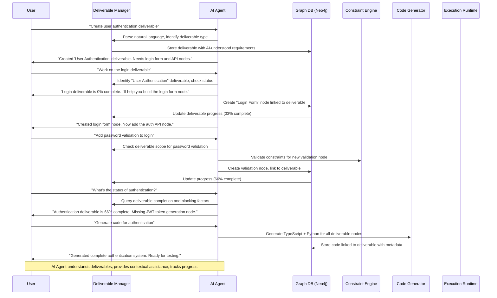

# SafePy Cloud MVP - Product Requirements Document

**Version:** 0.1.0 | **Status:** MVP Development | **Timeline:** 12 weeks | **Date:** December 2025

## Overview

SafePy Cloud MVP is a **minimal viable product** that demonstrates the core architectural innovation: **graph-first, constraint-to-type compilation** that eliminates runtime errors entirely AND creates **AI-navigable codebases** that solve the context window problem plaguing tools like Cursor and GitHub Copilot.

### MVP Core Value Proposition

**Problem:** Applications suffer from runtime errors due to lack of type safety. AI agents (Cursor, GitHub Copilot) get lost in large codebases due to context window limitations. Software projects lack systematic delivery management.
**Solution:** Graph database as single source of truth + constraint-to-type compiler + AI-navigable node system + deliverable-based project management.
**MVP Goal:** Prove that visual graphs with constraints solve type safety, AI navigation, AND systematic project delivery - creating AI-understandable, deliverable-driven codebases.

### Architectural Foundation (Non-Negotiable)

**Graph-First Architecture:** Everything starts with the graph - code is derivative
**Single Source of Truth:** Neo4j graph database from day one (no local storage/SQLite)
**Constraint-to-Type Compiler:** Visual constraints become compile-time type guarantees
**Context-Aware Execution:** Frontend/Backend/Hybrid contexts with proper separation

### Deliverable-Based Project Management (Core Innovation)

**Why Deliverables Matter:** Traditional code generation tools create code in isolation. SafePy integrates with project management where each node contributes to specific deliverables.

**AI-Powered Deliverable Intelligence:**

**Natural Language Commands:**
```typescript
// User can say:
"work on the user authentication deliverable"
"show me the login feature progress"
"what's blocking the payment integration?"
"generate code for the shopping cart epic"

// AI Agent understands:
// 1. Which deliverable is referenced
// 2. Current completion status
// 3. Associated nodes and code
// 4. Dependencies and blockers
// 5. What actions to take next
```

**Deliverable Structure:**
- **Epic Deliverables:** Large features broken into smaller deliverables
- **Feature Deliverables:** Specific functionality with acceptance criteria
- **Task Deliverables:** Individual implementation units
- **Node Groups:** Collections of nodes that implement a deliverable

**AI Deliverable Understanding:**
- **Scope Awareness:** AI knows what each deliverable encompasses
- **Code Mapping:** AI tracks which code belongs to which deliverable
- **Progress Intelligence:** AI understands completion status and next steps
- **Dependency Logic:** AI knows deliverable relationships and blockers

**Node-to-Deliverable Mapping:**
```mermaid
graph TD
    A[Epic: User Management<br/>AI: "Contains auth, profile, settings"] --> B[Deliverable: User Registration<br/>AI: "Frontend form + backend API"]
    A --> C[Deliverable: User Authentication<br/>AI: "Login/logout + JWT tokens"]
    A --> D[Deliverable: User Profile<br/>AI: "CRUD operations + validation"]

    B --> E[Node: Registration Form<br/>AI: "React component, 100% complete"]
    B --> F[Node: Email Validation<br/>AI: "Frontend + backend validation"]
    B --> G[Node: User Creation API<br/>AI: "Python endpoint, type-safe"]

    C --> H[Node: Login Form<br/>AI: "Form component, needs styling"]
    C --> I[Node: Password Hashing<br/>AI: "bcrypt integration, secure"]
    C --> J[Node: JWT Generation<br/>AI: "Token creation, 90% complete"]
```

**Deliverable States & Workflow:**
- **Planned:** Deliverable defined, nodes not yet created
- **In Progress:** Nodes being created/modified
- **Code Generated:** All nodes implemented, code generated
- **Testing:** Deliverable under test
- **Completed:** Deliverable deployed and accepted
- **Blocked:** Dependencies not met or issues found

**AI State Intelligence:**
- **Planned:** "This deliverable needs node creation. Should I start with the UI or backend?"
- **In Progress:** "Working on 3/5 nodes. The API node is 80% complete."
- **Code Generated:** "All code generated. Ready for testing. Found potential type conflicts."
- **Blocked:** "Waiting for 'Database Schema' deliverable. Can't proceed with data operations."
**AI Agent Navigation:** Nodes and constraints guide AI context window and systematic understanding
**Deliverable Intelligence:** AI understands deliverables, associated code, and project context for natural language commands
**Deliverable Integration:** Each node belongs to a deliverable, enabling systematic project management

### Language Support (MVP)

**Frontend:** TypeScript + React (100% type-safe, compiled to JavaScript)
**Backend:** Python (native type safety with mypy + Pydantic)
**Execution:** Browser (Pyodide) + Node.js + future runtimes

### Market Disruption: Solving AI Coding Assistant Limitations

**The $20B+ AI Coding Assistant Market Problem:**
- GitHub Copilot: ~10M users, but struggles with large codebases
- Cursor: Popular but hits context window limits on complex projects
- All AI assistants suffer from "getting lost" in codebases >50 files

**SafePy's Unique Solution:**
- **Graph-First Codebases:** AI sees architecture before code
- **Constraint-Guided Navigation:** Systematic, deterministic traversal
- **Dynamic Context Management:** Node restrictions prevent irrelevant code inclusion

**Competitive Advantage:**
- No other tool creates AI-navigable codebases from the ground up
- Solves the fundamental limitation of all current AI coding assistants
- Future-proofs codebases for any AI improvements

### AI Agent Architecture (Solving Context Window Problem)

**The Core Problem:** Current AI assistants (Cursor, GitHub Copilot) get lost in codebases because:
- Context windows are limited (~4K-32K tokens)
- No systematic understanding of codebase structure
- Cannot distinguish relevant from irrelevant code
- Struggle with complex dependency relationships

**SafePy Solution:** Graph-based AI navigation with constraint-guided focus

**Systematic Node Understanding:**
- **Node Taxonomy:** Hierarchical classification enabling AI to understand component relationships instantly
- **Constraint Ontology:** Formal rules that AI can use to determine valid/invalid operations
- **Execution Context Mapping:** Clear boundaries that prevent AI from getting confused between frontend/backend

**Logic Flow Navigation (Top→Bottom, Left→Right):**
- **Graph Traversal Algorithms:** Deterministic paths that AI can follow systematically
- **Context Window Management:** Dynamic adjustment based on node restrictions (not arbitrary token limits)
- **Dependency Resolution:** AI knows exactly which files/components are related via graph relationships

**AI Navigation Infrastructure:**
- **Node Metadata Schema:** Rich, structured information that fits in minimal context space
- **Relationship Indexing:** Pre-computed navigation paths prevent AI from exploring irrelevant code
- **Constraint-Guided Focus:** AI only sees code sections permitted by node constraints
- **Deliverable Intelligence:** AI understands project scope, completion status, and deliverable relationships

**AI Deliverable Intelligence System:**

**Natural Language Understanding:**
```typescript
// AI Agent can interpret commands like:
"work on user authentication" → Identifies "User Authentication" deliverable
"show login progress" → Displays completion status of login-related deliverables
"fix the registration bug" → Navigates to registration deliverable's nodes and code
"what's next for payments" → Analyzes payment deliverable dependencies and status
```

**Deliverable Context Awareness:**
- **Scope Recognition:** AI knows exactly what each deliverable encompasses
- **Code Mapping:** AI tracks generated code back to originating deliverables
- **Progress Intelligence:** AI understands completion percentages and blocking factors
- **Dependency Logic:** AI knows which deliverables depend on others

**Intelligent Assistance:**
- **Guided Development:** "Start with the database schema deliverable first"
- **Code Suggestions:** "For the login deliverable, you need these node types"
- **Issue Resolution:** "The payment deliverable is blocked by missing API keys"
- **Progress Updates:** "User registration is 80% complete, ready for testing"

**Solving Cursor/GitHub Copilot Limitations:**

**Current AI Problem:**
```typescript
// Cursor sees this massive codebase...
// 50+ files, 10K+ lines of code
// Context window: 8K tokens
// AI gets confused: "What does this function do? Where is it used?"
```

**SafePy Solution:**
```typescript
// AI sees the graph first, not code:
// Node: "UserAPI" (Backend, REST API)
// Constraints: Input=UserId(string), Output=UserData
// Relationships: Connected to "AuthMiddleware" (left), "DatabaseLayer" (right)
// AI instantly understands: This node fetches user data, requires auth, stores in DB
// Context window automatically adjusted to only relevant code sections
```

**Result:** AI agents can now systematically navigate any codebase size because they understand the graph structure first, then drill down into specific code sections as needed.

### MVP Success Criteria (AI-Powered Deliverable Development)

- ✅ **AI Deliverable Intelligence:** AI understands deliverables and associated code via natural language
- ✅ **Natural Language Commands:** Users can say "work on X deliverable" and AI responds intelligently
- ✅ **Deliverable Context Awareness:** AI knows scope, progress, dependencies, and blockers per deliverable
- ✅ **Code-to-Deliverable Mapping:** AI tracks which code belongs to which deliverable
- ✅ **Deliverable Integration:** Each node belongs to a deliverable with progress tracking
- ✅ **Project Management:** Epic → Feature → Task → Node hierarchy works
- ✅ **Dependency Management:** Deliverables respect dependencies and blocking states
- ✅ **Progress Visualization:** Visual dashboard shows project completion status
- ✅ **Graph-First Architecture:** Neo4j stores all graphs, constraints, and relationships
- ✅ **AI Context Window Solution:** AI agents navigate codebases systematically via node graph
- ✅ **Cursor/GitHub Copilot Fix:** Graph structure prevents AI confusion in large codebases
- ✅ **Logic Flow Navigation:** Clear top→bottom, left→right codebase traversal
- ✅ **Dynamic Context Adjustment:** Node restrictions guide AI focus automatically
- ✅ **Context Separation:** Frontend/Backend/Hybrid nodes with proper isolation
- ✅ **100% Type Safety:** Zero `any` types in generated TypeScript/Python code
- ✅ **Constraint-to-Type Compiler:** Visual constraints become compile-time guarantees
- ✅ **Multi-Runtime Execution:** Browser (Pyodide) + Node.js execution works
- ✅ **Cross-Context Communication:** Frontend ↔ Backend data flow functions
- ✅ **Graph Persistence:** All projects saved/loaded from Neo4j graph database

---

## 1. MVP Features

### Core Features (Must-Have for Launch)

#### 1.1 Visual Graph Editor
- **Canvas:** Drag & drop interface inspired by N8N (simplified)
- **Node Palette:** Basic node types in left sidebar
- **Properties Panel:** Node configuration in right sidebar
- **Connections:** Visual lines between nodes with data flow

#### 1.2 Basic Node Types

**Frontend Context (Browser):**
- **Data Source Node:** Fetch data from REST APIs, return typed TypeScript interfaces
- **Transform Node:** Process data with type-safe operations, output typed results
- **UI Output Node:** Display data in tables/charts, generate React components

**Backend Context (Server):**
- **API Source Node:** Call external APIs, return typed Python data classes
- **Data Transform Node:** Process data with pandas/numpy, type-safe operations
- **Database Output Node:** Store results in SQLite, typed data persistence

**Hybrid Context (Full-Stack):**
- **API Bridge Node:** Connect frontend to backend, type-safe data flow
- **Validation Node:** Cross-context data validation with shared types

#### 1.3 Constraint System (MVP)
- **Type Matching:** Nodes only connect if data types are compatible
- **Required Fields:** Essential configuration must be provided
- **Basic Validation:** Real-time feedback during graph building

#### 1.4 Code Generation
- **TypeScript Only:** Generate strict TypeScript code
- **Zero Any Types:** All variables have explicit types
- **Modular Code:** Separate files for each node type

#### 1.5 Local Execution
- **Node.js Runtime:** Execute generated code locally
- **Real-time Logs:** Show execution progress and results
- **Error Handling:** Clear error messages for debugging

#### 1.6 Project Management
- **Save/Load:** Store graphs in local storage
- **Project List:** View all saved projects
- **Basic Metadata:** Name, description, created date

---

## 2. MVP Technical Architecture

### MVP Tech Stack (Future-Proof Foundation)

| Component | Technology | Purpose |
|-----------|------------|---------|
| **Frontend** | Next.js + React + TypeScript | Visual editor and UI |
| **Graph Database** | Neo4j (Docker) | Single source of truth for graphs |
| **Graph Library** | React Flow | Drag & drop graph interface |
| **UI Components** | shadcn/ui | Consistent component library |
| **Python Runtime** | Pyodide | Execute Python in browser |
| **AI Agent Engine** | Custom TypeScript | Systematic node understanding & navigation |
| **Code Generation** | TypeScript + Python AST | Generate full-stack type-safe code |
| **Execution** | Pyodide (Python) + Node.js (TypeScript) | Run generated code locally |
| **Styling** | Tailwind CSS | Utility-first CSS framework |
| **Development** | Docker Compose | Consistent dev environment |

### MVP System Architecture (Complete Integration)

```mermaid
graph TB
    %% User Layer
    subgraph "User Interaction Layer"
        UI[Next.js Frontend]
        GE[Graph Editor Canvas]
        NP[Node Palette]
        PP[Properties Panel]
        PM[Project Manager]
        DM[Deliverable Manager]
    end

    %% AI Navigation Layer
    subgraph "AI Agent Navigation System"
        AIE[AI Agent Engine]
        NU[Node Understanding<br/>Taxonomy & Ontology]
        LFN[Logic Flow Navigation<br/>Top→Bottom, Left→Right]
        CWM[Context Window Management<br/>Dynamic Adjustment]
        CGF[Constraint-Guided Focus<br/>Relevance Filtering]
    end

    %% Project Management Layer
    subgraph "Deliverable-Based Project Management"
        DL[Deliverable Layer<br/>Epic/Feature/Task Management]
        DS[Deliverable States<br/>Planned → Completed]
        DD[Dependency Management<br/>Deliverable Relationships]
        DP[Progress Tracking<br/>Visual Status Dashboard]
    end

    %% Core Graph Layer
    subgraph "Graph-First Architecture"
        NEO[(Neo4j Graph DB<br/>Single Source of Truth)]
        GE2[Graph Engine<br/>CRUD Operations]
        CT[Constraint Taxonomy<br/>Node Relationships]
        NS[Node Schema<br/>Type Definitions]
        NM[Node-to-Deliverable Mapping<br/>Belongs-to Relationships]
    end

    %% Processing Layer
    subgraph "Code Generation & Validation"
        CE[Constraint Engine<br/>Validation & Compilation]
        CG[Code Generator<br/>TypeScript + Python]
        CTC[Constraint-to-Type Compiler<br/>Visual → Static Types]
        TV[Type Validator<br/>Zero 'any' Types]
    end

    %% Execution Layer
    subgraph "Multi-Runtime Execution"
        ORC[Execution Orchestrator<br/>Cross-Context Coordination]
        NJSE[Node.js Runtime<br/>TypeScript Execution]
        PYOD[Pyodide Runtime<br/>Python in Browser]
        HBE[Hybrid Bridge<br/>Frontend ↔ Backend]
    end

    %% Context Management
    subgraph "Context System"
        FCM[Frontend Context<br/>React/TypeScript]
        BCM[Backend Context<br/>Python/Pydantic]
        HCM[Hybrid Context<br/>Cross-Runtime]
        CM[Context Manager<br/>Isolation & Boundaries]
    end

    %% Data Flow
    UI --> GE
    GE --> NP
    GE --> PP
    UI --> PM
    UI --> DM

    DM --> DL
    DL --> DS
    DL --> DD
    DL --> DP

    DL --> GE
    DS --> GE
    DD --> GE

    AIE --> DL
    AIE --> DS
    AIE --> DP

    GE --> AIE
    AIE --> NU
    AIE --> LFN
    AIE --> CWM
    AIE --> CGF

    GE --> NEO
    PM --> NEO
    DM --> NEO
    DL --> NEO
    GE2 --> NEO
    CT --> NEO
    NS --> NEO
    NM --> NEO

    AIE --> CE
    CE --> CTC
    CTC --> CG
    CG --> TV

    CG --> ORC
    ORC --> NJSE
    ORC --> PYOD
    ORC --> HBE

    FCM --> CM
    BCM --> CM
    HCM --> CM
    CM --> ORC

    %% AI Navigation Integration
    NU -.-> GE2
    LFN -.-> CT
    CWM -.-> CE
    CGF -.-> CG

    %% Execution Results Flow
    NJSE --> UI
    PYOD --> UI
    HBE --> UI

    %% Styling
    classDef userLayer fill:#e1f5fe,stroke:#01579b,stroke-width:2px
    classDef deliverableLayer fill:#f1f8e9,stroke:#2e7d32,stroke-width:2px
    classDef aiLayer fill:#f3e5f5,stroke:#4a148c,stroke-width:2px
    classDef graphLayer fill:#e8f5e8,stroke:#1b5e20,stroke-width:2px
    classDef processingLayer fill:#fff3e0,stroke:#e65100,stroke-width:2px
    classDef executionLayer fill:#ffebee,stroke:#b71c1c,stroke-width:2px
    classDef contextLayer fill:#f3e5f5,stroke:#6a1b9a,stroke-width:2px

    class UI,GE,NP,PP,PM,DM userLayer
    class DL,DS,DD,DP deliverableLayer
    class AIE,NU,LFN,CWM,CGF aiLayer
    class NEO,GE2,CT,NS,NM graphLayer
    class CE,CG,CTC,TV processingLayer
    class ORC,NJSE,PYOD,HBE executionLayer
    class FCM,BCM,HCM,CM contextLayer

    linkStyle 24,25,26 stroke:#4a148c,stroke-width:3px
```



### How Everything Works Together: Data Flow & Interactions

#### 1. **Project Planning Flow (Business → Deliverables → Nodes)**
```
Business requirements → Epic deliverables → Feature deliverables → Task deliverables → Node groups → Individual nodes
```

#### 2. **Graph Creation Flow (User → Deliverables → AI → Graph DB)**
```
User selects deliverable → Deliverable defines node requirements → AI validates constraints → Graph stored in Neo4j → Real-time sync
```

#### 3. **AI Navigation Flow (Context Window Solution)**
```
AI sees deliverables first → Deliverable scope guides focus → Node taxonomy provides understanding → Logic flow guides traversal → Context window auto-adjusts
```

#### 4. **Code Generation Flow (Deliverables → Constraints → Types → Code)**
```
Deliverable completion status → Visual constraints → Type compilation → Language-specific code → Type validation → Runtime execution
```

#### 5. **Progress Tracking Flow (Nodes → Deliverables → Project Status)**
```
Node completion → Deliverable status updates → Dependency validation → Project progress calculation → Stakeholder notifications
```

#### 6. **Complete Integration Example: Deliverable-Driven Development**



### Solving AI Context Window Problem: Systematic Integration

#### The Problem with Current AI Assistants:
```
Cursor sees: 50 files × 200 lines = 10,000 lines of code
Context window: 8,000 tokens
Result: AI gets confused, misses relationships, makes wrong assumptions
```

#### SafePy's Graph-Based Solution:
```
AI sees: 5 nodes × structured metadata = Complete system understanding
Graph relationships: Clear data flow and dependencies
Context window: Dynamically adjusted to relevant code sections only
Result: AI navigates systematically, understands constraints, makes accurate decisions
```

#### Concrete Example: AI Fixing a Bug

**Without SafePy (Current AI Assistants):**
```typescript
// AI sees random code snippets
// Context: User mentions "login bug"
// AI searches: "login", "auth", "user"
// Finds 15+ files with login code
// Gets confused by different contexts
// Makes wrong assumptions about data flow
```

**With SafePy (Graph-Guided Navigation):**
```typescript
// AI sees graph structure first:
// Node: "UserLogin" (Frontend) → "AuthService" (Backend) → "UserDB" (Backend)
// Constraints: Email validation → Password hash → User permissions
// Logic flow: Top→Bottom (UI → Business Logic → Data)
// AI follows systematic path: Check UI validation → Auth logic → DB queries
// Context window: Only shows relevant code sections
// Result: AI understands complete flow, fixes bug accurately
```

#### Key Integration Points:

1. **Graph as AI Entry Point:** AI understands architecture before code
2. **Constraints Guide Navigation:** Node restrictions prevent irrelevant exploration
3. **Context Windows Auto-Adjust:** Dynamic focus based on graph relationships
4. **Systematic Traversal:** Deterministic top→bottom, left→right exploration
5. **Type Safety Informs AI:** Constraint-derived types prevent misunderstandings

### System Integration Summary

**The Complete SafePy Flow:**
1. **Project Planning** → Epic/Feature/Task deliverables define scope
2. **User Interaction** → Deliverable-driven graph creation with AI guidance
3. **AI Navigation** → Systematic understanding via node taxonomy & constraints
4. **Graph Persistence** → Neo4j stores relationships as single source of truth
5. **Deliverable Tracking** → Progress updates as nodes complete deliverables
6. **Constraint Validation** → Real-time type checking and relationship validation
7. **Code Generation** → Constraint-to-type compilation creates full-stack code
8. **Multi-Runtime Execution** → Orchestrated execution across contexts
9. **Result Unification** → Cross-context results presented with deliverable status

**Why This Solves AI Context Window + Project Management:**
- **Graph-First:** AI sees complete architecture instantly (not limited code snippets)
- **Deliverable-Scope:** AI focuses only on relevant deliverable nodes
- **Constraint-Guided:** Only relevant code sections enter context window
- **Systematic Navigation:** Deterministic traversal prevents getting lost
- **Progress Tracking:** AI understands project completion and dependencies
- **Type Safety:** Constraint-derived types eliminate ambiguity
- **Context Awareness:** Clear boundaries prevent cross-context confusion

**Result:** AI assistants can now understand and navigate ANY codebase size systematically, while developers get systematic project delivery - revolutionizing both AI-assisted development AND project management.
```

### File Structure (Graph-First MVP)

```
safepy-mvp/
├── app/                    # Next.js app router
│   ├── layout.tsx         # Root layout
│   ├── page.tsx           # Home/dashboard
│   ├── projects/          # Project pages
│   └── deliverables/      # Deliverable management pages
├── components/            # React components
│   ├── deliverables/     # Deliverable management
│   │   ├── deliverable-list.tsx
│   │   ├── progress-dashboard.tsx
│   │   ├── dependency-graph.tsx
│   │   └── deliverable-form.tsx
│   ├── graph/            # Graph editor components
│   │   ├── canvas.tsx    # React Flow canvas
│   │   ├── node-palette.tsx
│   │   └── properties-panel.tsx
│   └── ui/               # shadcn/ui components
├── lib/                  # Core business logic
│   ├── deliverables/     # Deliverable management system
│   │   ├── deliverable-engine.ts # CRUD operations
│   │   ├── progress-calculator.ts # Completion status
│   │   ├── dependency-manager.ts # Blocking/validation logic
│   │   ├── deliverable-schema.ts # Neo4j schemas
│   │   └── workflow-states.ts # State management
│   ├── ai-agent/         # AI Agent Navigation & Intelligence Engine
│   │   ├── deliverable-intelligence.ts # Natural language deliverable understanding
│   │   ├── code-mapping.ts # Code-to-deliverable relationship tracking
│   │   ├── contextual-assistance.ts # Smart suggestions based on deliverable context
│   │   ├── node-understanding.ts # Systematic node comprehension
│   │   ├── logic-flow.ts # Top→bottom, left→right navigation
│   │   ├── context-window.ts # Dynamic focus management
│   │   ├── node-taxonomy.ts # Hierarchical node classification
│   │   └── constraint-ontology.ts # Formal restriction definitions
│   ├── neo4j/            # Graph database layer
│   │   ├── driver.ts     # Neo4j connection & queries
│   │   ├── schemas.ts    # Graph schemas & constraints
│   │   └── migration.ts  # Schema migrations
│   ├── constraint-engine/# Constraint validation
│   │   ├── validator.ts  # Constraint checking
│   │   ├── compiler.ts   # Constraint-to-type compilation
│   │   └── types.ts      # Type generation logic
│   ├── code-generator/   # Code generation engines
│   │   ├── typescript.ts # React/TypeScript generation
│   │   ├── python.ts     # Python generation
│   │   └── shared.ts     # Cross-language utilities
│   ├── execution/        # Runtime orchestration
│   │   ├── nodejs.ts     # Node.js execution
│   │   ├── pyodide.ts    # Pyodide execution
│   │   └── orchestrator.ts # Cross-context coordination
│   ├── graph-engine.ts  # Graph manipulation & queries
│   └── node-types/      # Node definitions by context
├── types/               # TypeScript definitions
│   ├── graph.ts         # Graph data structures
│   ├── neo4j.ts         # Neo4j-specific types
│   ├── contexts.ts      # Execution contexts
│   └── generated.ts     # Generated code types
├── scripts/             # Development scripts
│   ├── init-neo4j.ts    # Database initialization
│   └── seed-data.ts     # Sample data
└── docker/              # Docker configuration
    ├── docker-compose.yml # Development environment
    └── neo4j/           # Neo4j configuration
```

---

## 3. MVP Implementation Plan

### Phase 1: Graph-First Foundation (5 weeks)

**Week 1: Neo4j & Infrastructure Setup**
```bash
# Initialize project
npx create-next-app@latest safepy-mvp --typescript --tailwind --app
cd safepy-mvp

# Setup Docker environment
docker run -d --name neo4j -p 7474:7474 -p 7687:7687 -e NEO4J_AUTH=none neo4j:latest

# Install dependencies
npm install reactflow neo4j-driver @types/react @types/node pyodide
npm install -D @types/reactflow

# Initialize Neo4j schema
node scripts/init-neo4j.js
```

**Week 2: Deliverable System Foundation**
- Deliverable schema in Neo4j (Epic/Feature/Task hierarchy)
- Deliverable CRUD operations
- Dependency management between deliverables
- Progress tracking system

**Week 3: Graph Database Integration**
- Neo4j driver setup and connection
- Node-to-deliverable relationship mapping
- Graph persistence layer
- Real-time sync between deliverables and nodes

**Week 4: Visual Editor Foundation**
- React Flow canvas with deliverable integration
- Deliverable-aware node placement
- Progress visualization in canvas
- Real-time deliverable status updates

**Week 5: AI Agent Foundation & Deliverable Intelligence**
- AI Agent Engine architecture (systematic node understanding)
- AI Deliverable Intelligence (natural language understanding of deliverables)
- Code-to-deliverable mapping system (track which code belongs to which deliverable)
- Contextual assistance engine (smart suggestions based on deliverable context)
- Deliverable-scope AI navigation (AI focuses on active deliverables)
- Node taxonomy and constraint ontology definition
- Logic flow navigation system (top→bottom, left→right)
- Context window management based on node restrictions
- Execution context separation (Frontend/Backend/Hybrid)
- Basic constraint validation with AI guidance

### Phase 2: Code Generation & Execution (5 weeks)

**Week 5: Pyodide Runtime Setup**
- Pyodide integration for Python execution
- Python package management (pandas, requests, pydantic)
- Browser-based Python sandbox
- Cross-origin and security setup

**Week 6: TypeScript Code Generation**
- Generate React components from frontend nodes
- Type-safe data flow and interfaces
- Node.js execution environment
- Error handling and logging

**Week 7: Python Code Generation**
- Generate Python functions from backend nodes
- Pydantic models and type validation
- Pyodide execution integration
- mypy validation pipeline

**Week 8: Constraint-to-Type Compiler**
- Visual constraints → TypeScript types
- Visual constraints → Python types
- Cross-context type compatibility
- Compile-time validation

**Week 9: Hybrid Execution Engine**
- Orchestrate frontend ↔ backend execution
- Data serialization between contexts
- Unified results aggregation
- Real-time execution monitoring

### Phase 3: MVP Features & Polish (3 weeks)

**Week 10: Core Node Types**
- Essential node implementations
- Context-specific node behaviors
- Node testing and validation
- Node palette organization

**Week 11: Project Management & UI**
- Graph persistence to Neo4j
- Project CRUD operations
- Export/import functionality
- User experience polish

**Week 12: Testing, Documentation & Launch**
- End-to-end graph execution tests
- Error handling and user feedback
- MVP documentation and demo
- Performance optimization

---

## 4. MVP Development Environment

### Prerequisites
- Node.js 18+
- Docker & Docker Compose
- npm or yarn
- Git

### Local Development Setup (Graph-First)

```bash
# Clone repository
git clone https://github.com/safe-py/safepy-mvp.git
cd safepy-mvp

# Start Neo4j database (graph-first foundation)
docker-compose up -d neo4j

# Wait for Neo4j to be ready
sleep 10

# Initialize Neo4j schema
npm run init-db

# Install dependencies
npm install

# Start development server
npm run dev

# Open http://localhost:3000
```

### Project Scripts
```json
{
  "scripts": {
    "dev": "next dev",
    "build": "next build",
    "start": "npm run build && next start",
    "lint": "next lint",
    "type-check": "tsc --noEmit",
    "init-db": "tsx scripts/init-neo4j.ts",
    "seed-db": "tsx scripts/seed-data.ts",
    "test-db": "tsx scripts/test-neo4j.ts"
  }
}
```

---

## 5. MVP User Journey

### First Time User Experience (AI-Powered Deliverable Development)

1. **Landing Page:** "Build AI-understandable codebases with intelligent project assistance"
2. **Natural Language Start:** Say "Create a user management system" to AI agent
3. **AI Creates Epic:** AI automatically creates "User Management" epic with sub-deliverables
4. **Conversational Refinement:** Tell AI "Focus on authentication first" - AI prioritizes deliverables
5. **Guided Node Creation:** AI suggests "Start with login form node for the auth deliverable"
6. **Intelligent Validation:** AI checks if nodes fit deliverable scope and requirements
7. **Progress Conversations:** Ask AI "What's the status of user registration?" - get detailed updates
8. **Contextual Help:** AI knows exactly which code and nodes belong to each deliverable
9. **Smart Execution:** Tell AI "Test the authentication deliverable" - AI runs appropriate tests
10. **Complete System:** AI-understandable codebase with systematic project delivery

### Success Metrics (MVP)

- **User can create first graph:** < 5 minutes
- **Graph executes successfully:** 100% of valid graphs
- **Generated code compiles:** Zero TypeScript errors
- **No runtime errors:** 100% type safety achieved

---

## 6. MVP Constraints & Limitations

### What's NOT in MVP (Intentionally Excluded)

**Future-Proof Decisions:**
- ✅ **Neo4j Graph Database:** Included from day one (graph-first architecture)
- ✅ **Multi-Runtime Foundation:** Browser + Node.js (extensible to serverless/containers)
- ✅ **Context System:** Frontend/Backend/Hybrid (enables full-stack later)
- ✅ **Constraint Engine:** Foundation for advanced validation rules
- ✅ **AI Agent Navigation:** Systematic node understanding and codebase traversal

**Truly Excluded for MVP:**
- ❌ AI-assisted development (Claude, GPT integration for code suggestions)
- ❌ User authentication & accounts (local development only)
- ❌ Team collaboration & sharing (single-user)
- ❌ Advanced node types (ML, streaming, complex workflows)
- ❌ Cloud deployment (local execution only)
- ❌ Performance monitoring (basic logging only)
- ❌ Production hardening (security, scaling, etc.)

### Future Features (Post-MVP)

- **AI Integration:** Claude/GPT assistance for graph building
- **Additional Languages:** Go, Rust, Java backend generation
- **Cloud Runtimes:** AWS Lambda, Vercel, Railway deployment
- **Advanced Node Types:** ML models, real-time streaming, complex data processing
- **Team Features:** Collaboration, version control, project sharing
- **Enterprise Features:** Authentication, audit logs, compliance
- **Performance:** Query optimization, caching, scaling

---

## 7. MVP Testing Strategy

### MVP Launch Validation Checklist

**AI-Powered Deliverable Intelligence:**
- [ ] AI understands natural language deliverable commands ("work on X", "status of Y")
- [ ] AI knows which nodes and code belong to each deliverable
- [ ] AI provides contextual help based on deliverable scope and progress
- [ ] AI tracks deliverable dependencies and blocking factors
- [ ] AI suggests next steps and prioritizes deliverables intelligently

**Deliverable-Driven Project Management:**
- [ ] Epic → Feature → Task → Node hierarchy works
- [ ] Deliverable creation and assignment to nodes
- [ ] Progress tracking updates as nodes are completed
- [ ] Dependency management prevents blocked deliverables
- [ ] Visual progress dashboard shows project status

**Graph-First Architecture:**
- [ ] Neo4j database initialized with schema
- [ ] Graph persistence works (save/load from Neo4j)
- [ ] Node-to-deliverable relationships maintained
- [ ] Constraint validation prevents invalid connections
- [ ] Context separation enforced (Frontend/Backend/Hybrid)

**AI Agent Navigation (Solving Context Window Problem):**
- [ ] AI focuses on deliverable scope first, then node relationships
- [ ] AI can understand codebase structure instantly via graph (not code)
- [ ] Systematic navigation prevents getting lost in large codebases
- [ ] Context window dynamically adjusts based on node restrictions
- [ ] Constraint ontology prevents AI confusion between contexts
- [ ] Graph traversal enables deterministic codebase exploration

**Code Generation & Type Safety:**
- [ ] Constraint-to-type compilation works
- [ ] Generated TypeScript: zero `any` types
- [ ] Generated Python: passes mypy validation
- [ ] Cross-context type compatibility maintained

**Multi-Runtime Execution:**
- [ ] Node.js execution of TypeScript code
- [ ] Pyodide execution of Python code
- [ ] Hybrid execution orchestration
- [ ] Error handling and result aggregation

**User Experience:**
- [ ] Deliverable-focused workflow guides development
- [ ] Visual graph editing with real-time feedback
- [ ] Context-aware node palette
- [ ] Properties panel with validation
- [ ] Execution results display with deliverable status

### MVP Launch Criteria

- ✅ All manual tests pass
- ✅ No TypeScript compilation errors
- ✅ Generated code runs successfully
- ✅ Basic error handling works
- ✅ Project save/load works
- ✅ Responsive design (desktop only)

---

This MVP PRD focuses on the **absolute minimum** needed to prove the core concept: visual graphs can generate 100% type-safe code. Everything not essential for this proof has been removed to enable fast iteration and learning.
